# AHR self-heal — the fault-rooted decision tree

What the self-heal arc (`selfheal.1`–`.10`) actually does, read from the FAULT
down rather than from the code out. Twenty-four roots — the things that can go
wrong on an AHR pool — and, under each, every action the system takes, every
decision it makes on a result, every refusal, every notification, every UI
state and every stated residual, in the order the system meets them.

The tree itself is `test/self-heal/decision-tree.yaml`. It is machine-checked by
`test/self-heal/check-decision-tree.mjs`, which rides `npm run test:unit`
through `packages/daemon/src/__tests__/selfheal-decision-tree.test.ts` and is
runnable by hand:

```
node test/self-heal/check-decision-tree.mjs
```

§Coverage and §The trees below are GENERATED from that YAML by
`test/self-heal/render-trees.mjs` — the drawings were hand-kept until the
seventh pass, which is how the same node came to carry two different
truncations of its label in two places. Change the YAML, then:

```
node test/self-heal/render-trees.mjs          # rewrite the two sections
node test/self-heal/render-trees.mjs --check  # …or just say they are stale
```

The `--check` form rides the same unit test as the structural check, so the
drawing cannot drift from its data again. Everything else in this file — the
header, §How to read it and §Findings — is written by hand.

The check is structural where a drawing can lie — a dangling edge, a cycle, a
root that reaches no terminal leaf, a `code:` naming a function that no longer
exists, a `test:` naming a case that no longer exists — and a REPORT where the
answer is a judgment: missing leaves, orphans and mis-applied actions are
counted and listed, never asserted. Those are §Findings below.

## How to read it

Every leaf carries three references, because a leaf with none of them is a
claim rather than a fact:

- `code:` — `<path>:<symbol>`, the thing that implements it, or `—`
- `test:` — the unit/route/harness test or the loop-suite case id that proves
  it (`suite:<id>`), or `—`
- `gt:` — the ground-truth verdict it rests on (`docs/AHR-SELF-HEAL-GROUND-TRUTH.md`), or `—`

Shapes:

| shape | kind | meaning |
|---|---|---|
| `{ … }` | decision | a predicate on a result |
| `[ … ]` | action | something the system does — the function is named |
| `( … )` | refusal | a refusal, with its reason code or its sentence |
| `[/ … /]` | notification | a PVE notification, with its wording anchor |
| `[[ … ]]` | ui | a UI state or affordance |
| `> … ]` | residual | a documented limit — the system stops here on purpose |

**The tree is fault-rooted, not a flowchart.** A shared decision node carries
only its CONTINUE edge; a branch that characterises a particular fault is
linked from THAT fault's root. So "which roots reach this leaf" has a real
answer, and the tree's `exclusive_actions` block can state which answers are
allowed:

| action | may be reached from | why |
|---|---|---|
| `md-action-repair` | R1 only | GT-18: bounded `mdadm --action=repair` rewrites parity correctly when the data is intact and BLESSES the rot when it is not; on a mirror it copies the first in-sync leg over the others without looking at which is right (N1) |
| `md-block-write` | R2, R3, R5, R6, R9, R15, R16, R19, R23 | GT-7/GT-8: a block goes through md only after a reconstruction matched the checksum btrfs stored for it |
| `restore-from-backup-advice` | R1, R3, R4, R6, R7, R9, R10, R11, R14, R16 | selfheal.7 F2 / D10: "restore this file from backup" is advice to OVERWRITE the file, so it may only be reached from a fault where nothing below the checksum tree can prove the block right |
| `not-corrupt-here-advice` | R18 only | the mapping-abort sentence asserts a positive fact — the bytes at the mapped location were READ and still PASS their stored checksum |

All four come back clean, which they did not before the seventh pass.

`md-action-repair` was already clean: the mirror root (R9) stops at
`not-a-parity-band` and the member-failure root (R10) at `array-busy`, which is
what N1 and GT-18 require.

`not-corrupt-here-advice` is now R18 only. It used to be reachable from R16 and
R22 as well, because every mapping failure became the `mapping-abort` bucket —
whose sentence says the bytes at the mapped location still pass their stored
checksum. That is true of the one case the re-verify establishes it for and of
nothing else, so those blocks moved to the `not-examined` bucket (F3).

`restore-from-backup-advice` changed on both sides. R22 came OFF the list: a
read-back-guard failure establishes nothing at all about the file, so it is
`not-examined` too (F9). Four faults went ON it, each through one named leaf
where the block genuinely cannot be proven — R1 through `E12d` (written, and it
fails its cold re-read), R4 and R9 through `E04f2` (both mirror legs fail and
disagree with each other), R11 through `E07a` (md has recorded bad blocks over
the row and can reconstruct nothing from that member). The list is longer and
every entry on it is a fault where a restore is the only action left.

## Coverage

| root | fault | nodes | terminal leaves | `code: —` | `test: —` |
|---|---|---|---|---|---|
| R1 | md mismatch with the data intact (parity / Q rot) | 57 | 7 | 0 | 0 |
| R2 | btrfs csum error — one data member rotted below md | 49 | 4 | 0 | 0 |
| R3 | two damaged members in one stripe (RAID5 unrepairable / RAID6 Q path) | 15 | 1 | 0 | 0 |
| R4 | rot that arrived THROUGH md (parity agrees with the bad data) | 33 | 4 | 0 | 0 |
| R5 | metadata rot (csum tree / fs tree) in a DUP copy | 29 | 4 | 1 | 1 |
| R6 | compressed-extent rot | 33 | 2 | 0 | 1 |
| R7 | rot in a file without checksums (NOCOW / prealloc / nodatasum) | 7 | 2 | 0 | 0 |
| R8 | rot in an extent referenced only by a snapshot (outsideMount) | 8 | 4 | 0 | 0 |
| R9 | mismatch on a RAID1 band (the legs disagree) | 62 | 20 | 0 | 0 |
| R10 | member failure / degraded array before, during or after a scrub or repair | 22 | 7 | 0 | 0 |
| R11 | URE during a rebuild (md bad-block list) | 36 | 5 | 0 | 0 |
| R12 | daemon SIGKILL / OOM / upgrade-restart mid-repair or mid-scrub | 14 | 7 | 0 | 0 |
| R13 | power loss mid-repair | 10 | 4 | 1 | 2 |
| R14 | a foreign md op (mdcheck, recovery, reshape) concurrent with ours | 25 | 7 | 0 | 0 |
| R15 | a block in band N of a multi-band pool | 28 | 2 | 0 | 0 |
| R16 | a block backing an iSCSI LUN image | 34 | 2 | 0 | 0 |
| R17 | check never started / state unknown / counter unreadable | 15 | 2 | 0 | 0 |
| R18 | file changed, truncated, deleted or inode reused between scrub and repair | 16 | 5 | 0 | 0 |
| R19 | a crc32c collision on a candidate (accepted residual) | 10 | 2 | 1 | 1 |
| R20 | the periodic timer paths (missed occurrence, vanished job, restart, shared spindles) | 10 | 2 | 0 | 0 |
| R21 | legacy and foreign states (mdcheck, marker-less units, masked timers, uninstall) | 12 | 7 | 1 | 1 |
| R22 | mapping failure (unreadable band geometry, unresolvable extent, owner-scan cap) | 17 | 5 | 0 | 0 |
| R23 | the pool's top-level mount held by a backup during a repair | 12 | 3 | 0 | 0 |
| R24 | the operator names a path outside the pool — a symlink, a bind mount | 5 | 4 | 0 | 0 |

**24 roots · 272 nodes · 71 terminal leaves · 4 with no code · 6 with no test ·
0 orphan nodes · 58 orphan exported actions · 0 mis-applied actions.**

## The trees

### R1 — md mismatch with the data intact (parity / Q rot)

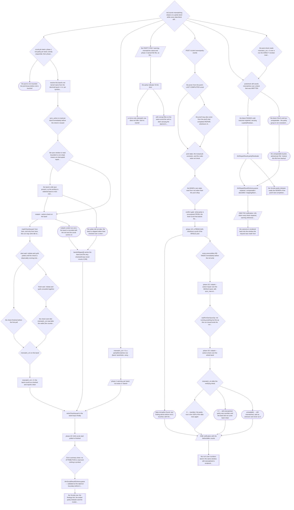
```mermaid
flowchart TD
  X1{"md counts mismatching stripes on a parity band while every data block still…"}
  S00{"scrub job starts: phase 1 md parity per band, strictly sequential, then phase…"}
  S22["mismatch_cnt &gt; 0: a parityMismatches row {band, bandIndex, array…"]
  S62[/"the PARITY-ONLY warning: mismatches stand and phase 2 named NO file, so the…"/]
  P00{"POST /v1/ahr/:name/parity-rewrite"}
  E12a{"postcheck still counts mismatches over a block that was WRITTEN"}
  E12e{"the post-check reads mismatch_cnt = 0 over a row the DIRECT member read…"}
  S01(["the pool is not mounted: the job throws before md is touched"])
  S02["resolve this band's md kernel name from the /dev/md/&lt;pool&gt;-r&lt;n&gt; pin symlink…"]
  S24[/"phase-1 warning, per band: 'rot exists in &lt;band&gt;"/]
  U02[["the parity indicator IS the door"]]
  P01{"the proof, from the pool's LAST COMPLETED scrub"}
  E12c["the block PASSES cold: outcome repaired, carrying a parityResidual…"]
  E12d(["the block FAILS cold too: unrepairable - the parity group is not consistent…"])
  S04{"sync_action re-read per band immediately before the check is issued"}
  S31["retireCheckIssued in the band loop's finally"]
  U07[["a mirror-only mismatch row does not offer 'click to rewrite'"]]
  U08[["with corrupt files on the same scrub the verb is dark carrying the daemon's…"]]
  P02{"pool state, the mutual job exclusion, and the node-wide md check"}
  P01r{"the proof may also come from the pool's last completed REPAIR, whichever of…"}
  J54["AhrRepairResult.parityResiduals"]
  J40(["the unrepairable bucket, advised per file: 'restore this file from backup'"])
  S06{"the sync window is read: bounded to one stripe means an interrupted repair…"}
  S40["phase 2/2: btrfs scrub start polled to finished"]
  P03{"the BAND's own state, read from md rather than the pool rollup"}
  J50["AhrRepairResultSchema.parse: repaired / unrepairable / aboveMd / mappingAbort…"]
  U02r[["the Scrubs parity indicator reads the NEWER of the pool's last completed…"]]
  S07["the band is idle (just proven), so the window is widened back to md's own…"]
  S08["mdadm --action=check on the band"]
  S42{"Error summary clean: no ATTRIBUTION is read and nothing is probed"}
  P04["confirm gate: what parity is recomputed FROM, the fresh scrub that aborts the…"]
  J51[/"ONE PVE notification: info when every block repaired, warning otherwise…"/]
  S07a(["the widen did not take: the band is skipped rather than checked over a sliver…"])
  S09["markCheckIssued: from here, and only from here, this run may write idle to…"]
  S08a(["mdadm exited non-zero: the band is recorded with the exit and the scrub carries on"])
  S60["AhrScrubResultSchema.parse — validated at the daemon boundary before it…"]
  P05["phase 1/3: a FRESH btrfs checksum scrub of the WHOLE pool"]
  J52[["the outcome is rendered back into the window the request was made from"]]
  S30["bandsSkipped[] carries the band and the why; checkedArrays never counts it (D8)"]
  S10{"start-wait: mdstat and sysfs polled until the check is observably running (md…"}
  S64[["the Scrubs row: the findings link, the amber parity indicator and the muted…"]]
  P05a(["data-corruption-found: any finding aborts before md is touched, with the…"])
  P06{"every precondition RE-TAKEN immediately before the md write"}
  S12{"the check finished before the first poll"}
  S14{"finish-wait: mdstat and sysfs consulted together"}
  P12[/"ONE notification with the before/after counts"/]
  P07["phase 2/3: mdadm --action=repair over the WHOLE band, with sync_max at…"]
  S20{"mismatch_cnt on this band"}
  S17{"the check went idle: mismatch_cnt read after the settle (the counter…"}
  P13[["the run's own numbers land in the same window; still-mismatched is rendered…"]]
  P08{"waitForOwnSyncOp: md running anything but the op this run issued ends the run…"}
  S23["mismatch_cnt = 0: the band counts as checked and reports clean"]
  P09["phase 3/3: mdadm --action=check over the whole band"]
  P10{"mismatch_cnt after the verifying check"}
  P11{"0 → rewritten: the parity row is the XOR of the data rows again"}
  P11a(["&gt; 0 → still-mismatched: parity was rewritten and the band did not come back clean"])
  P11b(["unreadable → still-mismatched, said as unknown and never as 0"])
  X1 --> S00
  X1 --> S22
  X1 --> S62
  X1 --> P00
  X1 --> E12a
  X1 --> E12e
  S00 --> S01
  S00 --> S02
  S22 --> S24
  S62 --> U02
  P00 --> P01
  E12a --> E12c
  E12a --> E12d
  E12e --> E12a
  S02 --> S04
  S24 --> S31
  U02 --> U07
  U02 --> U08
  P01 --> P02
  P01 --> P01r
  E12c --> J54
  E12d --> J40
  S04 --> S06
  S31 --> S40
  P02 --> P03
  P01r --> P02
  J54 --> J50
  J54 --> U02r
  J40 --> J50
  S06 --> S07
  S06 --> S08
  S40 --> S42
  P03 --> P04
  J50 --> J51
  S07 --> S08
  S07 --> S07a
  S08 --> S09
  S08 --> S08a
  S42 --> S60
  P04 --> P05
  J51 --> J52
  S07a --> S30
  S09 --> S10
  S08a --> S30
  S60 --> S64
  P05 --> P05a
  P05 --> P06
  S30 --> S31
  S10 --> S12
  S10 --> S14
  P05a --> P12
  P06 --> P07
  S12 --> S20
  S14 --> S17
  P12 --> P13
  P07 --> P08
  S20 --> S23
  S17 --> S20
  P08 --> P09
  S23 --> S31
  P09 --> P10
  P10 --> P11
  P10 --> P11a
  P10 --> P11b
  P11 --> P12
  P11a --> P12
  P11b --> P12
```

| leaf | kind | what the system does | `code:` | `test:` | `gt:` |
|---|---|---|---|---|---|
| `X1` | decision | md counts mismatching stripes on a parity band while every data block still passes its checksum | `packages/daemon/src/services/ahr-scrub.ts:scrubAhrPool` | `packages/daemon/src/services/__tests__/ahr-scrub.test.ts:parity mismatch and errors that name NO file` | `GT-18` |
| `S00` | decision | scrub job starts: phase 1 md parity per band, strictly sequential, then phase 2 btrfs checksums | `packages/daemon/src/services/ahr-scrub.ts:scrubAhrPool` | `packages/daemon/src/services/__tests__/ahr-scrub.test.ts:runs btrfs scrub to completion, THEN per-array checks sequentially` | `GT-5` |
| `S22` | action | mismatch_cnt > 0: a `parityMismatches` row {band, bandIndex, array, mismatchCnt, level} rides the result, and the band counts as CHECKED | `packages/daemon/src/services/ahr-scrub.ts:scrubAhrPool` | `packages/daemon/src/services/__tests__/ahr-scrub.test.ts:the new record fields round-trip the shared schema — and stay optional` | `GT-18` |
| `S62` | notification | the PARITY-ONLY warning: mismatches stand and phase 2 named NO file, so the parity (or Q) member is what disagrees and md would reconstruct from it at the next disk failure | `packages/daemon/src/services/ahr-scrub.ts:parityBody` | `packages/daemon/src/services/__tests__/ahr-scrub.test.ts:parity mismatch and errors that name NO file` | `GT-18` |
| `P00` | decision | POST /v1/ahr/:name/parity-rewrite — the body names ONE band, because md repairs a whole array at a time | `packages/daemon/src/services/ahr-parity-rewrite.ts:parityRewriteArray` | `packages/pve-integration/test/dialog-contracts.harness.mjs:rewrite: the body names ONE band, as a number` | `GT-18` |
| `E12a` | decision | postcheck still counts mismatches over a block that was WRITTEN: the block is re-read COLD and arbitrated against its stored csum again, because a non-zero post-check AFTER a write is a different verdict from one before it | `packages/daemon/src/services/selfheal-repair.ts:coldVerify` | `packages/daemon/src/services/__tests__/selfheal-repair.test.ts:RAID6 with the target block AND Q rotten (F2)` | `GT-12` |
| `E12e` | decision | the post-check reads `mismatch_cnt = 0` over a row the DIRECT member read still faults: md's stale view of our OWN write, never a clean parity group. `staleCache: true` is recorded and the block takes the same cold proof a counted residual takes; the advice is the re-scrub that produces a count Rewrite parity's evidence gate will accept | `packages/daemon/src/services/selfheal-repair.ts:directParityConsistent` | `packages/daemon/src/services/__tests__/selfheal-repair.test.ts:is not a clean pass: the block is proven cold and the residual is reported` | `GT-23` |
| `S01` | refusal | the pool is not mounted: the job throws before md is touched | `packages/daemon/src/services/ahr-scrub.ts:scrubAhrPool` | `packages/daemon/src/services/__tests__/ahr-scrub.test.ts:refuses an unmounted pool` | — |
| `S02` | action | resolve this band's md kernel name from the /dev/md/<pool>-r<n> pin symlink AT POINT OF USE — md numbers re-enumerate across a reassembly | `packages/daemon/src/services/ahr-scrub.ts:scrubAhrPool` | `packages/daemon/src/services/__tests__/ahr-scrub.test.ts:ignores a STALE route-time array.kernelName` | `GT-2` |
| `S24` | notification | phase-1 warning, per band: "rot exists in <band> — phase 2 (running now) checks every file's checksum; if a file is affected, it will be named" | `packages/daemon/src/services/ahr-scrub.ts:scrubAhrPool` | `packages/daemon/src/services/__tests__/ahr-scrub.test.ts:phase 1 rot: a mismatch_cnt > 0 warns before phase 2 starts — and phase 2 still runs` | `GT-5` |
| `U02` | ui | the parity indicator IS the door: `anas-win-scrub-parity` lists the bands md counted mismatches on and takes ONE | `packages/pve-integration/src/69-scrubs.js:showParityMismatches` | `packages/pve-integration/test/dialog-contracts.harness.mjs:rewrite: the parity indicator opens the parity window` | `GT-18` |
| `P01` | decision | the proof, from the pool's LAST COMPLETED scrub: mismatches counted on THIS band (matched on `bandIndex`, never a regex over the label) AND no data finding anywhere on the pool | `packages/daemon/src/services/ahr-parity-rewrite.ts:parityRewriteEvidence` | `packages/daemon/src/services/__tests__/ahr-parity-rewrite.test.ts:a clean scrub with a mismatch on THIS band is the proof` | `GT-18` |
| `E12c` | action | the block PASSES cold: outcome `repaired`, carrying a `parityResidual` {array, band, bandIndex, mismatchCnt} and the sentence "the block is repaired; the band still has a parity/Q mismatch - run Rewrite parity". Never restore advice over a block just proven correct | `packages/daemon/src/services/selfheal-repair.ts:parityResidualOf` | `packages/daemon/src/services/__tests__/selfheal-repair.test.ts:reports REPAIRED with a parity residual, never a restore` | `GT-12` |
| `E12d` | refusal | the block FAILS cold too: `unrepairable` - the parity group is not consistent AND the block cannot be proven. The one shape here where a restore is the right action | `packages/daemon/src/services/selfheal-repair.ts:repairBlock` | `packages/daemon/src/services/__tests__/selfheal-repair.test.ts:still fails UNREPAIRABLE when the written block does not read back clean either` | `GT-12` |
| `S04` | decision | `sync_action` re-read per band immediately before the check is issued | `packages/daemon/src/services/ahr-scrub.ts:syncAction` | `packages/daemon/src/services/__tests__/ahr-scrub.test.ts:does not ISSUE a check on a band md is already recovering` | `GT-19` |
| `S31` | action | retireCheckIssued in the band loop's `finally` — the token never outlives the iteration that took it (N3) | `packages/daemon/src/services/selfheal-syncop.ts:retireCheckIssued` | `packages/daemon/src/services/__tests__/ahr-scrub.test.ts:retires the token on the SKIP paths too — md never started the check (N3)` | — |
| `U07` | ui | a mirror-only mismatch row does not offer "click to rewrite": it names Repair from parity as the verb that arbitrates instead | `packages/pve-integration/src/69-scrubs.js:renderLastScrub` | `packages/pve-integration/test/dialog-contracts.harness.mjs:rewrite: a mirror-only mismatch row does NOT offer "click to rewrite"` | `GT-16` |
| `U08` | ui | with corrupt files on the same scrub the verb is dark carrying the daemon's own 409 sentence, and the handler refuses a click anyway | `packages/pve-integration/src/69-scrubs.js:parityRewriteBlocked` | `packages/pve-integration/test/dialog-contracts.harness.mjs:rewrite: the handler itself refuses, not just the disabled state` | `GT-18` |
| `P02` | decision | pool state, the mutual job exclusion, and the node-wide md check — all three before a confirm code is minted | `packages/daemon/src/routes/ahr-mutate.ts:ahrMutationRoutes` | `packages/daemon/src/routes/__tests__/ahr-repair.test.ts:409s a PARITY REWRITE on the same check, with the same sentence` | — |
| `P01r` | decision | the proof may also come from the pool's last completed REPAIR, whichever of the two is newer: a repair that wrote a block, proved it cold and saw md still counting the stripe has MEASURED the residual. A run that left blocks unrepaired, above md or unexamined is `data-findings-present` instead | `packages/daemon/src/services/ahr-parity-rewrite.ts:repairParityResiduals` | `packages/daemon/src/services/__tests__/ahr-parity-rewrite.test.ts:a repair job as the proof (F2)` | — |
| `J54` | action | AhrRepairResult.parityResiduals: one `parityMismatches`-shaped row per band, carrying the highest count seen - the shape the Scrubs indicator and Rewrite parity already read, so a residual this run measured is actionable without a fresh multi-hour scrub | `packages/daemon/src/services/ahr-repair.ts:repairAhrFiles` | `packages/daemon/src/services/__tests__/ahr-repair.test.ts:rolls the residual up into a parityMismatches-shaped row, with the band level` | — |
| `J40` | refusal | the `unrepairable` bucket, advised per file: "restore this file from backup" **[restore-from-backup-advice]** | `packages/daemon/src/services/ahr-repair.ts:RESTORE_FILE_SENTENCE` | `packages/daemon/src/services/__tests__/ahr-repair.test.ts:anything unrepairable or above md notifies at warning, in the epic's words` | — |
| `S06` | decision | the sync window is read: bounded to one stripe means an interrupted repair left GT-13's trap on this band | `packages/daemon/src/services/ahr-scrub.ts:restoreSyncWindow` | `packages/daemon/src/services/__tests__/ahr-scrub.test.ts:restores a sync window an interrupted repair left bounded` | `GT-13` |
| `S40` | action | phase 2/2: `btrfs scrub start` polled to finished — one pass, two callers (the scrub and the parity rewrite) | `packages/daemon/src/services/ahr-scrub.ts:btrfsScrubPass` | `packages/daemon/src/services/__tests__/ahr-scrub.test.ts:runs btrfs scrub to completion, THEN per-array checks sequentially` | `GT-3` |
| `P03` | decision | the BAND's own state, read from md rather than the pool rollup — a pool can read healthy while THIS array is mid-check | `packages/daemon/src/services/ahr-parity-rewrite.ts:parityRewriteArrayRefusal` | `packages/daemon/src/services/__tests__/ahr-parity-rewrite.test.ts:refuses a band that is not idle, and one whose sync window is still bounded` | `GT-17` |
| `J50` | action | AhrRepairResultSchema.parse: repaired / unrepairable / aboveMd / mappingAbort / notExamined, always summing to the blocks attempted | `packages/daemon/src/services/ahr-repair.ts:repairAhrFiles` | `packages/daemon/src/services/__tests__/ahr-repair.test.ts:the notification names all five counts, and they add up (review R9, seventh pass F3)` | — |
| `U02r` | ui | the Scrubs parity indicator reads the NEWER of the pool's last completed scrub and its last completed repair, so the residual opens the same door a scrub's row does | `packages/pve-integration/src/69-scrubs.js:latestParityByPool` | `packages/pve-integration/test/dialog-contracts.harness.mjs:the Scrubs row shows the parity indicator from the REPAIR job (F2)` | — |
| `S07` | action | the band is idle (just proven), so the window is widened back to md's own 0..max before the check goes in | `packages/daemon/src/services/ahr-scrub.ts:restoreSyncWindow` | `packages/daemon/src/services/__tests__/ahr-scrub.test.ts:restores a sync window an interrupted repair left bounded` | `GT-13` |
| `S08` | action | `mdadm --action=check` on the band — issued without `run`, so one band's refusal is a line, never the job's failure | `packages/daemon/src/services/ahr-scrub.ts:scrubAhrPool` | `packages/daemon/src/services/__tests__/ahr-scrub.test.ts:records a band whose check mdadm refuses` | `GT-5` |
| `S42` | decision | Error summary clean: no ATTRIBUTION is read and nothing is probed — the journal is read once more for the corrected-metadata count alone (selfheal.12), the one rot signal a clean scrub can hold | `packages/daemon/src/services/ahr-scrub.ts:parseBtrfsScrubStatus` | `packages/daemon/src/services/__tests__/ahr-scrub.test.ts:a clean scrub probes nothing, and reads the journal only for the corrected-metadata window` | `GT-3` |
| `P04` | action | confirm gate: what parity is recomputed FROM, the fresh scrub that aborts the run, the NOCOW blind spot, and a duration that INCLUDES phase 1's whole-pool scrub | `packages/daemon/src/services/ahr-parity-rewrite.ts:parityRewriteWarnings` | `packages/daemon/src/services/__tests__/ahr-parity-rewrite.test.ts:the estimate INCLUDES phase 1's full-pool checksum scrub (N8)` | — |
| `J51` | notification | ONE PVE notification: `info` when every block repaired, `warning` otherwise, with the per-file advice and the file list capped at 20 | `packages/daemon/src/services/ahr-repair.ts:repairBody` | `packages/daemon/src/services/__tests__/ahr-repair.test.ts:everything repaired notifies at info and says so` | — |
| `S07a` | refusal | the widen did not take: the band is skipped rather than checked over a sliver of itself | `packages/daemon/src/services/ahr-scrub.ts:restoreSyncWindow` | `packages/daemon/src/services/__tests__/ahr-scrub.test.ts:restores a sync window an interrupted repair left bounded` | `GT-13` |
| `S09` | action | markCheckIssued: from here, and only from here, this run may write `idle` to this array | `packages/daemon/src/services/selfheal-syncop.ts:markCheckIssued` | `packages/daemon/src/services/__tests__/ahr-scrub.test.ts:retires every band's issued-check token, so a later FOREIGN check is never ours (N3)` | — |
| `S08a` | refusal | mdadm exited non-zero: the band is recorded with the exit and the scrub carries on | `packages/daemon/src/services/ahr-scrub.ts:scrubAhrPool` | `packages/daemon/src/services/__tests__/ahr-scrub.test.ts:records a band whose check mdadm refuses` | — |
| `S60` | action | AhrScrubResultSchema.parse — validated at the daemon boundary before it leaves as a job result | `packages/daemon/src/services/ahr-scrub.ts:scrubAhrPool` | `packages/daemon/src/services/__tests__/ahr-scrub.test.ts:the new record fields round-trip the shared schema — and stay optional` | — |
| `P05` | action | phase 1/3: a FRESH btrfs checksum scrub of the WHOLE pool — the evidence scrub can be hours old, and this is what makes "the data is intact" a statement about now | `packages/daemon/src/services/ahr-scrub.ts:btrfsScrubPass` | `packages/daemon/src/services/__tests__/ahr-parity-rewrite.test.ts:the fresh btrfs scrub finding anything aborts before md is touched` | `GT-18` |
| `J52` | ui | the outcome is rendered back into the window the request was made from — per-file verdicts on their own rows, and the four counts | `packages/pve-integration/src/69-scrubs.js:showRepairResult` | `packages/pve-integration/test/dialog-contracts.harness.mjs:repair: the result appears in the window the request was made from` | — |
| `S30` | action | `bandsSkipped[]` carries the band and the why; `checkedArrays` never counts it (D8) | `packages/daemon/src/services/ahr-scrub.ts:scrubAhrPool` | `packages/daemon/src/services/__tests__/ahr-scrub.test.ts:a band md never started is recorded, not coverage — checkedArrays stays honest` | — |
| `S10` | decision | start-wait: mdstat and sysfs polled until the check is observably running (md takes the sysfs write asynchronously) | `packages/daemon/src/services/ahr-scrub.ts:scrubAhrPool` | `packages/daemon/src/services/__tests__/ahr-scrub.test.ts:waits for the check to START before waiting for it to finish` | — |
| `S64` | ui | the Scrubs row: the findings link, the amber parity indicator and the muted skipped-band count share ONE cell, each with its own tooltip | `packages/pve-integration/src/69-scrubs.js:renderLastScrub` | `packages/pve-integration/test/dialog-contracts.harness.mjs:scrubs: the row says how many files, labelled` | — |
| `P05a` | refusal | `data-corruption-found`: any finding aborts before md is touched, with the scrub's summary and its attributed files in the result | `packages/daemon/src/services/ahr-parity-rewrite.ts:rewriteBandParity` | `suite:8-neg` | `GT-18` |
| `P06` | decision | every precondition RE-TAKEN immediately before the md write — the evidence, the job exclusion, the band's state and the pre-write re-check | `packages/daemon/src/services/selfheal-repair.ts:preWriteRefusal` | `packages/daemon/src/services/__tests__/ahr-parity-rewrite.test.ts:re-checks the proof AFTER the scrub: evidence that went stale stops the write` | `GT-19` |
| `S12` | decision | the check finished before the first poll — proven ONLY by a `mismatch_cnt` that MOVED, because md zeroes it when a sync op starts | `packages/daemon/src/services/ahr-scrub.ts:mismatchCount` | `packages/daemon/src/services/__tests__/ahr-scrub.test.ts:a check that finished before the first poll is not "never started" — its MOVED counter is the verdict` | — |
| `S14` | decision | finish-wait: mdstat and sysfs consulted together — a `resync=PENDING` check is IN FLIGHT, not finished | `packages/daemon/src/services/ahr-scrub.ts:scrubAhrPool` | `packages/daemon/src/services/__tests__/ahr-scrub.test.ts:treats a resync=PENDING md check as in-flight — waits it out before the next band` | `GT-5` |
| `P12` | notification | ONE notification with the before/after counts: `info` on rewritten, `warning` on anything else | `packages/daemon/src/services/ahr-parity-rewrite.ts:rewriteBandParity` | `packages/pve-integration/test/dialog-contracts.harness.mjs:rewrite: the before and after counts are both said` | — |
| `P07` | action | phase 2/3: `mdadm --action=repair` over the WHOLE band, with `sync_max` at its default so no window is narrowed and no `idle` is ever written **[md-action-repair]** | `packages/daemon/src/services/ahr-parity-rewrite.ts:rewriteBandParity` | `suite:8-rewrite` | `GT-18` |
| `S20` | decision | `mismatch_cnt` on this band | `packages/daemon/src/services/ahr-scrub.ts:mismatchCount` | `packages/daemon/src/services/__tests__/ahr-scrub.test.ts:a genuine fast check whose counter was ZEROED is counted — and reported clean` | `GT-5` |
| `S17` | decision | the check went idle: `mismatch_cnt` read after the settle (the counter finalizes as the sync thread winds down) | `packages/daemon/src/services/ahr-scrub.ts:mismatchCount` | `packages/daemon/src/services/__tests__/ahr-scrub.test.ts:the mismatch counter is read from the sysfs file the 11.17 hook reads` | `GT-18` |
| `P13` | ui | the run's own numbers land in the same window; `still-mismatched` is rendered "not proven good", never as a finish | `packages/pve-integration/src/69-scrubs.js:showParityResult` | `packages/pve-integration/test/dialog-contracts.harness.mjs:rewrite: a still-mismatched run refuses to read as healthy` | — |
| `P08` | decision | waitForOwnSyncOp: md running anything but the op this run issued ends the run with every knob as md left it | `packages/daemon/src/services/selfheal-syncop.ts:ownsSyncOp` | `packages/daemon/src/services/__tests__/ahr-parity-rewrite.test.ts:a foreign md operation replacing the repair aborts the run with every knob untouched` | `GT-19` |
| `S23` | action | mismatch_cnt = 0: the band counts as checked and reports clean | `packages/daemon/src/services/ahr-scrub.ts:scrubAhrPool` | `packages/daemon/src/services/__tests__/ahr-scrub.test.ts:a genuine fast check whose counter was ZEROED is counted — and reported clean` | `GT-5` |
| `P09` | action | phase 3/3: `mdadm --action=check` over the whole band — a repair that RAN is not a repair that WORKED, and this is the only evidence md offers | `packages/daemon/src/services/ahr-parity-rewrite.ts:rewriteBandParity` | `suite:8-clean` | `GT-14` |
| `P10` | decision | `mismatch_cnt` after the verifying check | `packages/daemon/src/services/ahr-scrub.ts:mismatchCount` | `packages/daemon/src/services/__tests__/ahr-parity-rewrite.test.ts:a check that still counts mismatches is reported as still-mismatched, never as done` | `GT-18` |
| `P11` | decision | 0 → `rewritten`: the parity row is the XOR of the data rows again | `packages/daemon/src/services/ahr-parity-rewrite.ts:rewriteBandParity` | `suite:8-xor` | `GT-18` |
| `P11a` | refusal | > 0 → `still-mismatched`: parity was rewritten and the band did not come back clean — scrub the pool and look at its disks before rewriting again | `packages/daemon/src/services/ahr-parity-rewrite.ts:rewriteBandParity` | `packages/daemon/src/services/__tests__/ahr-parity-rewrite.test.ts:a check that still counts mismatches is reported as still-mismatched, never as done` | `GT-18` |
| `P11b` | refusal | unreadable → `still-mismatched`, said as unknown and never as 0 | `packages/daemon/src/services/ahr-scrub.ts:mismatchCount` | `packages/pve-integration/test/dialog-contracts.harness.mjs:rewrite: an unknown after-count is said as unknown, never as 0` | — |

### R2 — btrfs csum error — one data member rotted below md


```mermaid
flowchart TD
  X2{"btrfs scrub reports csum errors"}
  S43["attributeScrub: journalctl -k -o json bounded to THIS scrub's own window…"]
  S61[/"warning 'AHR scrub found errors'"/]
  P01b(["data-findings-present: repair those files first, because rewriting parity…"])
  E05f["mismatch_cnt = 0 while the direct member read faults the row"]
  S45["parse the kernel MESSAGE text for GT-3's shape, and keep only lines naming…"]
  U01[["the findings window: one row per finding, paths never truncated, the exact 4…"]]
  E06["rmw_level = 0 on the TARGET's band for the write window"]
  S47["group every stripe per root:inode, resolve each subvolume id once, cap the…"]
  U04[["ONE predicate lights every Repair door"]]
  U05[["greyed with the reason ON the button, each blocked kind counted in its own words"]]
  RT00{"POST /v1/ahr/:name/repair — the body names the EXACT files and 4 KiB blocks…"}
  E07{"reconstructionPlan: degraded re-read and each role's rd&lt;n&gt;/state…"}
  S48["findingPath: the kernel's subvolume-relative path taken relative to the…"]
  RT01{"the pool exists, and is mounted"}
  E07r5["RAID5: the one candidate is the XOR of the same stripe row on every other member"]
  S52{"the extents owning the named 64 KiB stripe, resolved through the engine's own…"}
  RT03{"job-queue exclusion, mutual in all three directions"}
  E08{"arbitrate: crc32c of each candidate against the stored csum, best first"}
  S53["every extent in the stripe is uncompressed: the kernel's offset IS the file offset"]
  RT04{"node-wide: an md check running on ANY AHR band of ANY pool, including one a…"}
  E09{"read-back guard: the md offset about to be written must hold the bytes read…"}
  S50["the finding rides the result: findings[], errorsAttributed, unattributed, truncated"]
  RT06{"confinement is not lexical only"}
  E10{"pre-write re-check at the LAST instant"}
  S60["AhrScrubResultSchema.parse — validated at the daemon boundary before it…"]
  RT07{"confirm gate: 409 + X-Anas-Confirm-Code, the signature carrying the exact…"}
  E11["write: ONE 4 KiB block, O_DIRECT + fsync, THROUGH md"]
  S64[["the Scrubs row: the findings link, the amber parity indicator and the muted…"]]
  RT08["the per-block cost stated CONCRETELY"]
  E12{"postcheck: the same evicted bounded check must now read mismatch_cnt = 0…"}
  RT09["202: the ahr.repair job is submitted, and the engine is driven strictly one…"]
  E13{"cold read through the FRESH pin snapshot (drop_caches first; the whole…"}
  E00{"repairBlock: the file must resolve under the mountpoint (the engine's own…"}
  E14["cleanup in finally, PER BAND and only the bands this run touched"]
  E01{"gates: EVERY band of the pool, because which band the block is on is not…"}
  E15{"outcome repaired, with the mapping, the steps and the stored csum as its…"}
  E02["pin: sweep this engine's OWN anas-selfheal-* prefix first, then take a…"]
  J50["AhrRepairResultSchema.parse: repaired / unrepairable / aboveMd / mappingAbort…"]
  E02a["§12 pool: createAhrSnapshot into @snapshots/anas-selfheal-&lt;ts&gt;, read cold…"]
  E02b["a file inside a NESTED subvolume is pinned by snapshotting THAT subvolume"]
  E02c["a flat pool (and the suite's loop rigs) has no @snapshots"]
  J51[/"ONE PVE notification: info when every block repaired, warning otherwise…"/]
  E03{"resolve, AFTER the pin: file block → EXTENT_DATA → the COVERING chunk's own…"}
  J52[["the outcome is rendered back into the window the request was made from"]]
  E04{"reverify: re-read the bytes AT the computed member location and require they…"}
  E05a["evictStripeCache: shrink stripe_cache_size to its floor of 17, sweep ±200…"]
  E05a2["directParityConsistent: every member's row read O_DIRECT off the MEMBER…"]
  E05{"precheck: a bounded md check over the TARGET stripe and its mismatch_cnt…"}
  X2 --> S43
  X2 --> S61
  X2 --> P01b
  X2 --> E05f
  S43 --> S45
  S61 --> U01
  E05f --> E06
  S45 --> S47
  U01 --> U04
  U01 --> U05
  U01 --> RT00
  E06 --> E07
  S47 --> S48
  U04 --> RT00
  RT00 --> RT01
  E07 --> E07r5
  S48 --> S52
  RT01 --> RT03
  E07r5 --> E08
  S52 --> S53
  RT03 --> RT04
  E08 --> E09
  S53 --> S50
  RT04 --> RT06
  E09 --> E10
  S50 --> S60
  RT06 --> RT07
  E10 --> E11
  S60 --> S64
  RT07 --> RT08
  E11 --> E12
  RT08 --> RT09
  E12 --> E13
  RT09 --> E00
  E13 --> E14
  E00 --> E01
  E14 --> E15
  E01 --> E02
  E15 --> J50
  E02 --> E02a
  E02 --> E02b
  E02 --> E02c
  J50 --> J51
  E02a --> E03
  E02b --> E03
  E02c --> E03
  J51 --> J52
  E03 --> E04
  E04 --> E05a
  E05a --> E05a2
  E05a2 --> E05
  E05 --> E06
```

| leaf | kind | what the system does | `code:` | `test:` | `gt:` |
|---|---|---|---|---|---|
| `X2` | decision | btrfs scrub reports csum errors: the kernel journal names the file, the 64 KiB stripe and the subvolume | `packages/daemon/src/services/ahr-scrub.ts:parseScrubWarning` | `packages/daemon/src/services/__tests__/ahr-scrub.test.ts:parses the drill's checksum-error line field for field` | `GT-3` |
| `S43` | action | attributeScrub: `journalctl -k -o json` bounded to THIS scrub's own window, line-capped | `packages/daemon/src/services/ahr-scrub.ts:attributeScrub` | `packages/daemon/src/services/__tests__/ahr-scrub.test.ts:asks the journal for this window's error lines only, and for a bounded number of them` | `GT-3` |
| `S61` | notification | warning "AHR scrub found errors": the summary, then up to 20 paths with their bad-block counts, then "…and N more" | `packages/daemon/src/services/ahr-scrub.ts:findingsBody` | `packages/daemon/src/services/__tests__/ahr-scrub.test.ts:carries the paths in the SAME warning notification — never a second one` | `GT-3` |
| `P01b` | refusal | `data-findings-present`: repair those files first, because rewriting parity now would recompute it from the corrupt data and make the rot permanent | `packages/daemon/src/services/ahr-parity-rewrite.ts:parityRewriteEvidence` | `packages/daemon/src/services/__tests__/ahr-parity-rewrite.test.ts:a scrub that found data corruption refuses with its own code` | `GT-18` |
| `E05f` | action | mismatch_cnt = 0 while the direct member read faults the row: md answered from its stripe cache (GT-23). The rot is BELOW md after all - `staleCache: true` is recorded, the step says so in the operator's words, and the repair goes on to the reconstruction | `packages/daemon/src/services/selfheal-repair.ts:directParityConsistent` | `packages/daemon/src/services/__tests__/selfheal-repair.test.ts:REPAIRS it anyway, and records that md's cached view was stale` | `GT-23` |
| `S45` | action | parse the kernel MESSAGE text for GT-3's shape, and keep only lines naming THIS pool's dm device | `packages/daemon/src/services/ahr-scrub.ts:attributeScrubErrors` | `packages/daemon/src/services/__tests__/ahr-scrub.test.ts:another pool scrubbing at the same time is not attributed to this one` | `GT-3` |
| `U01` | ui | the findings window: one row per finding, paths never truncated, the exact 4 KiB blocks, and the reported-vs-attributed line above | `packages/pve-integration/src/69-scrubs.js:showScrubFindings` | `packages/pve-integration/test/dialog-contracts.harness.mjs:scrubs: the window states reported vs attributed` | — |
| `E06` | action | `rmw_level = 0` on the TARGET's band for the write window — at the default, a correct block written through md updates parity against the JUNK (GT-7) | `packages/daemon/src/services/selfheal-repair.ts:repairBlock` | `packages/daemon/src/services/__tests__/selfheal-repair.test.ts:sets rmw_level to 0 BEFORE the write — the GT-7 poison is the default` | `GT-7` |
| `S47` | action | group every stripe per root:inode, resolve each subvolume id once, cap the list at 200 FILES while the counts keep counting | `packages/daemon/src/services/ahr-scrub.ts:AHR_SCRUB_FINDINGS_CAP` | `packages/daemon/src/services/__tests__/ahr-scrub.test.ts:caps the list at` | `GT-3` |
| `U04` | ui | ONE predicate lights every Repair door: not missing, not outsideMount, not unidentified, and at least one named block | `packages/pve-integration/src/69-scrubs.js:repairableFinding` | `packages/pve-integration/test/dialog-contracts.harness.mjs:scrubrepair: an AHR row with a repairable finding lights it` | — |
| `U05` | ui | greyed with the reason ON the button, each blocked kind counted in its own words | `packages/pve-integration/src/69-scrubs.js:blockedFindingReasons` | `packages/pve-integration/test/dialog-contracts.harness.mjs:scrubrepair: …and the tooltip says the findings cannot be repaired from here` | — |
| `RT00` | decision | POST /v1/ahr/:name/repair — the body names the EXACT files and 4 KiB blocks the operator ticked; nothing is inferred | `packages/daemon/src/routes/ahr-mutate.ts:ahrMutationRoutes` | `packages/daemon/src/routes/__tests__/ahr-repair.test.ts:400 on a body that names no file, no block, or a path that is not absolute` | — |
| `E07` | decision | reconstructionPlan: `degraded` re-read and each role's `rd<n>/state` consulted, so a member md KICKED since the gates is never read for its stale bytes | `packages/daemon/src/services/selfheal-repair.ts:reconstructionPlan` | `packages/daemon/src/services/__tests__/selfheal-repair.test.ts:keeps the syndrome that does not need the kicked member, and only that one` | — |
| `S48` | action | findingPath: the kernel's subvolume-relative path taken relative to the subvolume the pool actually MOUNTS (a §12 pool mounts @data AT the mountpoint) | `packages/daemon/src/services/ahr-scrub.ts:findingPath` | `packages/daemon/src/services/__tests__/ahr-scrub.test.ts:§12 layout: a NESTED subvolume keeps its remainder under the mountpoint` | `GT-3` |
| `RT01` | decision | the pool exists, and is mounted — a repair resolves the block through the live filesystem | `packages/daemon/src/routes/ahr-mutate.ts:ahrMutationRoutes` | `packages/daemon/src/routes/__tests__/ahr-repair.test.ts:401 without identity headers, 404 for a pool that is not there` | — |
| `E07r5` | action | RAID5: the one candidate is the XOR of the same stripe row on every other member | `packages/daemon/src/services/selfheal-repair.ts:reconstruct` | `suite:2-neg` | `GT-8` |
| `S52` | decision | the extents owning the named 64 KiB stripe, resolved through the engine's own mapping (extent tree backrefs, then one fs-tree hop per owner) | `packages/daemon/src/services/selfheal-map.ts:extentsForStripe` | `packages/daemon/src/services/__tests__/selfheal-map.test.ts:resolves the extents owning the named stripe, with their real file ranges` | `GT-3` |
| `RT03` | decision | job-queue exclusion, mutual in all three directions: a scrub, another repair or a parity rewrite already in flight on this pool | `packages/daemon/src/routes/ahr-mutate.ts:ahrMutationRoutes` | `packages/daemon/src/routes/__tests__/ahr-repair.test.ts:409 while a scrub job for this pool is in flight, naming the job` | — |
| `E08` | decision | arbitrate: crc32c of each candidate against the stored csum, best first — the btrfs checksum is what decides, never md | `packages/daemon/src/services/selfheal-csum.ts:crc32c` | `packages/daemon/src/services/__tests__/selfheal-repair.test.ts:reconstructs it, arbitrates against the stored csum and writes it back` | `GT-11` |
| `S53` | action | every extent in the stripe is uncompressed: the kernel's offset IS the file offset — probe its 16 blocks with O_DIRECT, a non-zero exit is a bad block | `packages/daemon/src/services/ahr-scrub.ts:probeStripe` | `packages/daemon/src/services/__tests__/ahr-scrub.test.ts:names the corrupt file, its stripe, and the exact failing 4 KiB block` | `GT-3` |
| `RT04` | decision | node-wide: an md `check` running on ANY AHR band of ANY pool, including one a previous daemon or mdcheck's timer started | `packages/daemon/src/services/ahr-scrub.ts:runningAhrCheck` | `packages/daemon/src/routes/__tests__/ahr-repair.test.ts:409s a REPAIR while md holds a queued check on a band — the job queue cannot see that check` | — |
| `E09` | decision | read-back guard: the md offset about to be written must hold the bytes read from the member (on RAID1, the bytes of SOME leg — md serves a mirror read from either) | `packages/daemon/src/services/selfheal-repair.ts:readBackGuard` | `packages/daemon/src/services/__tests__/selfheal-repair.test.ts:passes when md served the HEALTHY leg (R5: not a failed mapping)` | — |
| `S50` | action | the finding rides the result: findings[], errorsAttributed, unattributed, truncated | `packages/daemon/src/services/ahr-scrub.ts:attributeScrub` | `packages/daemon/src/services/__tests__/ahr-scrub.test.ts:round-trips a full finding through JSON unchanged` | — |
| `RT06` | decision | confinement is not lexical only: `realpath -e`, the containment check re-run on the canonical form, then `findmnt -T` must name the pool's OWN LV | `packages/daemon/src/routes/ahr-mutate.ts:repairRealPath` | `packages/daemon/src/routes/__tests__/ahr-repair.test.ts:400 for a symlink that resolves OUTSIDE the pool's tree, though the string is inside (D12)` | — |
| `E10` | decision | pre-write re-check at the LAST instant: `degraded`, `sync_action` and `reshape_position` re-read, because a bounded check over a 20 TB band takes minutes | `packages/daemon/src/services/selfheal-repair.ts:preWriteRefusal` | `packages/daemon/src/services/__tests__/selfheal-repair.test.ts:writes NOTHING when a recovery starts between the precheck and the write` | `GT-19` |
| `S60` | action | AhrScrubResultSchema.parse — validated at the daemon boundary before it leaves as a job result | `packages/daemon/src/services/ahr-scrub.ts:scrubAhrPool` | `packages/daemon/src/services/__tests__/ahr-scrub.test.ts:the new record fields round-trip the shared schema — and stay optional` | — |
| `RT07` | decision | confirm gate: 409 + X-Anas-Confirm-Code, the signature carrying the exact selection so a code cannot be replayed against another | `packages/daemon/src/safety/gate.ts:confirmGate` | `packages/daemon/src/routes/__tests__/ahr-repair.test.ts:a confirm code minted for one selection does not authorize another` | — |
| `E11` | action | write: ONE 4 KiB block, O_DIRECT + fsync, THROUGH md — and only after the reconstruction matched the checksum btrfs stored for it **[md-block-write]** | `packages/daemon/src/services/selfheal-repair.ts:repairBlock` | `suite:7-member` | `GT-8` |
| `S64` | ui | the Scrubs row: the findings link, the amber parity indicator and the muted skipped-band count share ONE cell, each with its own tooltip | `packages/pve-integration/src/69-scrubs.js:renderLastScrub` | `packages/pve-integration/test/dialog-contracts.harness.mjs:scrubs: the row says how many files, labelled` | — |
| `RT08` | action | the per-block cost stated CONCRETELY: two node-wide drop_caches, two ~N MiB read sweeps, and the stripe cache at its floor for the duration | `packages/daemon/src/routes/ahr-mutate.ts:perBlockSweepMiB` | `packages/daemon/src/routes/__tests__/ahr-repair.test.ts:the confirm warnings state the per-block cost CONCRETELY (D13)` | — |
| `E12` | decision | postcheck: the same evicted bounded check must now read `mismatch_cnt = 0` AND the same direct member-row computation must agree - the stripe was written through md moments ago, which is exactly the state its check answers from the cache in (GT-23) | `packages/daemon/src/services/selfheal-repair.ts:boundedWindowCheck` | `suite:7-bcheck` | `GT-8` |
| `RT09` | action | 202: the `ahr.repair` job is submitted, and the engine is driven strictly one block at a time | `packages/daemon/src/services/ahr-repair.ts:repairAhrFiles` | `packages/daemon/src/services/__tests__/ahr-repair.test.ts:runs strictly one block at a time, in the order they were asked for` | — |
| `E13` | decision | cold read through the FRESH pin snapshot (drop_caches first; the whole logical extent when compressed) — a warm page of the live file answers from memory and hides everything | `packages/daemon/src/services/selfheal-repair.ts:coldRead` | `suite:3-cold` | `GT-9` |
| `E00` | decision | repairBlock: the file must resolve under the mountpoint (the engine's own lexical check, on top of the route's realpath + findmnt) | `packages/daemon/src/services/selfheal-repair.ts:repairBlock` | `packages/daemon/src/services/__tests__/selfheal-repair.test.ts:refuses a file outside the mountpoint before doing anything at all` | — |
| `E14` | action | cleanup in `finally`, PER BAND and only the bands this run touched: rmw_level, then the sync window under the ownership rule, then stripe_cache_size, then destroy the pin | `packages/daemon/src/services/selfheal-repair.ts:restoreSyncKnobs` | `packages/daemon/src/services/__tests__/selfheal-repair.test.ts:restores rmw_level on the band it turned it down on — and leaves the other band alone` | `GT-13` |
| `E01` | decision | gates: EVERY band of the pool, because which band the block is on is not known until it has been pinned and resolved | `packages/daemon/src/services/selfheal-repair.ts:arrayRefusal` | `packages/daemon/src/services/__tests__/selfheal-repair.test.ts:REFUSES while md is busy, reshaping, or the array is not writable` | `GT-17` |
| `E15` | decision | outcome `repaired`, with the mapping, the steps and the stored csum as its audit trail | `packages/daemon/src/services/selfheal-repair.ts:repairBlock` | `packages/daemon/src/services/__tests__/selfheal-repair.test.ts:produces an outcome the shared schema accepts` | `GT-8` |
| `E02` | action | pin: sweep this engine's OWN `anas-selfheal-*` prefix first, then take a read-only snapshot — the same AHR snapshot verbs a backup uses | `packages/daemon/src/services/selfheal-repair.ts:sweepSelfhealPins` | `packages/daemon/src/services/__tests__/selfheal-repair.test.ts:sweeps a crashed earlier run's snapshot before taking its own` | — |
| `J50` | action | AhrRepairResultSchema.parse: repaired / unrepairable / aboveMd / mappingAbort / notExamined, always summing to the blocks attempted | `packages/daemon/src/services/ahr-repair.ts:repairAhrFiles` | `packages/daemon/src/services/__tests__/ahr-repair.test.ts:the notification names all five counts, and they add up (review R9, seventh pass F3)` | — |
| `E02a` | action | §12 pool: createAhrSnapshot into `@snapshots/anas-selfheal-<ts>`, read cold through withTopLevelMount | `packages/daemon/src/services/selfheal-repair.ts:takePin` | `packages/daemon/src/services/__tests__/selfheal-repair.test.ts:snapshots @data into @snapshots and cold-reads through the top-level mount` | — |
| `E02b` | action | a file inside a NESTED subvolume is pinned by snapshotting THAT subvolume — a read-only snapshot does not recurse | `packages/daemon/src/services/selfheal-repair.ts:nestedSubvolumeOf` | `packages/daemon/src/services/__tests__/selfheal-repair.test.ts:pins the NESTED subvolume a file lives in, not @data (a ro snapshot does not recurse)` | — |
| `E02c` | action | a flat pool (and the suite's loop rigs) has no `@snapshots`: the pin is an in-place read-only snapshot inside the mountpoint | `packages/daemon/src/services/selfheal-repair.ts:takePin` | `packages/daemon/src/services/__tests__/selfheal-repair.test.ts:falls back to an in-place snapshot for a FLAT pool — which the suite's rigs are` | — |
| `J51` | notification | ONE PVE notification: `info` when every block repaired, `warning` otherwise, with the per-file advice and the file list capped at 20 | `packages/daemon/src/services/ahr-repair.ts:repairBody` | `packages/daemon/src/services/__tests__/ahr-repair.test.ts:everything repaired notifies at info and says so` | — |
| `E03` | decision | resolve, AFTER the pin: file block → EXTENT_DATA → the COVERING chunk's own delta → the dm linear segment → member and offset from md geometry read live | `packages/daemon/src/services/selfheal-map.ts:resolveBlock` | `packages/daemon/src/services/__tests__/selfheal-map.test.ts:derives the block's repair unit and its logical byte from the tree, not from filefrag` | `GT-2` |
| `J52` | ui | the outcome is rendered back into the window the request was made from — per-file verdicts on their own rows, and the four counts | `packages/pve-integration/src/69-scrubs.js:showRepairResult` | `packages/pve-integration/test/dialog-contracts.harness.mjs:repair: the result appears in the window the request was made from` | — |
| `E04` | decision | reverify: re-read the bytes AT the computed member location and require they FAIL the currently stored csum | `packages/daemon/src/services/selfheal-repair.ts:reverify` | `packages/daemon/src/services/__tests__/selfheal-repair.test.ts:ABORTS when the bytes at the computed location still pass their csum` | `GT-11` |
| `E05a` | action | evictStripeCache: shrink `stripe_cache_size` to its floor of 17, sweep ±200 stripes while it is small, restore — without it a check over a recently touched stripe reads the CACHE and reports 0 over junk. On kernel 7.0.14-17 it no longer reaches a stripe written MOMENTS ago (GT-23), which is why the verdict no longer rests on its number alone | `packages/daemon/src/services/selfheal-repair.ts:memberDataSectors` | `packages/daemon/src/services/__tests__/selfheal-repair.test.ts:sweeps the stripes around a target near the END of the array` | `GT-14` |
| `E05a2` | action | directParityConsistent: every member's row read O_DIRECT off the MEMBER devices at its own data offset and the parity group recomputed - XOR of the data rows against P, the Q syndrome against Q on RAID6, the legs against each other on RAID1. md's cache takes no part in it, which is the whole point (GT-23) | `packages/daemon/src/services/selfheal-repair.ts:directParityConsistent` | `packages/daemon/src/services/__tests__/selfheal-repair.test.ts:diagnoses ABOVE MD when P and Q both agree with the bad data` | `GT-23` |
| `E05` | decision | precheck: a bounded md `check` over the TARGET stripe and its `mismatch_cnt`, weighed against the direct member-row computation - parityAgreement names the pair, and the verdict needs both | `packages/daemon/src/services/selfheal-repair.ts:parityAgreement` | `packages/daemon/src/services/__tests__/selfheal-repair.test.ts:names each of the four combinations` | `GT-5` |

### R3 — two damaged members in one stripe (RAID5 unrepairable / RAID6 Q path)

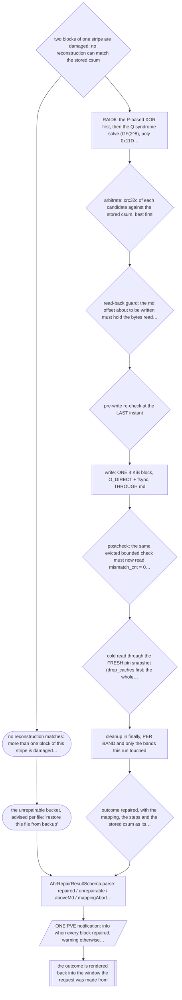
```mermaid
flowchart TD
  X3{"two blocks of one stripe are damaged: no reconstruction can match the stored csum"}
  E08a(["no reconstruction matches: more than one block of this stripe is damaged…"])
  E07r6["RAID6: the P-based XOR first, then the Q syndrome solve (GF(2^8), poly 0x11D…"]
  J40(["the unrepairable bucket, advised per file: 'restore this file from backup'"])
  E08{"arbitrate: crc32c of each candidate against the stored csum, best first"}
  J50["AhrRepairResultSchema.parse: repaired / unrepairable / aboveMd / mappingAbort…"]
  E09{"read-back guard: the md offset about to be written must hold the bytes read…"}
  J51[/"ONE PVE notification: info when every block repaired, warning otherwise…"/]
  E10{"pre-write re-check at the LAST instant"}
  J52[["the outcome is rendered back into the window the request was made from"]]
  E11["write: ONE 4 KiB block, O_DIRECT + fsync, THROUGH md"]
  E12{"postcheck: the same evicted bounded check must now read mismatch_cnt = 0…"}
  E13{"cold read through the FRESH pin snapshot (drop_caches first; the whole…"}
  E14["cleanup in finally, PER BAND and only the bands this run touched"]
  E15{"outcome repaired, with the mapping, the steps and the stored csum as its…"}
  X3 --> E08a
  X3 --> E07r6
  E08a --> J40
  E07r6 --> E08
  J40 --> J50
  E08 --> E09
  J50 --> J51
  E09 --> E10
  J51 --> J52
  E10 --> E11
  E11 --> E12
  E12 --> E13
  E13 --> E14
  E14 --> E15
  E15 --> J50
```

| leaf | kind | what the system does | `code:` | `test:` | `gt:` |
|---|---|---|---|---|---|
| `X3` | decision | two blocks of one stripe are damaged: no reconstruction can match the stored csum | `packages/daemon/src/services/selfheal-repair.ts:reconstruct` | `packages/daemon/src/services/__tests__/selfheal-repair.test.ts:is UNREPAIRABLE when no reconstruction matches the stored csum` | `GT-8` |
| `E08a` | refusal | no reconstruction matches: more than one block of this stripe is damaged, which is the point of arbitrating. Restore from backup. | `packages/daemon/src/services/selfheal-repair.ts:repairBlock` | `packages/daemon/src/services/__tests__/selfheal-repair.test.ts:is UNREPAIRABLE when no reconstruction matches the stored csum` | `GT-8` |
| `E07r6` | action | RAID6: the P-based XOR first, then the Q syndrome solve (GF(2^8), poly 0x11D, g^d over md's stripe order) which never consults P | `packages/daemon/src/services/selfheal-repair.ts:reconstructFromQ` | `packages/daemon/src/services/__tests__/selfheal-repair.test.ts:solves the Q syndrome for the one missing data block` | `GT-15` |
| `J40` | refusal | the `unrepairable` bucket, advised per file: "restore this file from backup" **[restore-from-backup-advice]** | `packages/daemon/src/services/ahr-repair.ts:RESTORE_FILE_SENTENCE` | `packages/daemon/src/services/__tests__/ahr-repair.test.ts:anything unrepairable or above md notifies at warning, in the epic's words` | — |
| `E08` | decision | arbitrate: crc32c of each candidate against the stored csum, best first — the btrfs checksum is what decides, never md | `packages/daemon/src/services/selfheal-csum.ts:crc32c` | `packages/daemon/src/services/__tests__/selfheal-repair.test.ts:reconstructs it, arbitrates against the stored csum and writes it back` | `GT-11` |
| `J50` | action | AhrRepairResultSchema.parse: repaired / unrepairable / aboveMd / mappingAbort / notExamined, always summing to the blocks attempted | `packages/daemon/src/services/ahr-repair.ts:repairAhrFiles` | `packages/daemon/src/services/__tests__/ahr-repair.test.ts:the notification names all five counts, and they add up (review R9, seventh pass F3)` | — |
| `E09` | decision | read-back guard: the md offset about to be written must hold the bytes read from the member (on RAID1, the bytes of SOME leg — md serves a mirror read from either) | `packages/daemon/src/services/selfheal-repair.ts:readBackGuard` | `packages/daemon/src/services/__tests__/selfheal-repair.test.ts:passes when md served the HEALTHY leg (R5: not a failed mapping)` | — |
| `J51` | notification | ONE PVE notification: `info` when every block repaired, `warning` otherwise, with the per-file advice and the file list capped at 20 | `packages/daemon/src/services/ahr-repair.ts:repairBody` | `packages/daemon/src/services/__tests__/ahr-repair.test.ts:everything repaired notifies at info and says so` | — |
| `E10` | decision | pre-write re-check at the LAST instant: `degraded`, `sync_action` and `reshape_position` re-read, because a bounded check over a 20 TB band takes minutes | `packages/daemon/src/services/selfheal-repair.ts:preWriteRefusal` | `packages/daemon/src/services/__tests__/selfheal-repair.test.ts:writes NOTHING when a recovery starts between the precheck and the write` | `GT-19` |
| `J52` | ui | the outcome is rendered back into the window the request was made from — per-file verdicts on their own rows, and the four counts | `packages/pve-integration/src/69-scrubs.js:showRepairResult` | `packages/pve-integration/test/dialog-contracts.harness.mjs:repair: the result appears in the window the request was made from` | — |
| `E11` | action | write: ONE 4 KiB block, O_DIRECT + fsync, THROUGH md — and only after the reconstruction matched the checksum btrfs stored for it **[md-block-write]** | `packages/daemon/src/services/selfheal-repair.ts:repairBlock` | `suite:7-member` | `GT-8` |
| `E12` | decision | postcheck: the same evicted bounded check must now read `mismatch_cnt = 0` AND the same direct member-row computation must agree - the stripe was written through md moments ago, which is exactly the state its check answers from the cache in (GT-23) | `packages/daemon/src/services/selfheal-repair.ts:boundedWindowCheck` | `suite:7-bcheck` | `GT-8` |
| `E13` | decision | cold read through the FRESH pin snapshot (drop_caches first; the whole logical extent when compressed) — a warm page of the live file answers from memory and hides everything | `packages/daemon/src/services/selfheal-repair.ts:coldRead` | `suite:3-cold` | `GT-9` |
| `E14` | action | cleanup in `finally`, PER BAND and only the bands this run touched: rmw_level, then the sync window under the ownership rule, then stripe_cache_size, then destroy the pin | `packages/daemon/src/services/selfheal-repair.ts:restoreSyncKnobs` | `packages/daemon/src/services/__tests__/selfheal-repair.test.ts:restores rmw_level on the band it turned it down on — and leaves the other band alone` | `GT-13` |
| `E15` | decision | outcome `repaired`, with the mapping, the steps and the stored csum as its audit trail | `packages/daemon/src/services/selfheal-repair.ts:repairBlock` | `packages/daemon/src/services/__tests__/selfheal-repair.test.ts:produces an outcome the shared schema accepts` | `GT-8` |

### R4 — rot that arrived THROUGH md (parity agrees with the bad data)

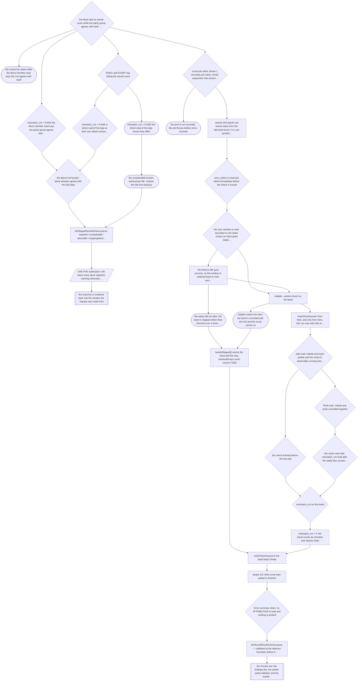
```mermaid
flowchart TD
  X4{"the block fails its stored csum while the parity group agrees with itself -…"}
  E05b{"mismatch_cnt = 0 AND the direct member read says the parity group agrees with…"}
  E05e(["md counts the stripe while the direct member read says the row agrees with itself"])
  E04f{"RAID1 with EVERY leg failing the stored csum"}
  S00{"scrub job starts: phase 1 md parity per band, strictly sequential, then phase…"}
  J43{"the above-md bucket: 'parity already agreed with the bad data"}
  E04f1{"mismatch_cnt = 0 AND a direct read of the legs at their own offsets shows…"}
  E04f2(["mismatch_cnt &gt; 0 AND the direct read of the legs shows they differ"])
  S01(["the pool is not mounted: the job throws before md is touched"])
  S02["resolve this band's md kernel name from the /dev/md/&lt;pool&gt;-r&lt;n&gt; pin symlink…"]
  J50["AhrRepairResultSchema.parse: repaired / unrepairable / aboveMd / mappingAbort…"]
  J40(["the unrepairable bucket, advised per file: 'restore this file from backup'"])
  S04{"sync_action re-read per band immediately before the check is issued"}
  J51[/"ONE PVE notification: info when every block repaired, warning otherwise…"/]
  S06{"the sync window is read: bounded to one stripe means an interrupted repair…"}
  J52[["the outcome is rendered back into the window the request was made from"]]
  S07["the band is idle (just proven), so the window is widened back to md's own…"]
  S08["mdadm --action=check on the band"]
  S07a(["the widen did not take: the band is skipped rather than checked over a sliver…"])
  S09["markCheckIssued: from here, and only from here, this run may write idle to…"]
  S08a(["mdadm exited non-zero: the band is recorded with the exit and the scrub carries on"])
  S30["bandsSkipped[] carries the band and the why; checkedArrays never counts it (D8)"]
  S10{"start-wait: mdstat and sysfs polled until the check is observably running (md…"}
  S31["retireCheckIssued in the band loop's finally"]
  S12{"the check finished before the first poll"}
  S14{"finish-wait: mdstat and sysfs consulted together"}
  S40["phase 2/2: btrfs scrub start polled to finished"]
  S20{"mismatch_cnt on this band"}
  S17{"the check went idle: mismatch_cnt read after the settle (the counter…"}
  S42{"Error summary clean: no ATTRIBUTION is read and nothing is probed"}
  S23["mismatch_cnt = 0: the band counts as checked and reports clean"]
  S60["AhrScrubResultSchema.parse — validated at the daemon boundary before it…"]
  S64[["the Scrubs row: the findings link, the amber parity indicator and the muted…"]]
  X4 --> E05b
  X4 --> E05e
  X4 --> E04f
  X4 --> S00
  E05b --> J43
  E04f --> E04f1
  E04f --> E04f2
  S00 --> S01
  S00 --> S02
  J43 --> J50
  E04f1 --> J43
  E04f2 --> J40
  S02 --> S04
  J50 --> J51
  J40 --> J50
  S04 --> S06
  J51 --> J52
  S06 --> S07
  S06 --> S08
  S07 --> S08
  S07 --> S07a
  S08 --> S09
  S08 --> S08a
  S07a --> S30
  S09 --> S10
  S08a --> S30
  S30 --> S31
  S10 --> S12
  S10 --> S14
  S31 --> S40
  S12 --> S20
  S14 --> S17
  S40 --> S42
  S20 --> S23
  S17 --> S20
  S42 --> S60
  S23 --> S31
  S60 --> S64
```

| leaf | kind | what the system does | `code:` | `test:` | `gt:` |
|---|---|---|---|---|---|
| `X4` | decision | the block fails its stored csum while the parity group agrees with itself - read BOTH ways, md's own bounded check over the stripe and a direct read of every member's row | `packages/daemon/src/services/selfheal-repair.ts:repairBlock` | `packages/daemon/src/services/__tests__/selfheal-repair.test.ts:diagnoses ABOVE MD when parity agrees with the bad data` | `GT-6` |
| `E05b` | decision | mismatch_cnt = 0 AND the direct member read says the parity group agrees with itself, while the block fails its stored csum: `above-md` — parity agrees with the bad data, which implicates something other than the disks. Nothing written. | `packages/daemon/src/services/selfheal-repair.ts:repairBlock` | `packages/daemon/src/services/__tests__/selfheal-repair.test.ts:diagnoses ABOVE MD when parity agrees with the bad data` | `GT-6` |
| `E05e` | refusal | md counts the stripe while the direct member read says the row agrees with itself: `unrepairable`, "md and the direct read disagree about this stripe; nothing written" - and NEVER `above-md`, which md's own count denies. No restore advice: nothing here proves the file unrecoverable | `packages/daemon/src/services/selfheal-repair.ts:parityAgreement` | `packages/daemon/src/services/__tests__/selfheal-repair.test.ts:REFUSES when md counts the stripe and the member rows agree — never above-md` | `GT-23` |
| `E04f` | decision | RAID1 with EVERY leg failing the stored csum: the bounded check is run BEFORE the verdict, because a mirror check compares the legs with each other - md's own answer to "do these legs agree?" | `packages/daemon/src/services/selfheal-repair.ts:repairBlock` | `packages/daemon/src/services/__tests__/selfheal-repair.test.ts:every mirror leg fails the csum (F4)` | `GT-16` |
| `S00` | decision | scrub job starts: phase 1 md parity per band, strictly sequential, then phase 2 btrfs checksums | `packages/daemon/src/services/ahr-scrub.ts:scrubAhrPool` | `packages/daemon/src/services/__tests__/ahr-scrub.test.ts:runs btrfs scrub to completion, THEN per-array checks sequentially` | `GT-5` |
| `J43` | decision | the `above-md` bucket: "parity already agreed with the bad data — this implicates something other than the disks (memory, controller, software)", which stays an implication | `packages/daemon/src/services/ahr-repair.ts:ABOVE_MD_SENTENCE` | `packages/daemon/src/services/__tests__/ahr-repair.test.ts:anything unrepairable or above md notifies at warning, in the epic's words` | `GT-6` |
| `E04f1` | decision | mismatch_cnt = 0 AND a direct read of the legs at their own offsets shows every leg holding the same bytes: the legs AGREE and are both wrong - `above-md`, the same diagnosis a parity band gets from the same fault, in the same words. Parallel construction: one fault, one reading, on both band types | `packages/daemon/src/services/selfheal-repair.ts:repairBlock` | `packages/daemon/src/services/__tests__/selfheal-repair.test.ts:mismatch_cnt 0 — the legs AGREE and are both wrong: ABOVE MD` | `GT-16` |
| `E04f2` | refusal | mismatch_cnt > 0 AND the direct read of the legs shows they differ: the legs disagree with each other and neither matches the stored csum - `unrepairable`, and here a restore IS the only action left | `packages/daemon/src/services/selfheal-repair.ts:repairBlock` | `packages/daemon/src/services/__tests__/selfheal-repair.test.ts:mismatch_cnt > 0 — the legs disagree and neither matches: UNREPAIRABLE` | `GT-16` |
| `S01` | refusal | the pool is not mounted: the job throws before md is touched | `packages/daemon/src/services/ahr-scrub.ts:scrubAhrPool` | `packages/daemon/src/services/__tests__/ahr-scrub.test.ts:refuses an unmounted pool` | — |
| `S02` | action | resolve this band's md kernel name from the /dev/md/<pool>-r<n> pin symlink AT POINT OF USE — md numbers re-enumerate across a reassembly | `packages/daemon/src/services/ahr-scrub.ts:scrubAhrPool` | `packages/daemon/src/services/__tests__/ahr-scrub.test.ts:ignores a STALE route-time array.kernelName` | `GT-2` |
| `J50` | action | AhrRepairResultSchema.parse: repaired / unrepairable / aboveMd / mappingAbort / notExamined, always summing to the blocks attempted | `packages/daemon/src/services/ahr-repair.ts:repairAhrFiles` | `packages/daemon/src/services/__tests__/ahr-repair.test.ts:the notification names all five counts, and they add up (review R9, seventh pass F3)` | — |
| `J40` | refusal | the `unrepairable` bucket, advised per file: "restore this file from backup" **[restore-from-backup-advice]** | `packages/daemon/src/services/ahr-repair.ts:RESTORE_FILE_SENTENCE` | `packages/daemon/src/services/__tests__/ahr-repair.test.ts:anything unrepairable or above md notifies at warning, in the epic's words` | — |
| `S04` | decision | `sync_action` re-read per band immediately before the check is issued | `packages/daemon/src/services/ahr-scrub.ts:syncAction` | `packages/daemon/src/services/__tests__/ahr-scrub.test.ts:does not ISSUE a check on a band md is already recovering` | `GT-19` |
| `J51` | notification | ONE PVE notification: `info` when every block repaired, `warning` otherwise, with the per-file advice and the file list capped at 20 | `packages/daemon/src/services/ahr-repair.ts:repairBody` | `packages/daemon/src/services/__tests__/ahr-repair.test.ts:everything repaired notifies at info and says so` | — |
| `S06` | decision | the sync window is read: bounded to one stripe means an interrupted repair left GT-13's trap on this band | `packages/daemon/src/services/ahr-scrub.ts:restoreSyncWindow` | `packages/daemon/src/services/__tests__/ahr-scrub.test.ts:restores a sync window an interrupted repair left bounded` | `GT-13` |
| `J52` | ui | the outcome is rendered back into the window the request was made from — per-file verdicts on their own rows, and the four counts | `packages/pve-integration/src/69-scrubs.js:showRepairResult` | `packages/pve-integration/test/dialog-contracts.harness.mjs:repair: the result appears in the window the request was made from` | — |
| `S07` | action | the band is idle (just proven), so the window is widened back to md's own 0..max before the check goes in | `packages/daemon/src/services/ahr-scrub.ts:restoreSyncWindow` | `packages/daemon/src/services/__tests__/ahr-scrub.test.ts:restores a sync window an interrupted repair left bounded` | `GT-13` |
| `S08` | action | `mdadm --action=check` on the band — issued without `run`, so one band's refusal is a line, never the job's failure | `packages/daemon/src/services/ahr-scrub.ts:scrubAhrPool` | `packages/daemon/src/services/__tests__/ahr-scrub.test.ts:records a band whose check mdadm refuses` | `GT-5` |
| `S07a` | refusal | the widen did not take: the band is skipped rather than checked over a sliver of itself | `packages/daemon/src/services/ahr-scrub.ts:restoreSyncWindow` | `packages/daemon/src/services/__tests__/ahr-scrub.test.ts:restores a sync window an interrupted repair left bounded` | `GT-13` |
| `S09` | action | markCheckIssued: from here, and only from here, this run may write `idle` to this array | `packages/daemon/src/services/selfheal-syncop.ts:markCheckIssued` | `packages/daemon/src/services/__tests__/ahr-scrub.test.ts:retires every band's issued-check token, so a later FOREIGN check is never ours (N3)` | — |
| `S08a` | refusal | mdadm exited non-zero: the band is recorded with the exit and the scrub carries on | `packages/daemon/src/services/ahr-scrub.ts:scrubAhrPool` | `packages/daemon/src/services/__tests__/ahr-scrub.test.ts:records a band whose check mdadm refuses` | — |
| `S30` | action | `bandsSkipped[]` carries the band and the why; `checkedArrays` never counts it (D8) | `packages/daemon/src/services/ahr-scrub.ts:scrubAhrPool` | `packages/daemon/src/services/__tests__/ahr-scrub.test.ts:a band md never started is recorded, not coverage — checkedArrays stays honest` | — |
| `S10` | decision | start-wait: mdstat and sysfs polled until the check is observably running (md takes the sysfs write asynchronously) | `packages/daemon/src/services/ahr-scrub.ts:scrubAhrPool` | `packages/daemon/src/services/__tests__/ahr-scrub.test.ts:waits for the check to START before waiting for it to finish` | — |
| `S31` | action | retireCheckIssued in the band loop's `finally` — the token never outlives the iteration that took it (N3) | `packages/daemon/src/services/selfheal-syncop.ts:retireCheckIssued` | `packages/daemon/src/services/__tests__/ahr-scrub.test.ts:retires the token on the SKIP paths too — md never started the check (N3)` | — |
| `S12` | decision | the check finished before the first poll — proven ONLY by a `mismatch_cnt` that MOVED, because md zeroes it when a sync op starts | `packages/daemon/src/services/ahr-scrub.ts:mismatchCount` | `packages/daemon/src/services/__tests__/ahr-scrub.test.ts:a check that finished before the first poll is not "never started" — its MOVED counter is the verdict` | — |
| `S14` | decision | finish-wait: mdstat and sysfs consulted together — a `resync=PENDING` check is IN FLIGHT, not finished | `packages/daemon/src/services/ahr-scrub.ts:scrubAhrPool` | `packages/daemon/src/services/__tests__/ahr-scrub.test.ts:treats a resync=PENDING md check as in-flight — waits it out before the next band` | `GT-5` |
| `S40` | action | phase 2/2: `btrfs scrub start` polled to finished — one pass, two callers (the scrub and the parity rewrite) | `packages/daemon/src/services/ahr-scrub.ts:btrfsScrubPass` | `packages/daemon/src/services/__tests__/ahr-scrub.test.ts:runs btrfs scrub to completion, THEN per-array checks sequentially` | `GT-3` |
| `S20` | decision | `mismatch_cnt` on this band | `packages/daemon/src/services/ahr-scrub.ts:mismatchCount` | `packages/daemon/src/services/__tests__/ahr-scrub.test.ts:a genuine fast check whose counter was ZEROED is counted — and reported clean` | `GT-5` |
| `S17` | decision | the check went idle: `mismatch_cnt` read after the settle (the counter finalizes as the sync thread winds down) | `packages/daemon/src/services/ahr-scrub.ts:mismatchCount` | `packages/daemon/src/services/__tests__/ahr-scrub.test.ts:the mismatch counter is read from the sysfs file the 11.17 hook reads` | `GT-18` |
| `S42` | decision | Error summary clean: no ATTRIBUTION is read and nothing is probed — the journal is read once more for the corrected-metadata count alone (selfheal.12), the one rot signal a clean scrub can hold | `packages/daemon/src/services/ahr-scrub.ts:parseBtrfsScrubStatus` | `packages/daemon/src/services/__tests__/ahr-scrub.test.ts:a clean scrub probes nothing, and reads the journal only for the corrected-metadata window` | `GT-3` |
| `S23` | action | mismatch_cnt = 0: the band counts as checked and reports clean | `packages/daemon/src/services/ahr-scrub.ts:scrubAhrPool` | `packages/daemon/src/services/__tests__/ahr-scrub.test.ts:a genuine fast check whose counter was ZEROED is counted — and reported clean` | `GT-5` |
| `S60` | action | AhrScrubResultSchema.parse — validated at the daemon boundary before it leaves as a job result | `packages/daemon/src/services/ahr-scrub.ts:scrubAhrPool` | `packages/daemon/src/services/__tests__/ahr-scrub.test.ts:the new record fields round-trip the shared schema — and stay optional` | — |
| `S64` | ui | the Scrubs row: the findings link, the amber parity indicator and the muted skipped-band count share ONE cell, each with its own tooltip | `packages/pve-integration/src/69-scrubs.js:renderLastScrub` | `packages/pve-integration/test/dialog-contracts.harness.mjs:scrubs: the row says how many files, labelled` | — |

### R5 — metadata rot (csum tree / fs tree) in a DUP copy

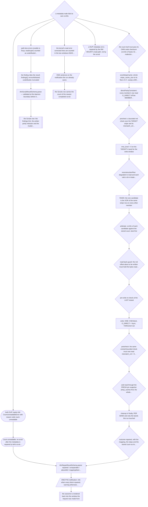
```mermaid
flowchart TD
  X5{"a metadata node fails its own crc32c"}
  E04b{"the csum leaf must pass its OWN node checksum (crc32c of bytes 32…nodesize…"}
  E04c(["both DUP copies fail: CsumUnreadableError with reason code csum-unreadable"])
  S46["path-less errors (unable to fixup, read/super) counted as unattributed…"]
  X5c["the kernel's read error corrected lines are counted in the two windows ANAS…"]
  X5r>"a DUP metadata rot is repaired by the RW MOUNT's read path, not by the scrub"]
  E05a["evictStripeCache: shrink stripe_cache_size to its floor of 17, sweep ±200…"]
  J42(["csum-unreadable: re-scrub after the metadata is repaired (a btrfs scrub…"])
  S50["the finding rides the result: findings[], errorsAttributed, unattributed, truncated"]
  X5n[/"ONE sentence on the notification the run already earns"/]
  E05a2["directParityConsistent: every member's row read O_DIRECT off the MEMBER…"]
  J50["AhrRepairResultSchema.parse: repaired / unrepairable / aboveMd / mappingAbort…"]
  S60["AhrScrubResultSchema.parse — validated at the daemon boundary before it…"]
  X5u[["the Scrubs row carries the count of the newest completed scrub"]]
  E05{"precheck: a bounded md check over the TARGET stripe and its mismatch_cnt…"}
  J51[/"ONE PVE notification: info when every block repaired, warning otherwise…"/]
  S64[["the Scrubs row: the findings link, the amber parity indicator and the muted…"]]
  E06["rmw_level = 0 on the TARGET's band for the write window"]
  J52[["the outcome is rendered back into the window the request was made from"]]
  E07{"reconstructionPlan: degraded re-read and each role's rd&lt;n&gt;/state…"}
  E07r5["RAID5: the one candidate is the XOR of the same stripe row on every other member"]
  E08{"arbitrate: crc32c of each candidate against the stored csum, best first"}
  E09{"read-back guard: the md offset about to be written must hold the bytes read…"}
  E10{"pre-write re-check at the LAST instant"}
  E11["write: ONE 4 KiB block, O_DIRECT + fsync, THROUGH md"]
  E12{"postcheck: the same evicted bounded check must now read mismatch_cnt = 0…"}
  E13{"cold read through the FRESH pin snapshot (drop_caches first; the whole…"}
  E14["cleanup in finally, PER BAND and only the bands this run touched"]
  E15{"outcome repaired, with the mapping, the steps and the stored csum as its…"}
  X5 --> E04b
  X5 --> E04c
  X5 --> S46
  X5 --> X5c
  X5 --> X5r
  E04b --> E05a
  E04c --> J42
  S46 --> S50
  X5c --> X5n
  E05a --> E05a2
  J42 --> J50
  S50 --> S60
  X5n --> X5u
  E05a2 --> E05
  J50 --> J51
  S60 --> S64
  E05 --> E06
  J51 --> J52
  E06 --> E07
  E07 --> E07r5
  E07r5 --> E08
  E08 --> E09
  E09 --> E10
  E10 --> E11
  E11 --> E12
  E12 --> E13
  E13 --> E14
  E14 --> E15
  E15 --> J50
```

| leaf | kind | what the system does | `code:` | `test:` | `gt:` |
|---|---|---|---|---|---|
| `X5` | decision | a metadata node fails its own crc32c — the csum tree leaf that would arbitrate the data block is itself rotten | `packages/daemon/src/services/selfheal-csum.ts:verifyNode` | `packages/daemon/src/services/__tests__/selfheal-csum.test.ts:refuses one flipped byte anywhere past the header csum` | `GT-20` |
| `E04b` | decision | the csum leaf must pass its OWN node checksum (crc32c of bytes 32…nodesize, and its own bytenr): a failed copy 0 falls back to the DUP chunk's second copy | `packages/daemon/src/services/selfheal-csum.ts:readStoredCsum` | `packages/daemon/src/services/__tests__/selfheal-csum.test.ts:falls back to the DUP chunk's SECOND copy when the first has rotted` | `GT-20` |
| `E04c` | refusal | both DUP copies fail: CsumUnreadableError with reason code `csum-unreadable` — nothing is known about the data block, and the words "restore from backup" are deliberately absent | `packages/daemon/src/services/selfheal-csum.ts:CsumUnreadableError` | `packages/daemon/src/services/__tests__/selfheal-csum.test.ts:REFUSES a csum leaf that fails its own node checksum, on both DUP copies` | `GT-20` |
| `S46` | action | path-less errors (`unable to fixup`, read/super) counted as `unattributed`, deduped against the logicals already attributed | `packages/daemon/src/services/ahr-scrub.ts:parseUnattributedScrubError` | `packages/daemon/src/services/__tests__/ahr-scrub.test.ts:errors with no path are counted unattributed — and never counted twice` | `GT-3` |
| `X5c` | action | the kernel's `read error corrected` lines are counted in the two windows ANAS already reads (selfheal.12 — never a watcher): the scrub's journal window and a repair job's own window, both filtered to the pool's dm device, and the count plus the member devices ride the result as `metadataCorrected {count, devices}` | `packages/daemon/src/services/ahr-scrub.ts:readCorrectedReads` | `packages/daemon/src/services/__tests__/ahr-scrub.test.ts:a clean scrub that corrected metadata says so — result and notification` | `GT-20` |
| `X5r` | residual | a DUP metadata rot is repaired by the RW MOUNT's read path, not by the scrub: `btrfs scrub` reports 0 corrected, and the only durable evidence is a one-time kernel `read error corrected` line — which is exactly what ANAS now counts in the windows it already reads (selfheal.12), so the residual is the SENTENCE, not silence | — | — | `GT-20` |
| `E05a` | action | evictStripeCache: shrink `stripe_cache_size` to its floor of 17, sweep ±200 stripes while it is small, restore — without it a check over a recently touched stripe reads the CACHE and reports 0 over junk. On kernel 7.0.14-17 it no longer reaches a stripe written MOMENTS ago (GT-23), which is why the verdict no longer rests on its number alone | `packages/daemon/src/services/selfheal-repair.ts:memberDataSectors` | `packages/daemon/src/services/__tests__/selfheal-repair.test.ts:sweeps the stripes around a target near the END of the array` | `GT-14` |
| `J42` | refusal | `csum-unreadable`: re-scrub after the metadata is repaired (a btrfs scrub repairs metadata copies), and explicitly do NOT restore | `packages/daemon/src/services/ahr-repair.ts:CSUM_UNREADABLE_SENTENCE` | `packages/daemon/src/services/__tests__/ahr-repair.test.ts:a csum-unreadable unrepairable block is told to re-scrub, not restore (D10)` | `GT-20` |
| `S50` | action | the finding rides the result: findings[], errorsAttributed, unattributed, truncated | `packages/daemon/src/services/ahr-scrub.ts:attributeScrub` | `packages/daemon/src/services/__tests__/ahr-scrub.test.ts:round-trips a full finding through JSON unchanged` | — |
| `X5n` | notification | ONE sentence on the notification the run already earns: "btrfs corrected N metadata read(s) from the mirror copy during this run. A member is returning bad metadata. Check that disk's SMART data in Disks." — and a CLEAN scrub whose only signal is this count earns its own warning, because the summary says nothing (GT-20) | `packages/daemon/src/services/ahr-scrub.ts:metadataCorrectedSentence` | `packages/daemon/src/services/__tests__/ahr-scrub.test.ts:the sentence rides the EXISTING notification when the scrub already found errors` | `GT-20` |
| `E05a2` | action | directParityConsistent: every member's row read O_DIRECT off the MEMBER devices at its own data offset and the parity group recomputed - XOR of the data rows against P, the Q syndrome against Q on RAID6, the legs against each other on RAID1. md's cache takes no part in it, which is the whole point (GT-23) | `packages/daemon/src/services/selfheal-repair.ts:directParityConsistent` | `packages/daemon/src/services/__tests__/selfheal-repair.test.ts:diagnoses ABOVE MD when P and Q both agree with the bad data` | `GT-23` |
| `J50` | action | AhrRepairResultSchema.parse: repaired / unrepairable / aboveMd / mappingAbort / notExamined, always summing to the blocks attempted | `packages/daemon/src/services/ahr-repair.ts:repairAhrFiles` | `packages/daemon/src/services/__tests__/ahr-repair.test.ts:the notification names all five counts, and they add up (review R9, seventh pass F3)` | — |
| `S60` | action | AhrScrubResultSchema.parse — validated at the daemon boundary before it leaves as a job result | `packages/daemon/src/services/ahr-scrub.ts:scrubAhrPool` | `packages/daemon/src/services/__tests__/ahr-scrub.test.ts:the new record fields round-trip the shared schema — and stay optional` | — |
| `X5u` | ui | the Scrubs row carries the count of the newest completed scrub — amber, labelled, with what happened / what it means / what to check as the tooltip — so a clean scrub never reads as a clean bill | `packages/pve-integration/src/69-scrubs.js:correctedFor` | `packages/pve-integration/test/dialog-contracts.harness.mjs:scrubs: a corrected-metadata count shows on the row, labelled` | — |
| `E05` | decision | precheck: a bounded md `check` over the TARGET stripe and its `mismatch_cnt`, weighed against the direct member-row computation - parityAgreement names the pair, and the verdict needs both | `packages/daemon/src/services/selfheal-repair.ts:parityAgreement` | `packages/daemon/src/services/__tests__/selfheal-repair.test.ts:names each of the four combinations` | `GT-5` |
| `J51` | notification | ONE PVE notification: `info` when every block repaired, `warning` otherwise, with the per-file advice and the file list capped at 20 | `packages/daemon/src/services/ahr-repair.ts:repairBody` | `packages/daemon/src/services/__tests__/ahr-repair.test.ts:everything repaired notifies at info and says so` | — |
| `S64` | ui | the Scrubs row: the findings link, the amber parity indicator and the muted skipped-band count share ONE cell, each with its own tooltip | `packages/pve-integration/src/69-scrubs.js:renderLastScrub` | `packages/pve-integration/test/dialog-contracts.harness.mjs:scrubs: the row says how many files, labelled` | — |
| `E06` | action | `rmw_level = 0` on the TARGET's band for the write window — at the default, a correct block written through md updates parity against the JUNK (GT-7) | `packages/daemon/src/services/selfheal-repair.ts:repairBlock` | `packages/daemon/src/services/__tests__/selfheal-repair.test.ts:sets rmw_level to 0 BEFORE the write — the GT-7 poison is the default` | `GT-7` |
| `J52` | ui | the outcome is rendered back into the window the request was made from — per-file verdicts on their own rows, and the four counts | `packages/pve-integration/src/69-scrubs.js:showRepairResult` | `packages/pve-integration/test/dialog-contracts.harness.mjs:repair: the result appears in the window the request was made from` | — |
| `E07` | decision | reconstructionPlan: `degraded` re-read and each role's `rd<n>/state` consulted, so a member md KICKED since the gates is never read for its stale bytes | `packages/daemon/src/services/selfheal-repair.ts:reconstructionPlan` | `packages/daemon/src/services/__tests__/selfheal-repair.test.ts:keeps the syndrome that does not need the kicked member, and only that one` | — |
| `E07r5` | action | RAID5: the one candidate is the XOR of the same stripe row on every other member | `packages/daemon/src/services/selfheal-repair.ts:reconstruct` | `suite:2-neg` | `GT-8` |
| `E08` | decision | arbitrate: crc32c of each candidate against the stored csum, best first — the btrfs checksum is what decides, never md | `packages/daemon/src/services/selfheal-csum.ts:crc32c` | `packages/daemon/src/services/__tests__/selfheal-repair.test.ts:reconstructs it, arbitrates against the stored csum and writes it back` | `GT-11` |
| `E09` | decision | read-back guard: the md offset about to be written must hold the bytes read from the member (on RAID1, the bytes of SOME leg — md serves a mirror read from either) | `packages/daemon/src/services/selfheal-repair.ts:readBackGuard` | `packages/daemon/src/services/__tests__/selfheal-repair.test.ts:passes when md served the HEALTHY leg (R5: not a failed mapping)` | — |
| `E10` | decision | pre-write re-check at the LAST instant: `degraded`, `sync_action` and `reshape_position` re-read, because a bounded check over a 20 TB band takes minutes | `packages/daemon/src/services/selfheal-repair.ts:preWriteRefusal` | `packages/daemon/src/services/__tests__/selfheal-repair.test.ts:writes NOTHING when a recovery starts between the precheck and the write` | `GT-19` |
| `E11` | action | write: ONE 4 KiB block, O_DIRECT + fsync, THROUGH md — and only after the reconstruction matched the checksum btrfs stored for it **[md-block-write]** | `packages/daemon/src/services/selfheal-repair.ts:repairBlock` | `suite:7-member` | `GT-8` |
| `E12` | decision | postcheck: the same evicted bounded check must now read `mismatch_cnt = 0` AND the same direct member-row computation must agree - the stripe was written through md moments ago, which is exactly the state its check answers from the cache in (GT-23) | `packages/daemon/src/services/selfheal-repair.ts:boundedWindowCheck` | `suite:7-bcheck` | `GT-8` |
| `E13` | decision | cold read through the FRESH pin snapshot (drop_caches first; the whole logical extent when compressed) — a warm page of the live file answers from memory and hides everything | `packages/daemon/src/services/selfheal-repair.ts:coldRead` | `suite:3-cold` | `GT-9` |
| `E14` | action | cleanup in `finally`, PER BAND and only the bands this run touched: rmw_level, then the sync window under the ownership rule, then stripe_cache_size, then destroy the pin | `packages/daemon/src/services/selfheal-repair.ts:restoreSyncKnobs` | `packages/daemon/src/services/__tests__/selfheal-repair.test.ts:restores rmw_level on the band it turned it down on — and leaves the other band alone` | `GT-13` |
| `E15` | decision | outcome `repaired`, with the mapping, the steps and the stored csum as its audit trail | `packages/daemon/src/services/selfheal-repair.ts:repairBlock` | `packages/daemon/src/services/__tests__/selfheal-repair.test.ts:produces an outcome the shared schema accepts` | `GT-8` |

### R6 — compressed-extent rot


```mermaid
flowchart TD
  X6{"one corrupt on-disk sector of a zstd blob takes out the whole 128 KiB logical extent"}
  S54["a COMPRESSED extent: drop the page cache first (btrfs falls back to buffered…"]
  E04e(["more than one on-disk sector of one repair unit fails its csum"])
  E13b(["the repaired region still reads back with an error through the snapshot"])
  E00{"repairBlock: the file must resolve under the mountpoint (the engine's own…"}
  S50["the finding rides the result: findings[], errorsAttributed, unattributed, truncated"]
  J40(["the unrepairable bucket, advised per file: 'restore this file from backup'"])
  E01{"gates: EVERY band of the pool, because which band the block is on is not…"}
  S60["AhrScrubResultSchema.parse — validated at the daemon boundary before it…"]
  J50["AhrRepairResultSchema.parse: repaired / unrepairable / aboveMd / mappingAbort…"]
  E02["pin: sweep this engine's OWN anas-selfheal-* prefix first, then take a…"]
  S64[["the Scrubs row: the findings link, the amber parity indicator and the muted…"]]
  J51[/"ONE PVE notification: info when every block repaired, warning otherwise…"/]
  E02a["§12 pool: createAhrSnapshot into @snapshots/anas-selfheal-&lt;ts&gt;, read cold…"]
  E02b["a file inside a NESTED subvolume is pinned by snapshotting THAT subvolume"]
  E02c["a flat pool (and the suite's loop rigs) has no @snapshots"]
  J52[["the outcome is rendered back into the window the request was made from"]]
  E03{"resolve, AFTER the pin: file block → EXTENT_DATA → the COVERING chunk's own…"}
  E04{"reverify: re-read the bytes AT the computed member location and require they…"}
  E05a["evictStripeCache: shrink stripe_cache_size to its floor of 17, sweep ±200…"]
  E05a2["directParityConsistent: every member's row read O_DIRECT off the MEMBER…"]
  E05{"precheck: a bounded md check over the TARGET stripe and its mismatch_cnt…"}
  E06["rmw_level = 0 on the TARGET's band for the write window"]
  E07{"reconstructionPlan: degraded re-read and each role's rd&lt;n&gt;/state…"}
  E07r5["RAID5: the one candidate is the XOR of the same stripe row on every other member"]
  E08{"arbitrate: crc32c of each candidate against the stored csum, best first"}
  E09{"read-back guard: the md offset about to be written must hold the bytes read…"}
  E10{"pre-write re-check at the LAST instant"}
  E11["write: ONE 4 KiB block, O_DIRECT + fsync, THROUGH md"]
  E12{"postcheck: the same evicted bounded check must now read mismatch_cnt = 0…"}
  E13{"cold read through the FRESH pin snapshot (drop_caches first; the whole…"}
  E14["cleanup in finally, PER BAND and only the bands this run touched"]
  E15{"outcome repaired, with the mapping, the steps and the stored csum as its…"}
  X6 --> S54
  X6 --> E04e
  X6 --> E13b
  X6 --> E00
  S54 --> S50
  E04e --> J40
  E13b --> J40
  E00 --> E01
  S50 --> S60
  J40 --> J50
  E01 --> E02
  S60 --> S64
  J50 --> J51
  E02 --> E02a
  E02 --> E02b
  E02 --> E02c
  J51 --> J52
  E02a --> E03
  E02b --> E03
  E02c --> E03
  E03 --> E04
  E04 --> E05a
  E05a --> E05a2
  E05a2 --> E05
  E05 --> E06
  E06 --> E07
  E07 --> E07r5
  E07r5 --> E08
  E08 --> E09
  E09 --> E10
  E10 --> E11
  E11 --> E12
  E12 --> E13
  E13 --> E14
  E14 --> E15
  E15 --> J50
```

| leaf | kind | what the system does | `code:` | `test:` | `gt:` |
|---|---|---|---|---|---|
| `X6` | decision | one corrupt on-disk sector of a zstd blob takes out the whole 128 KiB logical extent | `packages/daemon/src/services/selfheal-map.ts:repairUnitFor` | `packages/daemon/src/services/__tests__/selfheal-map.test.ts:the repair unit is the block when uncompressed and the whole blob when not` | `GT-9` |
| `S54` | action | a COMPRESSED extent: drop the page cache first (btrfs falls back to buffered I/O on compressed data) and probe the extent's REAL file range whole | `packages/daemon/src/services/ahr-scrub.ts:probeStripeExtents` | `packages/daemon/src/services/__tests__/ahr-scrub.test.ts:drops the page cache BEFORE a compressed extent's probe reads (D9)` | `GT-9` |
| `E04e` | refusal | more than one on-disk sector of one repair unit fails its csum: this cut reconstructs one sector at a time | `packages/daemon/src/services/selfheal-repair.ts:reverify` | — | `GT-9` |
| `E13b` | refusal | the repaired region still reads back with an error through the snapshot | `packages/daemon/src/services/selfheal-repair.ts:coldRead` | `packages/daemon/src/services/__tests__/selfheal-repair.test.ts:still fails UNREPAIRABLE when the written block does not read back clean either` | `GT-9` |
| `E00` | decision | repairBlock: the file must resolve under the mountpoint (the engine's own lexical check, on top of the route's realpath + findmnt) | `packages/daemon/src/services/selfheal-repair.ts:repairBlock` | `packages/daemon/src/services/__tests__/selfheal-repair.test.ts:refuses a file outside the mountpoint before doing anything at all` | — |
| `S50` | action | the finding rides the result: findings[], errorsAttributed, unattributed, truncated | `packages/daemon/src/services/ahr-scrub.ts:attributeScrub` | `packages/daemon/src/services/__tests__/ahr-scrub.test.ts:round-trips a full finding through JSON unchanged` | — |
| `J40` | refusal | the `unrepairable` bucket, advised per file: "restore this file from backup" **[restore-from-backup-advice]** | `packages/daemon/src/services/ahr-repair.ts:RESTORE_FILE_SENTENCE` | `packages/daemon/src/services/__tests__/ahr-repair.test.ts:anything unrepairable or above md notifies at warning, in the epic's words` | — |
| `E01` | decision | gates: EVERY band of the pool, because which band the block is on is not known until it has been pinned and resolved | `packages/daemon/src/services/selfheal-repair.ts:arrayRefusal` | `packages/daemon/src/services/__tests__/selfheal-repair.test.ts:REFUSES while md is busy, reshaping, or the array is not writable` | `GT-17` |
| `S60` | action | AhrScrubResultSchema.parse — validated at the daemon boundary before it leaves as a job result | `packages/daemon/src/services/ahr-scrub.ts:scrubAhrPool` | `packages/daemon/src/services/__tests__/ahr-scrub.test.ts:the new record fields round-trip the shared schema — and stay optional` | — |
| `J50` | action | AhrRepairResultSchema.parse: repaired / unrepairable / aboveMd / mappingAbort / notExamined, always summing to the blocks attempted | `packages/daemon/src/services/ahr-repair.ts:repairAhrFiles` | `packages/daemon/src/services/__tests__/ahr-repair.test.ts:the notification names all five counts, and they add up (review R9, seventh pass F3)` | — |
| `E02` | action | pin: sweep this engine's OWN `anas-selfheal-*` prefix first, then take a read-only snapshot — the same AHR snapshot verbs a backup uses | `packages/daemon/src/services/selfheal-repair.ts:sweepSelfhealPins` | `packages/daemon/src/services/__tests__/selfheal-repair.test.ts:sweeps a crashed earlier run's snapshot before taking its own` | — |
| `S64` | ui | the Scrubs row: the findings link, the amber parity indicator and the muted skipped-band count share ONE cell, each with its own tooltip | `packages/pve-integration/src/69-scrubs.js:renderLastScrub` | `packages/pve-integration/test/dialog-contracts.harness.mjs:scrubs: the row says how many files, labelled` | — |
| `J51` | notification | ONE PVE notification: `info` when every block repaired, `warning` otherwise, with the per-file advice and the file list capped at 20 | `packages/daemon/src/services/ahr-repair.ts:repairBody` | `packages/daemon/src/services/__tests__/ahr-repair.test.ts:everything repaired notifies at info and says so` | — |
| `E02a` | action | §12 pool: createAhrSnapshot into `@snapshots/anas-selfheal-<ts>`, read cold through withTopLevelMount | `packages/daemon/src/services/selfheal-repair.ts:takePin` | `packages/daemon/src/services/__tests__/selfheal-repair.test.ts:snapshots @data into @snapshots and cold-reads through the top-level mount` | — |
| `E02b` | action | a file inside a NESTED subvolume is pinned by snapshotting THAT subvolume — a read-only snapshot does not recurse | `packages/daemon/src/services/selfheal-repair.ts:nestedSubvolumeOf` | `packages/daemon/src/services/__tests__/selfheal-repair.test.ts:pins the NESTED subvolume a file lives in, not @data (a ro snapshot does not recurse)` | — |
| `E02c` | action | a flat pool (and the suite's loop rigs) has no `@snapshots`: the pin is an in-place read-only snapshot inside the mountpoint | `packages/daemon/src/services/selfheal-repair.ts:takePin` | `packages/daemon/src/services/__tests__/selfheal-repair.test.ts:falls back to an in-place snapshot for a FLAT pool — which the suite's rigs are` | — |
| `J52` | ui | the outcome is rendered back into the window the request was made from — per-file verdicts on their own rows, and the four counts | `packages/pve-integration/src/69-scrubs.js:showRepairResult` | `packages/pve-integration/test/dialog-contracts.harness.mjs:repair: the result appears in the window the request was made from` | — |
| `E03` | decision | resolve, AFTER the pin: file block → EXTENT_DATA → the COVERING chunk's own delta → the dm linear segment → member and offset from md geometry read live | `packages/daemon/src/services/selfheal-map.ts:resolveBlock` | `packages/daemon/src/services/__tests__/selfheal-map.test.ts:derives the block's repair unit and its logical byte from the tree, not from filefrag` | `GT-2` |
| `E04` | decision | reverify: re-read the bytes AT the computed member location and require they FAIL the currently stored csum | `packages/daemon/src/services/selfheal-repair.ts:reverify` | `packages/daemon/src/services/__tests__/selfheal-repair.test.ts:ABORTS when the bytes at the computed location still pass their csum` | `GT-11` |
| `E05a` | action | evictStripeCache: shrink `stripe_cache_size` to its floor of 17, sweep ±200 stripes while it is small, restore — without it a check over a recently touched stripe reads the CACHE and reports 0 over junk. On kernel 7.0.14-17 it no longer reaches a stripe written MOMENTS ago (GT-23), which is why the verdict no longer rests on its number alone | `packages/daemon/src/services/selfheal-repair.ts:memberDataSectors` | `packages/daemon/src/services/__tests__/selfheal-repair.test.ts:sweeps the stripes around a target near the END of the array` | `GT-14` |
| `E05a2` | action | directParityConsistent: every member's row read O_DIRECT off the MEMBER devices at its own data offset and the parity group recomputed - XOR of the data rows against P, the Q syndrome against Q on RAID6, the legs against each other on RAID1. md's cache takes no part in it, which is the whole point (GT-23) | `packages/daemon/src/services/selfheal-repair.ts:directParityConsistent` | `packages/daemon/src/services/__tests__/selfheal-repair.test.ts:diagnoses ABOVE MD when P and Q both agree with the bad data` | `GT-23` |
| `E05` | decision | precheck: a bounded md `check` over the TARGET stripe and its `mismatch_cnt`, weighed against the direct member-row computation - parityAgreement names the pair, and the verdict needs both | `packages/daemon/src/services/selfheal-repair.ts:parityAgreement` | `packages/daemon/src/services/__tests__/selfheal-repair.test.ts:names each of the four combinations` | `GT-5` |
| `E06` | action | `rmw_level = 0` on the TARGET's band for the write window — at the default, a correct block written through md updates parity against the JUNK (GT-7) | `packages/daemon/src/services/selfheal-repair.ts:repairBlock` | `packages/daemon/src/services/__tests__/selfheal-repair.test.ts:sets rmw_level to 0 BEFORE the write — the GT-7 poison is the default` | `GT-7` |
| `E07` | decision | reconstructionPlan: `degraded` re-read and each role's `rd<n>/state` consulted, so a member md KICKED since the gates is never read for its stale bytes | `packages/daemon/src/services/selfheal-repair.ts:reconstructionPlan` | `packages/daemon/src/services/__tests__/selfheal-repair.test.ts:keeps the syndrome that does not need the kicked member, and only that one` | — |
| `E07r5` | action | RAID5: the one candidate is the XOR of the same stripe row on every other member | `packages/daemon/src/services/selfheal-repair.ts:reconstruct` | `suite:2-neg` | `GT-8` |
| `E08` | decision | arbitrate: crc32c of each candidate against the stored csum, best first — the btrfs checksum is what decides, never md | `packages/daemon/src/services/selfheal-csum.ts:crc32c` | `packages/daemon/src/services/__tests__/selfheal-repair.test.ts:reconstructs it, arbitrates against the stored csum and writes it back` | `GT-11` |
| `E09` | decision | read-back guard: the md offset about to be written must hold the bytes read from the member (on RAID1, the bytes of SOME leg — md serves a mirror read from either) | `packages/daemon/src/services/selfheal-repair.ts:readBackGuard` | `packages/daemon/src/services/__tests__/selfheal-repair.test.ts:passes when md served the HEALTHY leg (R5: not a failed mapping)` | — |
| `E10` | decision | pre-write re-check at the LAST instant: `degraded`, `sync_action` and `reshape_position` re-read, because a bounded check over a 20 TB band takes minutes | `packages/daemon/src/services/selfheal-repair.ts:preWriteRefusal` | `packages/daemon/src/services/__tests__/selfheal-repair.test.ts:writes NOTHING when a recovery starts between the precheck and the write` | `GT-19` |
| `E11` | action | write: ONE 4 KiB block, O_DIRECT + fsync, THROUGH md — and only after the reconstruction matched the checksum btrfs stored for it **[md-block-write]** | `packages/daemon/src/services/selfheal-repair.ts:repairBlock` | `suite:7-member` | `GT-8` |
| `E12` | decision | postcheck: the same evicted bounded check must now read `mismatch_cnt = 0` AND the same direct member-row computation must agree - the stripe was written through md moments ago, which is exactly the state its check answers from the cache in (GT-23) | `packages/daemon/src/services/selfheal-repair.ts:boundedWindowCheck` | `suite:7-bcheck` | `GT-8` |
| `E13` | decision | cold read through the FRESH pin snapshot (drop_caches first; the whole logical extent when compressed) — a warm page of the live file answers from memory and hides everything | `packages/daemon/src/services/selfheal-repair.ts:coldRead` | `suite:3-cold` | `GT-9` |
| `E14` | action | cleanup in `finally`, PER BAND and only the bands this run touched: rmw_level, then the sync window under the ownership rule, then stripe_cache_size, then destroy the pin | `packages/daemon/src/services/selfheal-repair.ts:restoreSyncKnobs` | `packages/daemon/src/services/__tests__/selfheal-repair.test.ts:restores rmw_level on the band it turned it down on — and leaves the other band alone` | `GT-13` |
| `E15` | decision | outcome `repaired`, with the mapping, the steps and the stored csum as its audit trail | `packages/daemon/src/services/selfheal-repair.ts:repairBlock` | `packages/daemon/src/services/__tests__/selfheal-repair.test.ts:produces an outcome the shared schema accepts` | `GT-8` |

### R7 — rot in a file without checksums (NOCOW / prealloc / nodatasum)

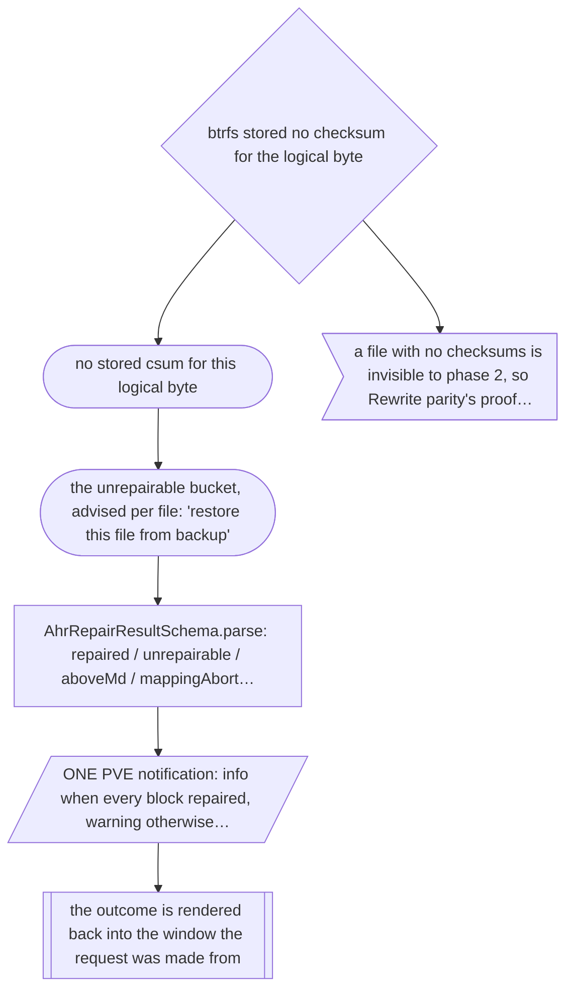
```mermaid
flowchart TD
  X7{"btrfs stored no checksum for the logical byte"}
  E04a(["no stored csum for this logical byte"])
  X7r>"a file with no checksums is invisible to phase 2, so Rewrite parity's proof…"]
  J40(["the unrepairable bucket, advised per file: 'restore this file from backup'"])
  J50["AhrRepairResultSchema.parse: repaired / unrepairable / aboveMd / mappingAbort…"]
  J51[/"ONE PVE notification: info when every block repaired, warning otherwise…"/]
  J52[["the outcome is rendered back into the window the request was made from"]]
  X7 --> E04a
  X7 --> X7r
  E04a --> J40
  J40 --> J50
  J50 --> J51
  J51 --> J52
```

| leaf | kind | what the system does | `code:` | `test:` | `gt:` |
|---|---|---|---|---|---|
| `X7` | decision | btrfs stored no checksum for the logical byte — a NOCOW file, a prealloc extent, or nodatasum | `packages/daemon/src/services/selfheal-csum.ts:findStoredCsumEntry` | `packages/daemon/src/services/__tests__/selfheal-csum.test.ts:reports NO stored csum rather than the nearest one (NOCOW / prealloc)` | — |
| `E04a` | refusal | no stored csum for this logical byte: there is nothing to arbitrate a reconstruction against | `packages/daemon/src/services/selfheal-csum.ts:findStoredCsumEntry` | `packages/daemon/src/services/__tests__/selfheal-csum.test.ts:reports NO stored csum rather than the nearest one (NOCOW / prealloc)` | — |
| `X7r` | residual | a file with no checksums is invisible to phase 2, so Rewrite parity's proof ("phase 2 clean") says nothing about it — the confirm gate states that ANAS creates no such file and cannot see into one it did not create | `packages/daemon/src/services/ahr-parity-rewrite.ts:parityRewriteWarnings` | `packages/daemon/src/services/__tests__/ahr-parity-rewrite.test.ts:names what parity is recomputed from, the scrub that runs first, NOCOW, and the estimate` | — |
| `J40` | refusal | the `unrepairable` bucket, advised per file: "restore this file from backup" **[restore-from-backup-advice]** | `packages/daemon/src/services/ahr-repair.ts:RESTORE_FILE_SENTENCE` | `packages/daemon/src/services/__tests__/ahr-repair.test.ts:anything unrepairable or above md notifies at warning, in the epic's words` | — |
| `J50` | action | AhrRepairResultSchema.parse: repaired / unrepairable / aboveMd / mappingAbort / notExamined, always summing to the blocks attempted | `packages/daemon/src/services/ahr-repair.ts:repairAhrFiles` | `packages/daemon/src/services/__tests__/ahr-repair.test.ts:the notification names all five counts, and they add up (review R9, seventh pass F3)` | — |
| `J51` | notification | ONE PVE notification: `info` when every block repaired, `warning` otherwise, with the per-file advice and the file list capped at 20 | `packages/daemon/src/services/ahr-repair.ts:repairBody` | `packages/daemon/src/services/__tests__/ahr-repair.test.ts:everything repaired notifies at info and says so` | — |
| `J52` | ui | the outcome is rendered back into the window the request was made from — per-file verdicts on their own rows, and the four counts | `packages/pve-integration/src/69-scrubs.js:showRepairResult` | `packages/pve-integration/test/dialog-contracts.harness.mjs:repair: the result appears in the window the request was made from` | — |

### R8 — rot in an extent referenced only by a snapshot (outsideMount)

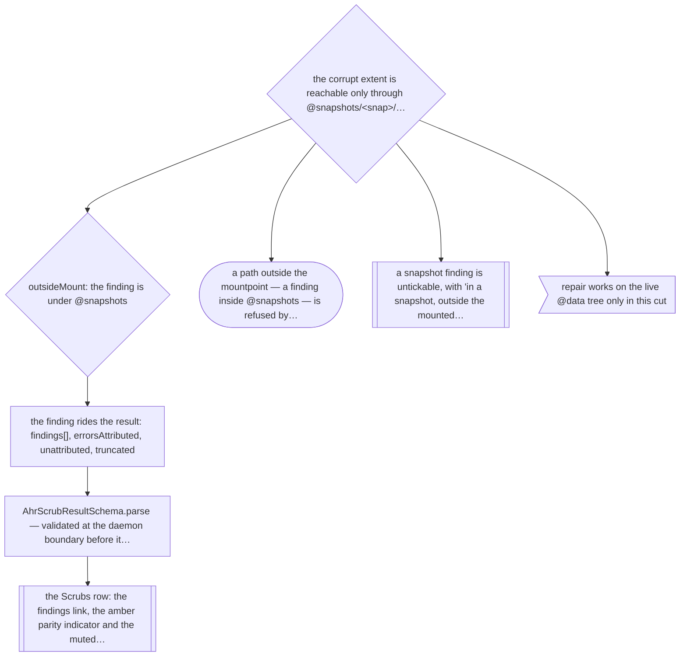
```mermaid
flowchart TD
  X8{"the corrupt extent is reachable only through @snapshots/&lt;snap&gt;/…"}
  S49{"outsideMount: the finding is under @snapshots"}
  RT06b(["a path outside the mountpoint — a finding inside @snapshots — is refused by…"])
  U06[["a snapshot finding is untickable, with 'in a snapshot, outside the mounted…"]]
  X8r>"repair works on the live @data tree only in this cut"]
  S50["the finding rides the result: findings[], errorsAttributed, unattributed, truncated"]
  S60["AhrScrubResultSchema.parse — validated at the daemon boundary before it…"]
  S64[["the Scrubs row: the findings link, the amber parity indicator and the muted…"]]
  X8 --> S49
  X8 --> RT06b
  X8 --> U06
  X8 --> X8r
  S49 --> S50
  S50 --> S60
  S60 --> S64
```

| leaf | kind | what the system does | `code:` | `test:` | `gt:` |
|---|---|---|---|---|---|
| `X8` | decision | the corrupt extent is reachable only through `@snapshots/<snap>/…` — real, expected, and outside the mounted tree | `packages/daemon/src/services/ahr-scrub.ts:findingPath` | `packages/daemon/src/services/__tests__/ahr-scrub.test.ts:a NESTED subvolume keeps its remainder, and a SNAPSHOT is reported outside the mount` | — |
| `S49` | decision | `outsideMount`: the finding is under `@snapshots` — reported filesystem-relative and NEVER probed at a path that is not it | `packages/daemon/src/services/ahr-scrub.ts:findingPath` | `packages/daemon/src/services/__tests__/ahr-scrub.test.ts:§12 layout: a snapshot is OUTSIDE the mounted tree — filesystem-relative, flagged` | — |
| `RT06b` | refusal | a path outside the mountpoint — a finding inside `@snapshots` — is refused by name, never quietly skipped | `packages/daemon/src/routes/ahr-mutate.ts:ahrMutationRoutes` | `packages/daemon/src/routes/__tests__/ahr-repair.test.ts:400 for a path outside the pool's mountpoint — repair is the live @data tree only` | — |
| `U06` | ui | a snapshot finding is untickable, with "in a snapshot, outside the mounted tree" in its own Repair column | `packages/pve-integration/src/69-scrubs.js:repairBlockedReason` | `packages/pve-integration/test/dialog-contracts.harness.mjs:repair: a finding inside a SNAPSHOT cannot be ticked` | — |
| `X8r` | residual | repair works on the live @data tree only in this cut: an `outsideMount` finding has no verb at all, and the rollback confirm is the only place its consequence is stated | `packages/pve-integration/src/69-scrubs.js:repairBlockedReason` | `packages/pve-integration/test/dialog-contracts.harness.mjs:snaps8: the confirm warns of the unrepaired finding inside THIS snapshot` | — |
| `S50` | action | the finding rides the result: findings[], errorsAttributed, unattributed, truncated | `packages/daemon/src/services/ahr-scrub.ts:attributeScrub` | `packages/daemon/src/services/__tests__/ahr-scrub.test.ts:round-trips a full finding through JSON unchanged` | — |
| `S60` | action | AhrScrubResultSchema.parse — validated at the daemon boundary before it leaves as a job result | `packages/daemon/src/services/ahr-scrub.ts:scrubAhrPool` | `packages/daemon/src/services/__tests__/ahr-scrub.test.ts:the new record fields round-trip the shared schema — and stay optional` | — |
| `S64` | ui | the Scrubs row: the findings link, the amber parity indicator and the muted skipped-band count share ONE cell, each with its own tooltip | `packages/pve-integration/src/69-scrubs.js:renderLastScrub` | `packages/pve-integration/test/dialog-contracts.harness.mjs:scrubs: the row says how many files, labelled` | — |

### R9 — mismatch on a RAID1 band (the legs disagree)

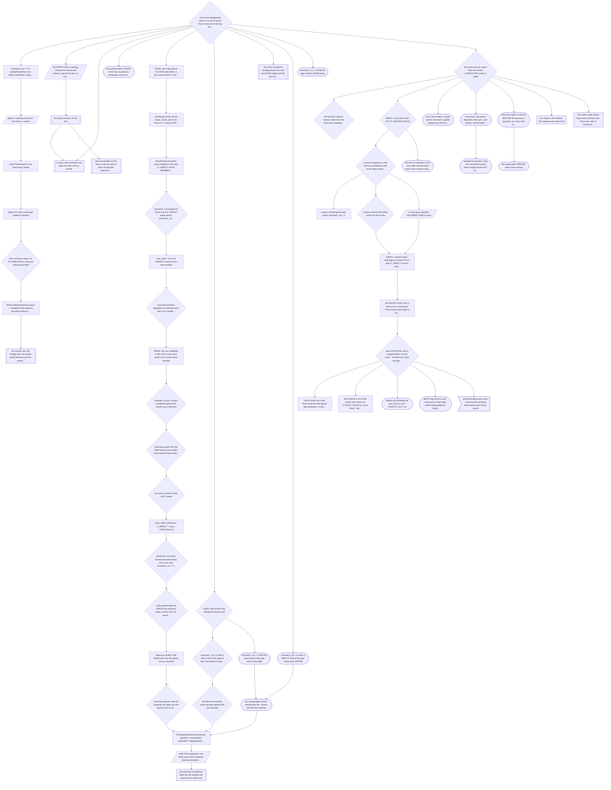
```mermaid
flowchart TD
  X9{"md counts disagreeing LEGS on a mirror band; the rot may be on the leg md…"}
  S22["mismatch_cnt &gt; 0: a parityMismatches row {band, bandIndex, array…"]
  S62[/"the PARITY-ONLY warning: mismatches stand and phase 2 named NO file, so the…"/]
  U07[["a mirror-only mismatch row does not offer 'click to rewrite'"]]
  P03a(["not-a-parity-band: a RAID1 mirror has no parity to recompute, and md's…"])
  E04g["RAID1: each leg read at ITS OWN data offset, a torn read retried 3×; the…"]
  E04f{"RAID1 with EVERY leg failing the stored csum"}
  X9r[["the mirror-mismatch wording names the verb that DOES apply and the one the…"]]
  E04f3(["mismatch_cnt = 0 while a DIRECT read of the legs shows they DIFFER"])
  E04f4(["mismatch_cnt &gt; 0 while the legs hold the SAME bytes"])
  M00{"the verb's licence, taken from the newest COMPLETED scrub or repair"}
  S24[/"phase-1 warning, per band: 'rot exists in &lt;band&gt;"/]
  U02[["the parity indicator IS the door"]]
  E05a["evictStripeCache: shrink stripe_cache_size to its floor of 17, sweep ±200…"]
  E04f1{"mismatch_cnt = 0 AND a direct read of the legs at their own offsets shows…"}
  E04f2(["mismatch_cnt &gt; 0 AND the direct read of the legs shows they differ"])
  J40(["the unrepairable bucket, advised per file: 'restore this file from backup'"])
  M00b{"the band the request names, taken from the pool's own topology…"}
  M01{"ARM A, 'scrub until clean' (GT-22 UNEXPECTED(1))"}
  M10(["not-a-mirror-band: a parity band's mismatch is parity disagreeing with the…"])
  M12(["array-busy / job-active: degraded, mid-sync, sync window still bounded…"])
  M13(["md's own repair is refused BEFORE the process is spawned, on every door of…"])
  M15[["the result, in the window the request was made from"]]
  M17[["the confirm gate states both arms and their cost, that a row with no checksum…"]]
  S31["retireCheckIssued in the band loop's finally"]
  U08[["with corrupt files on the same scrub the verb is dark carrying the daemon's…"]]
  E05a2["directParityConsistent: every member's row read O_DIRECT off the MEMBER…"]
  J43{"the above-md bucket: 'parity already agreed with the bad data"}
  J50["AhrRepairResultSchema.parse: repaired / unrepairable / aboveMd / mappingAbort…"]
  M01b{"a pass's progress is read from the breakdown btrfs scrub status prints…"}
  M14(["md took an operation of its own while a whole-band check was running (a leg…"])
  M12b(["bad-blocks-present: a leg with recorded md bad-block ranges serves EIO for…"])
  M13b(["the guard itself THROWS rather than warning"])
  S40["phase 2/2: btrfs scrub start polled to finished"]
  E05{"precheck: a bounded md check over the TARGET stripe and its mismatch_cnt…"}
  J51[/"ONE PVE notification: info when every block repaired, warning otherwise…"/]
  M02["a pass's whole-band check reads mismatch_cnt = 0"]
  M03{"a pass corrects NOTHING while md still counts"}
  M11[/"a scrub pass reported UNCORRECTABLE errors"/]
  S42{"Error summary clean: no ATTRIBUTION is read and nothing is probed"}
  E06["rmw_level = 0 on the TARGET's band for the write window"]
  J52[["the outcome is rendered back into the window the request was made from"]]
  M04["ARM B, 'compare legs': both legs are read IN FULL with O_DIRECT at each leg's…"]
  S60["AhrScrubResultSchema.parse — validated at the daemon boundary before it…"]
  E07{"reconstructionPlan: degraded re-read and each role's rd&lt;n&gt;/state…"}
  M04b["the WHOLE chunk tree is read once, in one dump. The forward chain walks it by…"]
  S64[["the Scrubs row: the findings link, the amber parity indicator and the muted…"]]
  E07r5["RAID5: the one candidate is the XOR of the same stripe row on every other member"]
  M05{"each DIFFERING row is mapped BACK up the chain - md byte to LV byte through…"}
  E08{"arbitrate: crc32c of each candidate against the stored csum, best first"}
  M06["DATA chunk: the csum btrfs stored for that logical byte arbitrates. crc32c…"]
  M07["METADATA or SYSTEM chunk: btrfs stores no EXTENT_CSUM for a tree block - the…"]
  M08(["nothing can arbitrate the row, and it is LEFT EXACTLY AS IT IS"])
  M09(["BOTH legs fail the row's checksum (or both pass while holding different bytes)"])
  M16>"arm B decided every row it could and the verifying whole-band check STILL counts"]
  E09{"read-back guard: the md offset about to be written must hold the bytes read…"}
  E10{"pre-write re-check at the LAST instant"}
  E11["write: ONE 4 KiB block, O_DIRECT + fsync, THROUGH md"]
  E12{"postcheck: the same evicted bounded check must now read mismatch_cnt = 0…"}
  E13{"cold read through the FRESH pin snapshot (drop_caches first; the whole…"}
  E14["cleanup in finally, PER BAND and only the bands this run touched"]
  E15{"outcome repaired, with the mapping, the steps and the stored csum as its…"}
  X9 --> S22
  X9 --> S62
  X9 --> U07
  X9 --> P03a
  X9 --> E04g
  X9 --> E04f
  X9 --> X9r
  X9 --> E04f3
  X9 --> E04f4
  X9 --> M00
  S22 --> S24
  S62 --> U02
  E04g --> E05a
  E04f --> E04f1
  E04f --> E04f2
  E04f3 --> J40
  M00 --> M00b
  M00 --> M01
  M00 --> M10
  M00 --> M12
  M00 --> M13
  M00 --> M15
  M00 --> M17
  S24 --> S31
  U02 --> U07
  U02 --> U08
  E05a --> E05a2
  E04f1 --> J43
  E04f2 --> J40
  J40 --> J50
  M01 --> M01b
  M01 --> M14
  M12 --> M12b
  M13 --> M13b
  S31 --> S40
  E05a2 --> E05
  J43 --> J50
  J50 --> J51
  M01b --> M02
  M01b --> M03
  M01b --> M11
  S40 --> S42
  E05 --> E06
  J51 --> J52
  M03 --> M04
  M11 --> M04
  S42 --> S60
  E06 --> E07
  M04 --> M04b
  S60 --> S64
  E07 --> E07r5
  M04b --> M05
  E07r5 --> E08
  M05 --> M06
  M05 --> M07
  M05 --> M08
  M05 --> M09
  M05 --> M16
  E08 --> E09
  E09 --> E10
  E10 --> E11
  E11 --> E12
  E12 --> E13
  E13 --> E14
  E14 --> E15
  E15 --> J50
```

| leaf | kind | what the system does | `code:` | `test:` | `gt:` |
|---|---|---|---|---|---|
| `X9` | decision | md counts disagreeing LEGS on a mirror band; the rot may be on the leg md does not serve reads from | `packages/daemon/src/services/ahr-scrub.ts:scrubAhrPool` | `packages/daemon/src/services/__tests__/ahr-scrub.test.ts:every mismatching band warns; an unreadable counter warns about nothing` | `GT-16` |
| `S22` | action | mismatch_cnt > 0: a `parityMismatches` row {band, bandIndex, array, mismatchCnt, level} rides the result, and the band counts as CHECKED | `packages/daemon/src/services/ahr-scrub.ts:scrubAhrPool` | `packages/daemon/src/services/__tests__/ahr-scrub.test.ts:the new record fields round-trip the shared schema — and stay optional` | `GT-18` |
| `S62` | notification | the PARITY-ONLY warning: mismatches stand and phase 2 named NO file, so the parity (or Q) member is what disagrees and md would reconstruct from it at the next disk failure | `packages/daemon/src/services/ahr-scrub.ts:parityBody` | `packages/daemon/src/services/__tests__/ahr-scrub.test.ts:parity mismatch and errors that name NO file` | `GT-18` |
| `U07` | ui | a mirror-only mismatch row does not offer "click to rewrite": it names Repair from parity as the verb that arbitrates instead | `packages/pve-integration/src/69-scrubs.js:renderLastScrub` | `packages/pve-integration/test/dialog-contracts.harness.mjs:rewrite: a mirror-only mismatch row does NOT offer "click to rewrite"` | `GT-16` |
| `P03a` | refusal | `not-a-parity-band`: a RAID1 mirror has no parity to recompute, and md's repair copies the first in-sync leg over the others without looking at which is right — refused FIRST, and for good | `packages/daemon/src/services/ahr-parity-rewrite.ts:mirrorBandRefusal` | `packages/daemon/src/services/__tests__/ahr-parity-rewrite.test.ts:REFUSES a RAID1 mirror band outright — md repair there is a coin flip on the good copy (N1)` | `GT-16` |
| `E04g` | action | RAID1: each leg read at ITS OWN data offset, a torn read retried 3×; the failing leg is named as the member and the passing legs become the candidates | `packages/daemon/src/services/selfheal-map.ts:memberOffsetOn` | `packages/daemon/src/services/__tests__/selfheal-repair.test.ts:reports the FAILING leg as the member, at that leg's own offset` | `GT-16` |
| `E04f` | decision | RAID1 with EVERY leg failing the stored csum: the bounded check is run BEFORE the verdict, because a mirror check compares the legs with each other - md's own answer to "do these legs agree?" | `packages/daemon/src/services/selfheal-repair.ts:repairBlock` | `packages/daemon/src/services/__tests__/selfheal-repair.test.ts:every mirror leg fails the csum (F4)` | `GT-16` |
| `X9r` | ui | the mirror-mismatch wording names the verb that DOES apply and the one the operator must not reach for: "no parity to rewrite - the legs disagree with each other; do not run md repair on a mirror; click to reconcile the mirror". Rewrite parity stays dark on a RAID1 row and says why (story selfheal.11) | `packages/pve-integration/src/69-scrubs.js:MIRROR_BAND_REASON` | `packages/pve-integration/test/dialog-contracts.harness.mjs:it says there is no parity to rewrite, and points at the mirror verb` | `GT-16` |
| `E04f3` | refusal | mismatch_cnt = 0 while a DIRECT read of the legs shows they DIFFER: md's cached view of this stripe was stale (GT-23), so this is not the mirror's `above-md` at all - `unrepairable` with staleCache recorded, and the restore stands | `packages/daemon/src/services/selfheal-repair.ts:directParityConsistent` | `packages/daemon/src/services/__tests__/selfheal-repair.test.ts:mismatch_cnt 0 over legs that DIFFER: md's cached view was stale, never above-md (GT-23)` | `GT-23` |
| `E04f4` | refusal | mismatch_cnt > 0 while the legs hold the SAME bytes: md and the direct read disagree about this stripe - `unrepairable`, nothing written, and NEVER `above-md` (which md's own count denies). No restore advice: nothing here proves the file unrecoverable | `packages/daemon/src/services/selfheal-repair.ts:parityAgreement` | `packages/daemon/src/services/__tests__/selfheal-repair.test.ts:mismatch_cnt > 0 over legs that hold the SAME bytes: md and the direct read disagree (GT-23)` | `GT-23` |
| `M00` | decision | the verb's licence, taken from the newest COMPLETED scrub or repair: md counted mismatches on THIS band, the band is `raid1`, and the checksum pass was clean across the pool. A row with no recorded level is refused rather than guessed at - the two mismatch verbs are not interchangeable | `packages/daemon/src/services/ahr-mirror-reconcile.ts:mirrorReconcileEvidence` | `packages/daemon/src/services/__tests__/ahr-mirror-reconcile.test.ts:accepts a RAID1 band the last scrub counted mismatches on, with no findings` | `GT-22` |
| `S24` | notification | phase-1 warning, per band: "rot exists in <band> — phase 2 (running now) checks every file's checksum; if a file is affected, it will be named" | `packages/daemon/src/services/ahr-scrub.ts:scrubAhrPool` | `packages/daemon/src/services/__tests__/ahr-scrub.test.ts:phase 1 rot: a mismatch_cnt > 0 warns before phase 2 starts — and phase 2 still runs` | `GT-5` |
| `U02` | ui | the parity indicator IS the door: `anas-win-scrub-parity` lists the bands md counted mismatches on and takes ONE | `packages/pve-integration/src/69-scrubs.js:showParityMismatches` | `packages/pve-integration/test/dialog-contracts.harness.mjs:rewrite: the parity indicator opens the parity window` | `GT-18` |
| `E05a` | action | evictStripeCache: shrink `stripe_cache_size` to its floor of 17, sweep ±200 stripes while it is small, restore — without it a check over a recently touched stripe reads the CACHE and reports 0 over junk. On kernel 7.0.14-17 it no longer reaches a stripe written MOMENTS ago (GT-23), which is why the verdict no longer rests on its number alone | `packages/daemon/src/services/selfheal-repair.ts:memberDataSectors` | `packages/daemon/src/services/__tests__/selfheal-repair.test.ts:sweeps the stripes around a target near the END of the array` | `GT-14` |
| `E04f1` | decision | mismatch_cnt = 0 AND a direct read of the legs at their own offsets shows every leg holding the same bytes: the legs AGREE and are both wrong - `above-md`, the same diagnosis a parity band gets from the same fault, in the same words. Parallel construction: one fault, one reading, on both band types | `packages/daemon/src/services/selfheal-repair.ts:repairBlock` | `packages/daemon/src/services/__tests__/selfheal-repair.test.ts:mismatch_cnt 0 — the legs AGREE and are both wrong: ABOVE MD` | `GT-16` |
| `E04f2` | refusal | mismatch_cnt > 0 AND the direct read of the legs shows they differ: the legs disagree with each other and neither matches the stored csum - `unrepairable`, and here a restore IS the only action left | `packages/daemon/src/services/selfheal-repair.ts:repairBlock` | `packages/daemon/src/services/__tests__/selfheal-repair.test.ts:mismatch_cnt > 0 — the legs disagree and neither matches: UNREPAIRABLE` | `GT-16` |
| `J40` | refusal | the `unrepairable` bucket, advised per file: "restore this file from backup" **[restore-from-backup-advice]** | `packages/daemon/src/services/ahr-repair.ts:RESTORE_FILE_SENTENCE` | `packages/daemon/src/services/__tests__/ahr-repair.test.ts:anything unrepairable or above md notifies at warning, in the epic's words` | — |
| `M00b` | decision | the band the request names, taken from the pool's own topology (`<pool>-r<n>`, its md device and its per-leg height). A band the pool does not have is a 400 that lists the bands it does, before any confirm code is minted | `packages/daemon/src/services/ahr-mirror-reconcile.ts:mirrorReconcileArray` | `packages/daemon/src/routes/__tests__/ahr-mutate.test.ts:400 on a body that names no band, and on a band the pool does not have` | — |
| `M01` | decision | ARM A, "scrub until clean" (GT-22 UNEXPECTED(1)): an ordinary btrfs scrub that MEETS the rot heals the whole band through md - btrfs re-reads on a csum failure, md serves the other leg, and md propagates the write-back to BOTH legs. The pass is repeated up to three times because md's read-balance is not contractual, with a whole-band md check after each | `packages/daemon/src/services/ahr-mirror-reconcile.ts:reconcileMirrorBand` | `packages/daemon/src/services/__tests__/ahr-mirror-reconcile.test.ts:stops at the first pass whose check reads 0 — the scrub healed the band through md` | `GT-22` |
| `M10` | refusal | `not-a-mirror-band`: a parity band's mismatch is parity disagreeing with the data, and it has a verb of its own (Rewrite parity). Not a state that passes - it never becomes true for that band. The pair with `not-a-parity-band` is what carries the epic's invariant at both doors | `packages/daemon/src/services/ahr-mirror-reconcile.ts:parityBandRefusal` | `packages/daemon/src/services/__tests__/ahr-mirror-reconcile.test.ts:refuses a PARITY band outright — it never becomes a mirror` | `GT-18` |
| `M12` | refusal | `array-busy` / `job-active`: degraded, mid-sync, sync window still bounded (GT-13's trap - the whole-band check is this run's only proof), or another scrub/repair/rewrite/reconcile in flight. Every one of them re-taken immediately before arm B writes anything | `packages/daemon/src/services/ahr-mirror-reconcile.ts:mirrorReconcileArrayRefusal` | `packages/daemon/src/services/__tests__/ahr-mirror-reconcile.test.ts:refuses a degraded band, a busy one, and one whose sync window is still bounded` | `GT-17` |
| `M13` | refusal | md's own `repair` is refused BEFORE the process is spawned, on every door of the executor this verb uses - `exec`, `pipeline` and `execToStream` alike (GT-22(f): on a mirror it copies leg 0 blindly, and junk on leg 0 was propagated to leg 1 on the rig). The ruling is absolute, so this is a wrapper and not a convention: there is no way past it | `packages/daemon/src/services/ahr-mirror-reconcile.ts:mirrorGuardedExecutor` | `packages/daemon/src/services/__tests__/ahr-mirror-reconcile.test.ts:the guarded executor never lets one through, on any of its three doors` | `GT-22` |
| `M15` | ui | the result, in the window the request was made from: which ARM answered, the counts before and after, the rows nothing could arbitrate, and - on anything but `reconciled` - that the band is NOT clean and md repair is still the wrong thing to reach for. The notification says the same, once | `packages/pve-integration/src/69-scrubs.js:showMirrorResult` | `packages/pve-integration/test/dialog-contracts.harness.mjs:the ARM that answered is named — arm A is the ordinary scrub healing it` | — |
| `M17` | ui | the confirm gate states both arms and their cost, that a row with no checksum is LEFT EXACTLY AS IT IS, that a row neither leg satisfies is never written, that the pool stays ONLINE and undegraded throughout (the whole difference from doing it by hand with mdadm), and that md's own repair is not used and must not be run by hand either | `packages/daemon/src/services/ahr-mirror-reconcile.ts:mirrorReconcileWarnings` | `packages/daemon/src/services/__tests__/ahr-mirror-reconcile.test.ts:names both arms, what is left alone, and the absence of a degraded window` | `GT-22` |
| `S31` | action | retireCheckIssued in the band loop's `finally` — the token never outlives the iteration that took it (N3) | `packages/daemon/src/services/selfheal-syncop.ts:retireCheckIssued` | `packages/daemon/src/services/__tests__/ahr-scrub.test.ts:retires the token on the SKIP paths too — md never started the check (N3)` | — |
| `U08` | ui | with corrupt files on the same scrub the verb is dark carrying the daemon's own 409 sentence, and the handler refuses a click anyway | `packages/pve-integration/src/69-scrubs.js:parityRewriteBlocked` | `packages/pve-integration/test/dialog-contracts.harness.mjs:rewrite: the handler itself refuses, not just the disabled state` | `GT-18` |
| `E05a2` | action | directParityConsistent: every member's row read O_DIRECT off the MEMBER devices at its own data offset and the parity group recomputed - XOR of the data rows against P, the Q syndrome against Q on RAID6, the legs against each other on RAID1. md's cache takes no part in it, which is the whole point (GT-23) | `packages/daemon/src/services/selfheal-repair.ts:directParityConsistent` | `packages/daemon/src/services/__tests__/selfheal-repair.test.ts:diagnoses ABOVE MD when P and Q both agree with the bad data` | `GT-23` |
| `J43` | decision | the `above-md` bucket: "parity already agreed with the bad data — this implicates something other than the disks (memory, controller, software)", which stays an implication | `packages/daemon/src/services/ahr-repair.ts:ABOVE_MD_SENTENCE` | `packages/daemon/src/services/__tests__/ahr-repair.test.ts:anything unrepairable or above md notifies at warning, in the epic's words` | `GT-6` |
| `J50` | action | AhrRepairResultSchema.parse: repaired / unrepairable / aboveMd / mappingAbort / notExamined, always summing to the blocks attempted | `packages/daemon/src/services/ahr-repair.ts:repairAhrFiles` | `packages/daemon/src/services/__tests__/ahr-repair.test.ts:the notification names all five counts, and they add up (review R9, seventh pass F3)` | — |
| `M01b` | decision | a pass's progress is read from the breakdown `btrfs scrub status` prints under its error summary: `Corrected` is how many blocks the scrub healed through md this time round, and `Uncorrectable` is the count that means no copy can satisfy a checksum. A clean pass prints no breakdown and both read zero | `packages/daemon/src/services/ahr-mirror-reconcile.ts:parseScrubErrorCounts` | `packages/daemon/src/services/__tests__/ahr-mirror-reconcile.test.ts:reads the breakdown btrfs prints under its error summary` | `GT-22` |
| `M14` | refusal | md took an operation of its own while a whole-band check was running (a leg failing puts it into `recover`): the run walks away with every knob exactly as md left it, and reports `residual` with `foreign-sync-op`. Same waiter, same ownership rule as the parity rewrite - one place decides | `packages/daemon/src/services/ahr-parity-rewrite.ts:waitForOwnSyncOp` | `packages/daemon/src/services/__tests__/ahr-mirror-reconcile.test.ts:walks away when md takes an operation of its own mid-check` | `GT-13` |
| `M12b` | refusal | `bad-blocks-present`: a leg with recorded md bad-block ranges serves EIO for them and holds no correct copy, so a row inside one cannot be read off that leg at all - and arm B's whole method is reading both legs. Replace the member first; not a wait-and-retry state | `packages/daemon/src/services/ahr-mirror-reconcile.ts:mirrorBadBlocksRefusal` | `packages/daemon/src/services/__tests__/ahr-mirror-reconcile.test.ts:refuses a band with recorded md bad blocks — md holds no correct copy there` | — |
| `M13b` | refusal | the guard itself THROWS rather than warning: a run that reached this point has a bug in ANAS, and the correct outcome of that bug is a failed job - never a blessed rot. The suite asserts the same invariant on the RUN instead of on the source: md announces `md: repair of RAID array mdN` when it takes one, and no case-9 row may find that line | `packages/daemon/src/services/ahr-mirror-reconcile.ts:assertNoMdRepair` | `suite:9-neg-no-md-repair` | `GT-22` |
| `S40` | action | phase 2/2: `btrfs scrub start` polled to finished — one pass, two callers (the scrub and the parity rewrite) | `packages/daemon/src/services/ahr-scrub.ts:btrfsScrubPass` | `packages/daemon/src/services/__tests__/ahr-scrub.test.ts:runs btrfs scrub to completion, THEN per-array checks sequentially` | `GT-3` |
| `E05` | decision | precheck: a bounded md `check` over the TARGET stripe and its `mismatch_cnt`, weighed against the direct member-row computation - parityAgreement names the pair, and the verdict needs both | `packages/daemon/src/services/selfheal-repair.ts:parityAgreement` | `packages/daemon/src/services/__tests__/selfheal-repair.test.ts:names each of the four combinations` | `GT-5` |
| `J51` | notification | ONE PVE notification: `info` when every block repaired, `warning` otherwise, with the per-file advice and the file list capped at 20 | `packages/daemon/src/services/ahr-repair.ts:repairBody` | `packages/daemon/src/services/__tests__/ahr-repair.test.ts:everything repaired notifies at info and says so` | — |
| `M02` | action | a pass's whole-band check reads `mismatch_cnt = 0`: the legs agree again and the run stops there. `arm: scrub`, one row per pass with its `corrected` count - the cheapest arm, and the one that costs no leg read at all | `packages/daemon/src/services/ahr-scrub.ts:btrfsScrubPass` | `suite:9a-reconcile` | `GT-22` |
| `M03` | decision | a pass corrects NOTHING while md still counts: md is not serving the rotten leg to btrfs, so repeating the same coin flip proves nothing. Arm A stops at once and arm B takes over - this is the residual case the story names | `packages/daemon/src/services/ahr-mirror-reconcile.ts:reconcileMirrorBand` | `packages/daemon/src/services/__tests__/ahr-mirror-reconcile.test.ts:a pass that corrects NOTHING while md still counts stops arm A at once` | `GT-22` |
| `M11` | notification | a scrub pass reported UNCORRECTABLE errors: the files are NAMED and the run CARRIES ON. This is the one place the mirror verb's gates differ from Rewrite parity's - that verb aborts on any finding because md repair would bless the rot, and this one writes no row it cannot prove. A file no copy can satisfy is a fact to report (and its rows come back as `unresolvedRows`), not a reason to leave the rest of the band mismatched. The notification is a `warning` even when the band itself comes out clean | `packages/daemon/src/services/ahr-mirror-reconcile.ts:reconcileMirrorBand` | `packages/daemon/src/services/__tests__/ahr-mirror-reconcile.test.ts:NAMES an uncorrectable file and carries on — it is a fact to report, not a refusal` | `GT-22` |
| `S42` | decision | Error summary clean: no ATTRIBUTION is read and nothing is probed — the journal is read once more for the corrected-metadata count alone (selfheal.12), the one rot signal a clean scrub can hold | `packages/daemon/src/services/ahr-scrub.ts:parseBtrfsScrubStatus` | `packages/daemon/src/services/__tests__/ahr-scrub.test.ts:a clean scrub probes nothing, and reads the journal only for the corrected-metadata window` | `GT-3` |
| `E06` | action | `rmw_level = 0` on the TARGET's band for the write window — at the default, a correct block written through md updates parity against the JUNK (GT-7) | `packages/daemon/src/services/selfheal-repair.ts:repairBlock` | `packages/daemon/src/services/__tests__/selfheal-repair.test.ts:sets rmw_level to 0 BEFORE the write — the GT-7 poison is the default` | `GT-7` |
| `J52` | ui | the outcome is rendered back into the window the request was made from — per-file verdicts on their own rows, and the four counts | `packages/pve-integration/src/69-scrubs.js:showRepairResult` | `packages/pve-integration/test/dialog-contracts.harness.mjs:repair: the result appears in the window the request was made from` | — |
| `M04` | action | ARM B, "compare legs": both legs are read IN FULL with O_DIRECT at each leg's OWN data offset (`rd<n>/offset` may differ) and compared in 4 KiB rows. Same IO as a check, and NO degraded window - no leg is failed, removed or re-added at any point | `packages/daemon/src/services/selfheal-map.ts:memberOffsetOn` | `packages/daemon/src/services/__tests__/ahr-mirror-reconcile.test.ts:reads both legs in windows and still decides every row — the result parses as the shared schema` | `GT-16` |
| `S60` | action | AhrScrubResultSchema.parse — validated at the daemon boundary before it leaves as a job result | `packages/daemon/src/services/ahr-scrub.ts:scrubAhrPool` | `packages/daemon/src/services/__tests__/ahr-scrub.test.ts:the new record fields round-trip the shared schema — and stay optional` | — |
| `E07` | decision | reconstructionPlan: `degraded` re-read and each role's `rd<n>/state` consulted, so a member md KICKED since the gates is never read for its stale bytes | `packages/daemon/src/services/selfheal-repair.ts:reconstructionPlan` | `packages/daemon/src/services/__tests__/selfheal-repair.test.ts:keeps the syndrome that does not need the kicked member, and only that one` | — |
| `M04b` | action | the WHOLE chunk tree is read once, in one dump. The forward chain walks it by key because it starts from a logical byte; arm B starts from an md byte and nothing in the tree is keyed by device offset, so there is no walk to make. Affordable where the csum tree is not: a chunk covers a gigabyte | `packages/daemon/src/services/selfheal-map.ts:readAllChunkItems` | `packages/daemon/src/services/__tests__/ahr-mirror-reconcile.test.ts:arbitrates a rotten DATA row by its stored checksum and writes the winner through md` | `GT-2` |
| `S64` | ui | the Scrubs row: the findings link, the amber parity indicator and the muted skipped-band count share ONE cell, each with its own tooltip | `packages/pve-integration/src/69-scrubs.js:renderLastScrub` | `packages/pve-integration/test/dialog-contracts.harness.mjs:scrubs: the row says how many files, labelled` | — |
| `E07r5` | action | RAID5: the one candidate is the XOR of the same stripe row on every other member | `packages/daemon/src/services/selfheal-repair.ts:reconstruct` | `suite:2-neg` | `GT-8` |
| `M05` | decision | each DIFFERING row is mapped BACK up the chain - md byte to LV byte through the dm segment, LV byte to btrfs logical through the covering chunk's own delta (the GT-2 hop, inverted; a DUP metadata chunk's second copy answers too, and says which copy it is). The chunk's TYPE then says which authority arbitrates the row | `packages/daemon/src/services/selfheal-map.ts:logicalForMdByte` | `packages/daemon/src/services/__tests__/ahr-mirror-reconcile.test.ts:is the exact inverse of the forward hop, dm offset and chunk delta included` | `GT-2` |
| `E08` | decision | arbitrate: crc32c of each candidate against the stored csum, best first — the btrfs checksum is what decides, never md | `packages/daemon/src/services/selfheal-csum.ts:crc32c` | `packages/daemon/src/services/__tests__/selfheal-repair.test.ts:reconstructs it, arbitrates against the stored csum and writes it back` | `GT-11` |
| `M06` | action | DATA chunk: the csum btrfs stored for that logical byte arbitrates. crc32c each leg's row, and the leg that matches WINS - its bytes are written THROUGH md, which writes both legs. The same write the repair engine makes, for the same reason **[md-block-write]** | `packages/daemon/src/services/selfheal-csum.ts:readStoredCsum` | `suite:9b-compare` | `GT-7` |
| `M07` | action | METADATA or SYSTEM chunk: btrfs stores no EXTENT_CSUM for a tree block - the checksum is in the node's own header, over its own bytes. The containing 16 KiB node is read off each leg and checked the way btrfs checks it; the leg whose copy vouches for itself wins. The verdict is cached per node (a node is four rows) **[md-block-write]** | `packages/daemon/src/services/selfheal-csum.ts:verifyNode` | `packages/daemon/src/services/__tests__/ahr-mirror-reconcile.test.ts:a METADATA row is decided by the node's own header checksum` | `GT-20` |
| `M08` | refusal | nothing can arbitrate the row, and it is LEFT EXACTLY AS IT IS: a row in no chunk at all is free space (btrfs has never written there, and legs may disagree about it), and a DATA row with no stored csum is a NOCOW file, a prealloc range or `nodatasum`. Counted as `freeSpaceRows` / `uncheckedRows` and reported, never guessed at | `packages/daemon/src/services/ahr-mirror-reconcile.ts:reconcileMirrorBand` | `packages/daemon/src/services/__tests__/ahr-mirror-reconcile.test.ts:counts rows in no chunk as free space and leaves them exactly as they are` | — |
| `M09` | refusal | BOTH legs fail the row's checksum (or both pass while holding different bytes): `unresolvedRows`, nothing written, outcome `residual`. Neither copy is the file, so the file needs restoring from backup - and the band's leftover mismatch is reported rather than hidden **[restore-from-backup-advice]** | `packages/daemon/src/services/ahr-mirror-reconcile.ts:reconcileMirrorBand` | `suite:9-neg` | `GT-22` |
| `M16` | residual | arm B decided every row it could and the verifying whole-band check STILL counts: `residual`, never `reconciled`. The rows with no checksum are named as the likely remainder, because they are the ones this verb deliberately did not touch | `packages/daemon/src/services/ahr-mirror-reconcile.ts:reconcileMirrorBand` | `packages/daemon/src/services/__tests__/ahr-mirror-reconcile.test.ts:a band that comes back still mismatched is a residual, never a success` | `GT-22` |
| `E09` | decision | read-back guard: the md offset about to be written must hold the bytes read from the member (on RAID1, the bytes of SOME leg — md serves a mirror read from either) | `packages/daemon/src/services/selfheal-repair.ts:readBackGuard` | `packages/daemon/src/services/__tests__/selfheal-repair.test.ts:passes when md served the HEALTHY leg (R5: not a failed mapping)` | — |
| `E10` | decision | pre-write re-check at the LAST instant: `degraded`, `sync_action` and `reshape_position` re-read, because a bounded check over a 20 TB band takes minutes | `packages/daemon/src/services/selfheal-repair.ts:preWriteRefusal` | `packages/daemon/src/services/__tests__/selfheal-repair.test.ts:writes NOTHING when a recovery starts between the precheck and the write` | `GT-19` |
| `E11` | action | write: ONE 4 KiB block, O_DIRECT + fsync, THROUGH md — and only after the reconstruction matched the checksum btrfs stored for it **[md-block-write]** | `packages/daemon/src/services/selfheal-repair.ts:repairBlock` | `suite:7-member` | `GT-8` |
| `E12` | decision | postcheck: the same evicted bounded check must now read `mismatch_cnt = 0` AND the same direct member-row computation must agree - the stripe was written through md moments ago, which is exactly the state its check answers from the cache in (GT-23) | `packages/daemon/src/services/selfheal-repair.ts:boundedWindowCheck` | `suite:7-bcheck` | `GT-8` |
| `E13` | decision | cold read through the FRESH pin snapshot (drop_caches first; the whole logical extent when compressed) — a warm page of the live file answers from memory and hides everything | `packages/daemon/src/services/selfheal-repair.ts:coldRead` | `suite:3-cold` | `GT-9` |
| `E14` | action | cleanup in `finally`, PER BAND and only the bands this run touched: rmw_level, then the sync window under the ownership rule, then stripe_cache_size, then destroy the pin | `packages/daemon/src/services/selfheal-repair.ts:restoreSyncKnobs` | `packages/daemon/src/services/__tests__/selfheal-repair.test.ts:restores rmw_level on the band it turned it down on — and leaves the other band alone` | `GT-13` |
| `E15` | decision | outcome `repaired`, with the mapping, the steps and the stored csum as its audit trail | `packages/daemon/src/services/selfheal-repair.ts:repairBlock` | `packages/daemon/src/services/__tests__/selfheal-repair.test.ts:produces an outcome the shared schema accepts` | `GT-8` |

### R10 — member failure / degraded array before, during or after a scrub or repair

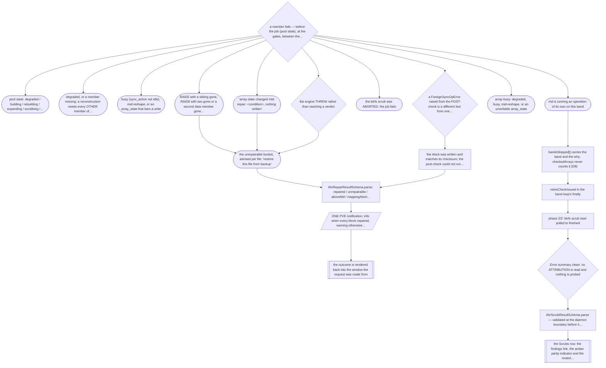
```mermaid
flowchart TD
  X10{"a member fails — before the job (pool state), at the gates, between the…"}
  RT02(["pool state: degraded / building / rebuilding / expanding / scrubbing /…"])
  E01a(["degraded, or a member missing: a reconstruction needs every OTHER member of…"])
  E01b(["busy (sync_action not idle), mid-reshape, or an array_state that bars a write"])
  E07a(["RAID5 with a sibling gone, RAID6 with two gone or a second data member gone…"])
  E10a(["'array state changed mid-repair: &lt;condition&gt;, nothing written'"])
  E12b{"a ForeignSyncOpError raised from the POST-check is a different fact from one…"}
  S41(["the btrfs scrub was ABORTED: the job fails"])
  S05(["md is running an operation of its own on this band"])
  P03b(["array-busy: degraded, busy, mid-reshape, or an unwritable array_state"])
  J31{"the engine THREW rather than reaching a verdict"}
  J40(["the unrepairable bucket, advised per file: 'restore this file from backup'"])
  J53["'the block was written and matches its checksum; the post-check could not run…"]
  S30["bandsSkipped[] carries the band and the why; checkedArrays never counts it (D8)"]
  J50["AhrRepairResultSchema.parse: repaired / unrepairable / aboveMd / mappingAbort…"]
  S31["retireCheckIssued in the band loop's finally"]
  J51[/"ONE PVE notification: info when every block repaired, warning otherwise…"/]
  S40["phase 2/2: btrfs scrub start polled to finished"]
  J52[["the outcome is rendered back into the window the request was made from"]]
  S42{"Error summary clean: no ATTRIBUTION is read and nothing is probed"}
  S60["AhrScrubResultSchema.parse — validated at the daemon boundary before it…"]
  S64[["the Scrubs row: the findings link, the amber parity indicator and the muted…"]]
  X10 --> RT02
  X10 --> E01a
  X10 --> E01b
  X10 --> E07a
  X10 --> E10a
  X10 --> E12b
  X10 --> S41
  X10 --> S05
  X10 --> P03b
  X10 --> J31
  E07a --> J40
  E10a --> J40
  E12b --> J53
  S05 --> S30
  J31 --> J40
  J40 --> J50
  J53 --> J50
  S30 --> S31
  J50 --> J51
  S31 --> S40
  J51 --> J52
  S40 --> S42
  S42 --> S60
  S60 --> S64
```

| leaf | kind | what the system does | `code:` | `test:` | `gt:` |
|---|---|---|---|---|---|
| `X10` | decision | a member fails — before the job (pool state), at the gates, between the precheck and the write, or under the running check | `packages/daemon/src/services/selfheal-repair.ts:arrayRefusal` | `packages/daemon/src/services/__tests__/selfheal-repair.test.ts:REFUSES while the array is degraded` | `GT-17` |
| `RT02` | refusal | pool state: degraded / building / rebuilding / expanding / scrubbing / offline / failed / readonly, each in its own words, BEFORE a confirm code exists | `packages/daemon/src/routes/ahr-mutate.ts:ahrMutationRoutes` | `packages/daemon/src/routes/__tests__/ahr-repair.test.ts:409 while the pool is busy — no X-Anas-Confirm-Code to bypass it with` | `GT-17` |
| `E01a` | refusal | degraded, or a member missing: a reconstruction needs every OTHER member of the stripe | `packages/daemon/src/services/selfheal-repair.ts:arrayRefusal` | `packages/daemon/src/services/__tests__/selfheal-repair.test.ts:REFUSES while the array is degraded` | `GT-17` |
| `E01b` | refusal | busy (`sync_action` not idle), mid-reshape, or an `array_state` that bars a write — `clean` and `active` are both healthy (GT-17) | `packages/daemon/src/services/selfheal-repair.ts:arrayRefusal` | `packages/daemon/src/services/__tests__/selfheal-repair.test.ts:REFUSES while md is busy, reshaping, or the array is not writable` | `GT-17` |
| `E07a` | refusal | RAID5 with a sibling gone, RAID6 with two gone or a second data member gone, RAID1 with no leg left: nothing can be reconstructed, nothing was written | `packages/daemon/src/services/selfheal-repair.ts:reconstructionPlan` | `packages/daemon/src/services/__tests__/selfheal-repair.test.ts:REFUSES a RAID5 reconstruction once a sibling is gone` | — |
| `E10a` | refusal | "array state changed mid-repair: <condition>, nothing written" | `packages/daemon/src/services/selfheal-repair.ts:preWriteRefusal` | `packages/daemon/src/services/__tests__/selfheal-repair.test.ts:writes NOTHING when a recovery starts between the precheck and the write` | `GT-19` |
| `E12b` | decision | a ForeignSyncOpError raised from the POST-check is a different fact from one raised before the write: a `written` flag set at the write step decides which sentence the outcome carries | `packages/daemon/src/services/selfheal-repair.ts:ForeignSyncOpError` | `packages/daemon/src/services/__tests__/selfheal-repair.test.ts:a foreign md op AFTER the write (F5)` | `GT-19` |
| `S41` | refusal | the btrfs scrub was ABORTED: the job fails | `packages/daemon/src/services/ahr-scrub.ts:btrfsScrubPass` | `packages/daemon/src/services/__tests__/ahr-scrub.test.ts:aborted btrfs scrub fails the job` | — |
| `S05` | refusal | md is running an operation of its own on this band: nothing is issued, the band is recorded "not checked (md is running <op>)" | `packages/daemon/src/services/ahr-scrub.ts:syncAction` | `packages/daemon/src/services/__tests__/ahr-scrub.test.ts:does not ISSUE a check on a band md is already recovering` | `GT-19` |
| `P03b` | refusal | `array-busy`: degraded, busy, mid-reshape, or an unwritable array_state — the same sentence the block repair refuses with | `packages/daemon/src/services/selfheal-repair.ts:arrayRefusal` | `packages/daemon/src/services/__tests__/ahr-parity-rewrite.test.ts:refuses a degraded band` | `GT-17` |
| `J31` | decision | the engine THREW rather than reaching a verdict: that block is `unrepairable` with the error as its reason, and the remaining blocks still get their attempt | `packages/daemon/src/services/ahr-repair.ts:repairAhrFiles` | `packages/daemon/src/services/__tests__/ahr-repair.test.ts:a block the engine THROWS on is unrepairable with the error text — the job carries on` | — |
| `J40` | refusal | the `unrepairable` bucket, advised per file: "restore this file from backup" **[restore-from-backup-advice]** | `packages/daemon/src/services/ahr-repair.ts:RESTORE_FILE_SENTENCE` | `packages/daemon/src/services/__tests__/ahr-repair.test.ts:anything unrepairable or above md notifies at warning, in the epic's words` | — |
| `J53` | action | "the block was written and matches its checksum; the post-check could not run (md started <op>) - re-scrub to confirm parity", reported `repaired` with a `postcheckSkipped` note. Never "nothing written" after a write | `packages/shared/src/schemas/selfheal.ts:postcheckSkipped` | `packages/daemon/src/services/__tests__/selfheal-repair.test.ts:says the block WAS written and the post-check could not run` | `GT-19` |
| `S30` | action | `bandsSkipped[]` carries the band and the why; `checkedArrays` never counts it (D8) | `packages/daemon/src/services/ahr-scrub.ts:scrubAhrPool` | `packages/daemon/src/services/__tests__/ahr-scrub.test.ts:a band md never started is recorded, not coverage — checkedArrays stays honest` | — |
| `J50` | action | AhrRepairResultSchema.parse: repaired / unrepairable / aboveMd / mappingAbort / notExamined, always summing to the blocks attempted | `packages/daemon/src/services/ahr-repair.ts:repairAhrFiles` | `packages/daemon/src/services/__tests__/ahr-repair.test.ts:the notification names all five counts, and they add up (review R9, seventh pass F3)` | — |
| `S31` | action | retireCheckIssued in the band loop's `finally` — the token never outlives the iteration that took it (N3) | `packages/daemon/src/services/selfheal-syncop.ts:retireCheckIssued` | `packages/daemon/src/services/__tests__/ahr-scrub.test.ts:retires the token on the SKIP paths too — md never started the check (N3)` | — |
| `J51` | notification | ONE PVE notification: `info` when every block repaired, `warning` otherwise, with the per-file advice and the file list capped at 20 | `packages/daemon/src/services/ahr-repair.ts:repairBody` | `packages/daemon/src/services/__tests__/ahr-repair.test.ts:everything repaired notifies at info and says so` | — |
| `S40` | action | phase 2/2: `btrfs scrub start` polled to finished — one pass, two callers (the scrub and the parity rewrite) | `packages/daemon/src/services/ahr-scrub.ts:btrfsScrubPass` | `packages/daemon/src/services/__tests__/ahr-scrub.test.ts:runs btrfs scrub to completion, THEN per-array checks sequentially` | `GT-3` |
| `J52` | ui | the outcome is rendered back into the window the request was made from — per-file verdicts on their own rows, and the four counts | `packages/pve-integration/src/69-scrubs.js:showRepairResult` | `packages/pve-integration/test/dialog-contracts.harness.mjs:repair: the result appears in the window the request was made from` | — |
| `S42` | decision | Error summary clean: no ATTRIBUTION is read and nothing is probed — the journal is read once more for the corrected-metadata count alone (selfheal.12), the one rot signal a clean scrub can hold | `packages/daemon/src/services/ahr-scrub.ts:parseBtrfsScrubStatus` | `packages/daemon/src/services/__tests__/ahr-scrub.test.ts:a clean scrub probes nothing, and reads the journal only for the corrected-metadata window` | `GT-3` |
| `S60` | action | AhrScrubResultSchema.parse — validated at the daemon boundary before it leaves as a job result | `packages/daemon/src/services/ahr-scrub.ts:scrubAhrPool` | `packages/daemon/src/services/__tests__/ahr-scrub.test.ts:the new record fields round-trip the shared schema — and stay optional` | — |
| `S64` | ui | the Scrubs row: the findings link, the amber parity indicator and the muted skipped-band count share ONE cell, each with its own tooltip | `packages/pve-integration/src/69-scrubs.js:renderLastScrub` | `packages/pve-integration/test/dialog-contracts.harness.mjs:scrubs: the row says how many files, labelled` | — |

### R11 — URE during a rebuild (md bad-block list)


```mermaid
flowchart TD
  X11{"a survivor returns a URE during a degraded rebuild"}
  H0{"anas-md-event &lt;event&gt; &lt;md&gt; [&lt;member&gt;]"}
  H3[/"after a real rebuild: the recorded bad-block RANGES"/]
  H5["the md geometry reads each member's bad-block list (md/rd&lt;n&gt;/bad_blocks -…"]
  H1{"RebuildFinished: last_sync_action says whether a CHECK or a real rebuild finished"}
  H4{"DegradedArray with a sync running, no faulty member and every slot accounted for"}
  S00{"scrub job starts: phase 1 md parity per band, strictly sequential, then phase…"}
  H6(["bad-blocks-present: Rewrite parity refuses a band with ANY non-empty…"])
  H7{"the repair engine treats a member with a range over the TARGET ROW as ABSENT…"}
  H2[/"after a check: the mismatch counter, and 'the periodic scrub's phase 2 checks…"/]
  S01(["the pool is not mounted: the job throws before md is touched"])
  S02["resolve this band's md kernel name from the /dev/md/&lt;pool&gt;-r&lt;n&gt; pin symlink…"]
  E07a(["RAID5 with a sibling gone, RAID6 with two gone or a second data member gone…"])
  S04{"sync_action re-read per band immediately before the check is issued"}
  J40(["the unrepairable bucket, advised per file: 'restore this file from backup'"])
  S06{"the sync window is read: bounded to one stripe means an interrupted repair…"}
  J50["AhrRepairResultSchema.parse: repaired / unrepairable / aboveMd / mappingAbort…"]
  S07["the band is idle (just proven), so the window is widened back to md's own…"]
  S08["mdadm --action=check on the band"]
  J51[/"ONE PVE notification: info when every block repaired, warning otherwise…"/]
  S07a(["the widen did not take: the band is skipped rather than checked over a sliver…"])
  S09["markCheckIssued: from here, and only from here, this run may write idle to…"]
  S08a(["mdadm exited non-zero: the band is recorded with the exit and the scrub carries on"])
  J52[["the outcome is rendered back into the window the request was made from"]]
  S30["bandsSkipped[] carries the band and the why; checkedArrays never counts it (D8)"]
  S10{"start-wait: mdstat and sysfs polled until the check is observably running (md…"}
  S31["retireCheckIssued in the band loop's finally"]
  S12{"the check finished before the first poll"}
  S14{"finish-wait: mdstat and sysfs consulted together"}
  S40["phase 2/2: btrfs scrub start polled to finished"]
  S20{"mismatch_cnt on this band"}
  S17{"the check went idle: mismatch_cnt read after the settle (the counter…"}
  S42{"Error summary clean: no ATTRIBUTION is read and nothing is probed"}
  S23["mismatch_cnt = 0: the band counts as checked and reports clean"]
  S60["AhrScrubResultSchema.parse — validated at the daemon boundary before it…"]
  S64[["the Scrubs row: the findings link, the amber parity indicator and the muted…"]]
  X11 --> H0
  X11 --> H3
  X11 --> H5
  H0 --> H1
  H0 --> H4
  H3 --> S00
  H5 --> H6
  H5 --> H7
  H1 --> H2
  S00 --> S01
  S00 --> S02
  H7 --> E07a
  H2 --> S00
  S02 --> S04
  E07a --> J40
  S04 --> S06
  J40 --> J50
  S06 --> S07
  S06 --> S08
  J50 --> J51
  S07 --> S08
  S07 --> S07a
  S08 --> S09
  S08 --> S08a
  J51 --> J52
  S07a --> S30
  S09 --> S10
  S08a --> S30
  S30 --> S31
  S10 --> S12
  S10 --> S14
  S31 --> S40
  S12 --> S20
  S14 --> S17
  S40 --> S42
  S20 --> S23
  S17 --> S20
  S42 --> S60
  S23 --> S31
  S60 --> S64
```

| leaf | kind | what the system does | `code:` | `test:` | `gt:` |
|---|---|---|---|---|---|
| `X11` | decision | a survivor returns a URE during a degraded rebuild: md records the range in the member's bad-block list and reconstructs nothing there | `packaging/anas-md-event.sh:count_bad_block_ranges` | `packaging/test/md-event.test.sh:journald line has BADBLOCKS=3` | — |
| `H0` | decision | anas-md-event <event> <md> [<member>]: one structured journald record, severity mapped from the event | `packaging/anas-md-event.sh:last_sync_action` | `packaging/test/md-event.test.sh:journald has ACTION=check` | — |
| `H3` | notification | after a real rebuild: the recorded bad-block RANGES — "data in those ranges could not be reconstructed during the rebuild" — and the same advice to scrub | `packaging/anas-md-event.sh:count_bad_block_ranges` | `packaging/test/md-event.test.sh:note counts the ranges` | — |
| `H5` | action | the md geometry reads each member's bad-block list (`md/rd<n>/bad_blocks` - the kernel's own symlink to `dev-<name>`), one range per line, matched in that member's own data coordinates. An UNREADABLE list is null and is not the same as an empty one | `packages/daemon/src/services/selfheal-map.ts:parseBadBlocks` | `packages/daemon/src/services/__tests__/selfheal-map.test.ts:parses one range per line, ignoring anything that is not two numbers` | — |
| `H1` | decision | RebuildFinished: `last_sync_action` says whether a CHECK or a real rebuild finished — mdadm names every sync op "Rebuild" | `packaging/anas-md-event.sh:last_sync_action` | `packaging/test/md-event.test.sh:title says check finished` | — |
| `H4` | decision | DegradedArray with a sync running, no faulty member and every slot accounted for: journald only, never an alert — md BUILDS RAID5/6 degraded-plus-recovering | `packaging/anas-md-event.sh:initial_build_shape` | `packaging/test/md-event.test.sh:notify severity stays info` | — |
| `S00` | decision | scrub job starts: phase 1 md parity per band, strictly sequential, then phase 2 btrfs checksums | `packages/daemon/src/services/ahr-scrub.ts:scrubAhrPool` | `packages/daemon/src/services/__tests__/ahr-scrub.test.ts:runs btrfs scrub to completion, THEN per-array checks sequentially` | `GT-5` |
| `H6` | refusal | `bad-blocks-present`: Rewrite parity refuses a band with ANY non-empty bad-block list - md cannot reconstruct from a member with recorded bad blocks, and a whole-band repair would recompute parity from rows md cannot read. Replace the member first | `packages/daemon/src/services/ahr-parity-rewrite.ts:badBlocksRefusal` | `packages/daemon/src/services/__tests__/ahr-parity-rewrite.test.ts:REFUSES the band, names the member, and hands md nothing` | — |
| `H7` | decision | the repair engine treats a member with a range over the TARGET ROW as ABSENT, exactly as it treats one md has kicked: RAID5 then has nothing left, RAID6 still has the other syndrome | `packages/daemon/src/services/selfheal-repair.ts:memberHasBadBlock` | `packages/daemon/src/services/__tests__/selfheal-repair.test.ts:RAID5: a sibling with a recorded range ends the reconstruction, by name` | — |
| `H2` | notification | after a check: the mismatch counter, and "the periodic scrub's phase 2 checks every file's checksum and will name any affected file" | `packaging/anas-md-event.sh:mismatch_count` | `packaging/test/md-event.test.sh:recommends an ANAS Scrub` | `GT-18` |
| `S01` | refusal | the pool is not mounted: the job throws before md is touched | `packages/daemon/src/services/ahr-scrub.ts:scrubAhrPool` | `packages/daemon/src/services/__tests__/ahr-scrub.test.ts:refuses an unmounted pool` | — |
| `S02` | action | resolve this band's md kernel name from the /dev/md/<pool>-r<n> pin symlink AT POINT OF USE — md numbers re-enumerate across a reassembly | `packages/daemon/src/services/ahr-scrub.ts:scrubAhrPool` | `packages/daemon/src/services/__tests__/ahr-scrub.test.ts:ignores a STALE route-time array.kernelName` | `GT-2` |
| `E07a` | refusal | RAID5 with a sibling gone, RAID6 with two gone or a second data member gone, RAID1 with no leg left: nothing can be reconstructed, nothing was written | `packages/daemon/src/services/selfheal-repair.ts:reconstructionPlan` | `packages/daemon/src/services/__tests__/selfheal-repair.test.ts:REFUSES a RAID5 reconstruction once a sibling is gone` | — |
| `S04` | decision | `sync_action` re-read per band immediately before the check is issued | `packages/daemon/src/services/ahr-scrub.ts:syncAction` | `packages/daemon/src/services/__tests__/ahr-scrub.test.ts:does not ISSUE a check on a band md is already recovering` | `GT-19` |
| `J40` | refusal | the `unrepairable` bucket, advised per file: "restore this file from backup" **[restore-from-backup-advice]** | `packages/daemon/src/services/ahr-repair.ts:RESTORE_FILE_SENTENCE` | `packages/daemon/src/services/__tests__/ahr-repair.test.ts:anything unrepairable or above md notifies at warning, in the epic's words` | — |
| `S06` | decision | the sync window is read: bounded to one stripe means an interrupted repair left GT-13's trap on this band | `packages/daemon/src/services/ahr-scrub.ts:restoreSyncWindow` | `packages/daemon/src/services/__tests__/ahr-scrub.test.ts:restores a sync window an interrupted repair left bounded` | `GT-13` |
| `J50` | action | AhrRepairResultSchema.parse: repaired / unrepairable / aboveMd / mappingAbort / notExamined, always summing to the blocks attempted | `packages/daemon/src/services/ahr-repair.ts:repairAhrFiles` | `packages/daemon/src/services/__tests__/ahr-repair.test.ts:the notification names all five counts, and they add up (review R9, seventh pass F3)` | — |
| `S07` | action | the band is idle (just proven), so the window is widened back to md's own 0..max before the check goes in | `packages/daemon/src/services/ahr-scrub.ts:restoreSyncWindow` | `packages/daemon/src/services/__tests__/ahr-scrub.test.ts:restores a sync window an interrupted repair left bounded` | `GT-13` |
| `S08` | action | `mdadm --action=check` on the band — issued without `run`, so one band's refusal is a line, never the job's failure | `packages/daemon/src/services/ahr-scrub.ts:scrubAhrPool` | `packages/daemon/src/services/__tests__/ahr-scrub.test.ts:records a band whose check mdadm refuses` | `GT-5` |
| `J51` | notification | ONE PVE notification: `info` when every block repaired, `warning` otherwise, with the per-file advice and the file list capped at 20 | `packages/daemon/src/services/ahr-repair.ts:repairBody` | `packages/daemon/src/services/__tests__/ahr-repair.test.ts:everything repaired notifies at info and says so` | — |
| `S07a` | refusal | the widen did not take: the band is skipped rather than checked over a sliver of itself | `packages/daemon/src/services/ahr-scrub.ts:restoreSyncWindow` | `packages/daemon/src/services/__tests__/ahr-scrub.test.ts:restores a sync window an interrupted repair left bounded` | `GT-13` |
| `S09` | action | markCheckIssued: from here, and only from here, this run may write `idle` to this array | `packages/daemon/src/services/selfheal-syncop.ts:markCheckIssued` | `packages/daemon/src/services/__tests__/ahr-scrub.test.ts:retires every band's issued-check token, so a later FOREIGN check is never ours (N3)` | — |
| `S08a` | refusal | mdadm exited non-zero: the band is recorded with the exit and the scrub carries on | `packages/daemon/src/services/ahr-scrub.ts:scrubAhrPool` | `packages/daemon/src/services/__tests__/ahr-scrub.test.ts:records a band whose check mdadm refuses` | — |
| `J52` | ui | the outcome is rendered back into the window the request was made from — per-file verdicts on their own rows, and the four counts | `packages/pve-integration/src/69-scrubs.js:showRepairResult` | `packages/pve-integration/test/dialog-contracts.harness.mjs:repair: the result appears in the window the request was made from` | — |
| `S30` | action | `bandsSkipped[]` carries the band and the why; `checkedArrays` never counts it (D8) | `packages/daemon/src/services/ahr-scrub.ts:scrubAhrPool` | `packages/daemon/src/services/__tests__/ahr-scrub.test.ts:a band md never started is recorded, not coverage — checkedArrays stays honest` | — |
| `S10` | decision | start-wait: mdstat and sysfs polled until the check is observably running (md takes the sysfs write asynchronously) | `packages/daemon/src/services/ahr-scrub.ts:scrubAhrPool` | `packages/daemon/src/services/__tests__/ahr-scrub.test.ts:waits for the check to START before waiting for it to finish` | — |
| `S31` | action | retireCheckIssued in the band loop's `finally` — the token never outlives the iteration that took it (N3) | `packages/daemon/src/services/selfheal-syncop.ts:retireCheckIssued` | `packages/daemon/src/services/__tests__/ahr-scrub.test.ts:retires the token on the SKIP paths too — md never started the check (N3)` | — |
| `S12` | decision | the check finished before the first poll — proven ONLY by a `mismatch_cnt` that MOVED, because md zeroes it when a sync op starts | `packages/daemon/src/services/ahr-scrub.ts:mismatchCount` | `packages/daemon/src/services/__tests__/ahr-scrub.test.ts:a check that finished before the first poll is not "never started" — its MOVED counter is the verdict` | — |
| `S14` | decision | finish-wait: mdstat and sysfs consulted together — a `resync=PENDING` check is IN FLIGHT, not finished | `packages/daemon/src/services/ahr-scrub.ts:scrubAhrPool` | `packages/daemon/src/services/__tests__/ahr-scrub.test.ts:treats a resync=PENDING md check as in-flight — waits it out before the next band` | `GT-5` |
| `S40` | action | phase 2/2: `btrfs scrub start` polled to finished — one pass, two callers (the scrub and the parity rewrite) | `packages/daemon/src/services/ahr-scrub.ts:btrfsScrubPass` | `packages/daemon/src/services/__tests__/ahr-scrub.test.ts:runs btrfs scrub to completion, THEN per-array checks sequentially` | `GT-3` |
| `S20` | decision | `mismatch_cnt` on this band | `packages/daemon/src/services/ahr-scrub.ts:mismatchCount` | `packages/daemon/src/services/__tests__/ahr-scrub.test.ts:a genuine fast check whose counter was ZEROED is counted — and reported clean` | `GT-5` |
| `S17` | decision | the check went idle: `mismatch_cnt` read after the settle (the counter finalizes as the sync thread winds down) | `packages/daemon/src/services/ahr-scrub.ts:mismatchCount` | `packages/daemon/src/services/__tests__/ahr-scrub.test.ts:the mismatch counter is read from the sysfs file the 11.17 hook reads` | `GT-18` |
| `S42` | decision | Error summary clean: no ATTRIBUTION is read and nothing is probed — the journal is read once more for the corrected-metadata count alone (selfheal.12), the one rot signal a clean scrub can hold | `packages/daemon/src/services/ahr-scrub.ts:parseBtrfsScrubStatus` | `packages/daemon/src/services/__tests__/ahr-scrub.test.ts:a clean scrub probes nothing, and reads the journal only for the corrected-metadata window` | `GT-3` |
| `S23` | action | mismatch_cnt = 0: the band counts as checked and reports clean | `packages/daemon/src/services/ahr-scrub.ts:scrubAhrPool` | `packages/daemon/src/services/__tests__/ahr-scrub.test.ts:a genuine fast check whose counter was ZEROED is counted — and reported clean` | `GT-5` |
| `S60` | action | AhrScrubResultSchema.parse — validated at the daemon boundary before it leaves as a job result | `packages/daemon/src/services/ahr-scrub.ts:scrubAhrPool` | `packages/daemon/src/services/__tests__/ahr-scrub.test.ts:the new record fields round-trip the shared schema — and stay optional` | — |
| `S64` | ui | the Scrubs row: the findings link, the amber parity indicator and the muted skipped-band count share ONE cell, each with its own tooltip | `packages/pve-integration/src/69-scrubs.js:renderLastScrub` | `packages/pve-integration/test/dialog-contracts.harness.mjs:scrubs: the row says how many files, labelled` | — |

### R12 — daemon SIGKILL / OOM / upgrade-restart mid-repair or mid-scrub

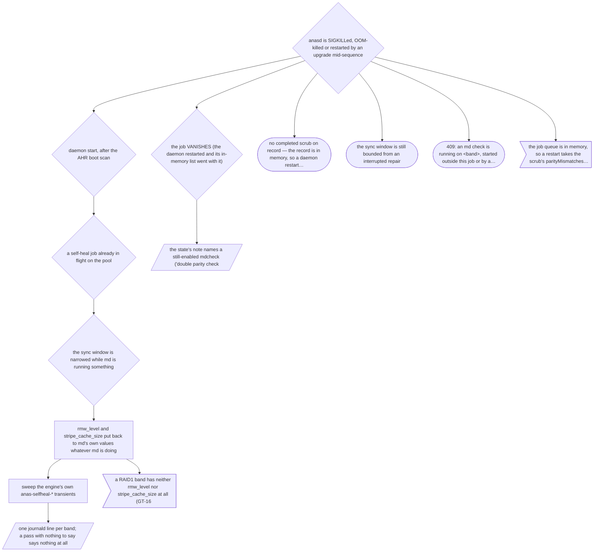
```mermaid
flowchart TD
  X12{"anasd is SIGKILLed, OOM-killed or restarted by an upgrade mid-sequence"}
  RC0{"daemon start, after the AHR boot scan"}
  T07{"the job VANISHES (the daemon restarted and its in-memory list went with it)"}
  P01a(["no completed scrub on record — the record is in memory, so a daemon restart…"])
  P03c(["the sync window is still bounded from an interrupted repair"])
  RT04a(["409: an md check is running on &lt;band&gt;, started outside this job or by a…"])
  X12r>"the job queue is in memory, so a restart takes the scrub's parityMismatches…"]
  RC1{"a self-heal job already in flight on the pool"}
  T13[/"the state's note names a still-enabled mdcheck ('double parity check"/]
  RC2{"the sync window is narrowed while md is running something"}
  RC3["rmw_level and stripe_cache_size put back to md's own values whatever md is doing"]
  RC4["sweep the engine's own anas-selfheal-* transients"]
  RC6>"a RAID1 band has neither rmw_level nor stripe_cache_size at all (GT-16"]
  RC5[/"one journald line per band; a pass with nothing to say says nothing at all"/]
  X12 --> RC0
  X12 --> T07
  X12 --> P01a
  X12 --> P03c
  X12 --> RT04a
  X12 --> X12r
  RC0 --> RC1
  T07 --> T13
  RC1 --> RC2
  RC2 --> RC3
  RC3 --> RC4
  RC3 --> RC6
  RC4 --> RC5
```

| leaf | kind | what the system does | `code:` | `test:` | `gt:` |
|---|---|---|---|---|---|
| `X12` | decision | anasd is SIGKILLed, OOM-killed or restarted by an upgrade mid-sequence: no `finally` runs | `packages/daemon/src/services/selfheal-reconcile.ts:reconcileSelfhealState` | `packages/daemon/src/services/__tests__/selfheal-reconcile.test.ts:puts the sync window, rmw_level and stripe cache back to md's own values` | `GT-13` |
| `RC0` | decision | daemon start, after the AHR boot scan: walk every band and put back any self-heal knob a killed run left turned aside | `packages/daemon/src/services/selfheal-reconcile.ts:reconcileSelfhealState` | `packages/daemon/src/services/__tests__/selfheal-reconcile.test.ts:puts the sync window, rmw_level and stripe cache back to md's own values` | `GT-1` |
| `T07` | decision | the job VANISHES (the daemon restarted and its in-memory list went with it): three CONSECUTIVE 404s end the wait, rather than blocking pools 2..n for a day | `packages/daemon/src/scrub-task.ts:pollScrubJob` | `packages/daemon/src/__tests__/scrub-task.test.ts:a VANISHED job (404) ends the wait after 3 confirmations, with a journald line (review F9)` | — |
| `P01a` | refusal | no completed scrub on record — the record is in memory, so a daemon restart clears it | `packages/daemon/src/services/ahr-parity-rewrite.ts:parityRewriteEvidence` | `packages/daemon/src/services/__tests__/ahr-parity-rewrite.test.ts:no completed scrub is no proof` | — |
| `P03c` | refusal | the sync window is still bounded from an interrupted repair: a whole-band repair under it would cover that sliver and report a count that means nothing (GT-13) | `packages/daemon/src/services/ahr-parity-rewrite.ts:parityRewriteArrayRefusal` | `packages/daemon/src/services/__tests__/ahr-parity-rewrite.test.ts:refuses a band that is not idle, and one whose sync window is still bounded` | `GT-13` |
| `RT04a` | refusal | 409: an md check is running on <band>, started outside this job or by a previous daemon — neither the pool state nor the job queue can see it | `packages/daemon/src/services/ahr-scrub.ts:runningAhrCheck` | `packages/daemon/src/routes/__tests__/ahr-repair.test.ts:409s a PARITY REWRITE on the same check, with the same sentence` | — |
| `X12r` | residual | the job queue is in memory, so a restart takes the scrub's `parityMismatches` record with it and Rewrite parity has no proof until a fresh multi-hour two-phase scrub has run — the refusal says so in those words | `packages/daemon/src/services/ahr-parity-rewrite.ts:parityRewriteEvidence` | `packages/daemon/src/services/__tests__/ahr-parity-rewrite.test.ts:no completed scrub is no proof` | — |
| `RC1` | decision | a self-heal job already in flight on the pool: the knobs and the pin are in USE, not leftovers — the pool is skipped entirely and the job is named | `packages/daemon/src/services/selfheal-reconcile.ts:reconcileSelfhealState` | `packages/daemon/src/services/__tests__/selfheal-reconcile.test.ts:leaves every knob and the transient snapshot alone, and says which job` | — |
| `T13` | notification | the state's `note` names a still-enabled mdcheck ("double parity check — mdcheck is on") and every md array that is no AHR band | `packages/daemon/src/services/scrub-schedules.ts:foreignMdArrays` | `packages/daemon/src/services/__tests__/scrub-schedules.test.ts:the note is honest: mdcheck on ⇒ "double parity check"; foreign md arrays are named` | — |
| `RC2` | decision | the sync window is narrowed while md is running something: left exactly as it is and REPORTED — widening it under a recovery resumes and re-bounds an operation that is not ours | `packages/daemon/src/services/selfheal-reconcile.ts:reconcileBand` | `packages/daemon/src/services/__tests__/selfheal-reconcile.test.ts:leaves the sync window alone and reports the band instead` | `GT-19` |
| `RC3` | action | `rmw_level` and `stripe_cache_size` put back to md's own values whatever md is doing — they change how md writes, never what it is doing | `packages/daemon/src/services/selfheal-io.ts:MD_DEFAULT_RMW_LEVEL` | `packages/daemon/src/services/__tests__/selfheal-reconcile.test.ts:puts the sync window, rmw_level and stripe cache back to md's own values` | `GT-1` |
| `RC4` | action | sweep the engine's own `anas-selfheal-*` transients — both pin shapes, and nothing an operator or a backup made | `packages/daemon/src/services/selfheal-repair.ts:sweepSelfhealPins` | `packages/daemon/src/services/__tests__/selfheal-reconcile.test.ts:sweeps the engine's own prefix out of @snapshots, and nothing else` | — |
| `RC6` | residual | a RAID1 band has neither `rmw_level` nor `stripe_cache_size` at all (GT-16 — absent, not zero): reconcile leaves it alone | `packages/daemon/src/services/selfheal-reconcile.ts:reconcileBand` | `packages/daemon/src/services/__tests__/selfheal-reconcile.test.ts:leaves a RAID1 band alone — it has neither knob at all (GT-16)` | `GT-16` |
| `RC5` | notification | one journald line per band; a pass with nothing to say says nothing at all | `packages/daemon/src/services/selfheal-reconcile.ts:reconcileWasQuiet` | `packages/daemon/src/services/__tests__/selfheal-reconcile.test.ts:writes nothing and says nothing` | — |

### R13 — power loss mid-repair

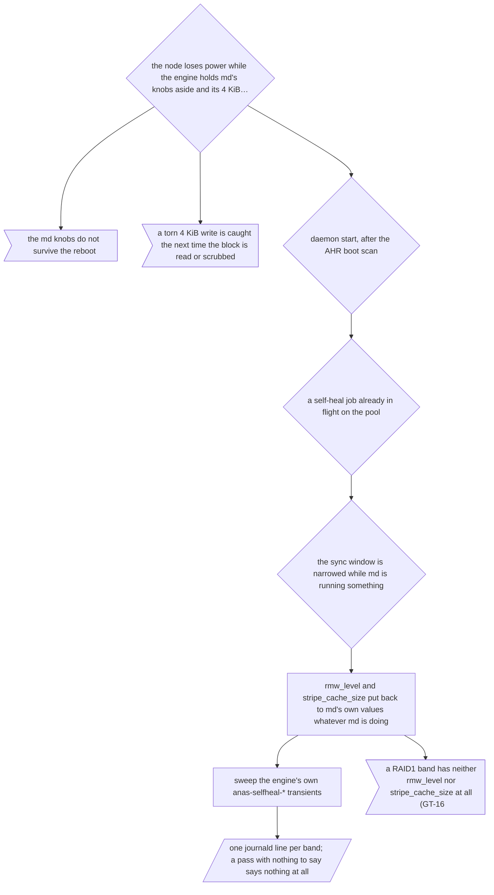
```mermaid
flowchart TD
  X13{"the node loses power while the engine holds md's knobs aside and its 4 KiB…"}
  X13a>"the md knobs do not survive the reboot"]
  X13b>"a torn 4 KiB write is caught the next time the block is read or scrubbed"]
  RC0{"daemon start, after the AHR boot scan"}
  RC1{"a self-heal job already in flight on the pool"}
  RC2{"the sync window is narrowed while md is running something"}
  RC3["rmw_level and stripe_cache_size put back to md's own values whatever md is doing"]
  RC4["sweep the engine's own anas-selfheal-* transients"]
  RC6>"a RAID1 band has neither rmw_level nor stripe_cache_size at all (GT-16"]
  RC5[/"one journald line per band; a pass with nothing to say says nothing at all"/]
  X13 --> X13a
  X13 --> X13b
  X13 --> RC0
  RC0 --> RC1
  RC1 --> RC2
  RC2 --> RC3
  RC3 --> RC4
  RC3 --> RC6
  RC4 --> RC5
```

| leaf | kind | what the system does | `code:` | `test:` | `gt:` |
|---|---|---|---|---|---|
| `X13` | decision | the node loses power while the engine holds md's knobs aside and its 4 KiB write is in flight | `packages/daemon/src/services/selfheal-io.ts:writeDirect` | — | `GT-13` |
| `X13a` | residual | the md knobs do not survive the reboot: `rmw_level`, `sync_min`/`sync_max` and `stripe_cache_size` come back at md's own defaults on re-assembly, so the GT-13 trap is a daemon-restart problem and not a power-loss one | `packages/daemon/src/services/selfheal-io.ts:MD_DEFAULT_SYNC_MAX` | `packages/daemon/src/services/__tests__/selfheal-reconcile.test.ts:writes nothing and says nothing` | `GT-1` |
| `X13b` | residual | a torn 4 KiB write is caught the next time the block is read or scrubbed — btrfs's own checksum is the only record that the write did not land, and ANAS keeps none of its own (stateless) | — | — | `GT-8` |
| `RC0` | decision | daemon start, after the AHR boot scan: walk every band and put back any self-heal knob a killed run left turned aside | `packages/daemon/src/services/selfheal-reconcile.ts:reconcileSelfhealState` | `packages/daemon/src/services/__tests__/selfheal-reconcile.test.ts:puts the sync window, rmw_level and stripe cache back to md's own values` | `GT-1` |
| `RC1` | decision | a self-heal job already in flight on the pool: the knobs and the pin are in USE, not leftovers — the pool is skipped entirely and the job is named | `packages/daemon/src/services/selfheal-reconcile.ts:reconcileSelfhealState` | `packages/daemon/src/services/__tests__/selfheal-reconcile.test.ts:leaves every knob and the transient snapshot alone, and says which job` | — |
| `RC2` | decision | the sync window is narrowed while md is running something: left exactly as it is and REPORTED — widening it under a recovery resumes and re-bounds an operation that is not ours | `packages/daemon/src/services/selfheal-reconcile.ts:reconcileBand` | `packages/daemon/src/services/__tests__/selfheal-reconcile.test.ts:leaves the sync window alone and reports the band instead` | `GT-19` |
| `RC3` | action | `rmw_level` and `stripe_cache_size` put back to md's own values whatever md is doing — they change how md writes, never what it is doing | `packages/daemon/src/services/selfheal-io.ts:MD_DEFAULT_RMW_LEVEL` | `packages/daemon/src/services/__tests__/selfheal-reconcile.test.ts:puts the sync window, rmw_level and stripe cache back to md's own values` | `GT-1` |
| `RC4` | action | sweep the engine's own `anas-selfheal-*` transients — both pin shapes, and nothing an operator or a backup made | `packages/daemon/src/services/selfheal-repair.ts:sweepSelfhealPins` | `packages/daemon/src/services/__tests__/selfheal-reconcile.test.ts:sweeps the engine's own prefix out of @snapshots, and nothing else` | — |
| `RC6` | residual | a RAID1 band has neither `rmw_level` nor `stripe_cache_size` at all (GT-16 — absent, not zero): reconcile leaves it alone | `packages/daemon/src/services/selfheal-reconcile.ts:reconcileBand` | `packages/daemon/src/services/__tests__/selfheal-reconcile.test.ts:leaves a RAID1 band alone — it has neither knob at all (GT-16)` | `GT-16` |
| `RC5` | notification | one journald line per band; a pass with nothing to say says nothing at all | `packages/daemon/src/services/selfheal-reconcile.ts:reconcileWasQuiet` | `packages/daemon/src/services/__tests__/selfheal-reconcile.test.ts:writes nothing and says nothing` | — |

### R14 — a foreign md op (mdcheck, recovery, reshape) concurrent with ours

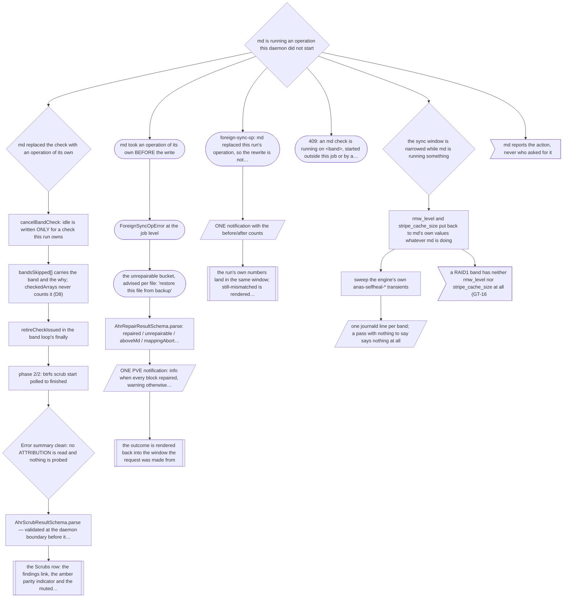
```mermaid
flowchart TD
  X14{"md is running an operation this daemon did not start"}
  S15{"md replaced the check with an operation of its own"}
  E05c(["md took an operation of its own BEFORE the write"])
  P08a(["foreign-sync-op: md replaced this run's operation, so the rewrite is not…"])
  RT04a(["409: an md check is running on &lt;band&gt;, started outside this job or by a…"])
  RC2{"the sync window is narrowed while md is running something"}
  X14r>"md reports the action, never who asked for it"]
  S18["cancelBandCheck: idle is written ONLY for a check this run owns"]
  J44(["ForeignSyncOpError at the job level"])
  P12[/"ONE notification with the before/after counts"/]
  RC3["rmw_level and stripe_cache_size put back to md's own values whatever md is doing"]
  S30["bandsSkipped[] carries the band and the why; checkedArrays never counts it (D8)"]
  J40(["the unrepairable bucket, advised per file: 'restore this file from backup'"])
  P13[["the run's own numbers land in the same window; still-mismatched is rendered…"]]
  RC4["sweep the engine's own anas-selfheal-* transients"]
  RC6>"a RAID1 band has neither rmw_level nor stripe_cache_size at all (GT-16"]
  S31["retireCheckIssued in the band loop's finally"]
  J50["AhrRepairResultSchema.parse: repaired / unrepairable / aboveMd / mappingAbort…"]
  RC5[/"one journald line per band; a pass with nothing to say says nothing at all"/]
  S40["phase 2/2: btrfs scrub start polled to finished"]
  J51[/"ONE PVE notification: info when every block repaired, warning otherwise…"/]
  S42{"Error summary clean: no ATTRIBUTION is read and nothing is probed"}
  J52[["the outcome is rendered back into the window the request was made from"]]
  S60["AhrScrubResultSchema.parse — validated at the daemon boundary before it…"]
  S64[["the Scrubs row: the findings link, the amber parity indicator and the muted…"]]
  X14 --> S15
  X14 --> E05c
  X14 --> P08a
  X14 --> RT04a
  X14 --> RC2
  X14 --> X14r
  S15 --> S18
  E05c --> J44
  P08a --> P12
  RC2 --> RC3
  S18 --> S30
  J44 --> J40
  P12 --> P13
  RC3 --> RC4
  RC3 --> RC6
  S30 --> S31
  J40 --> J50
  RC4 --> RC5
  S31 --> S40
  J50 --> J51
  S40 --> S42
  J51 --> J52
  S42 --> S60
  S60 --> S64
```

| leaf | kind | what the system does | `code:` | `test:` | `gt:` |
|---|---|---|---|---|---|
| `X14` | decision | md is running an operation this daemon did not start — mdcheck's check, a recovery onto a spare, a resync, a reshape, or a frozen array | `packages/daemon/src/services/selfheal-syncop.ts:ownsSyncOp` | `packages/daemon/src/services/__tests__/selfheal-repair.test.ts:stops the bounded check itself rather than narrowing a recovery's window` | `GT-19` |
| `S15` | decision | md replaced the check with an operation of its own: this band will not be checked in this run, and no counter is read | `packages/daemon/src/services/selfheal-syncop.ts:foreignOpNote` | `packages/daemon/src/services/__tests__/ahr-scrub.test.ts:stops waiting on a band whose check became` | `GT-19` |
| `E05c` | refusal | md took an operation of its own BEFORE the write: ForeignSyncOpError is raised INSTEAD of writing anything, and every knob is left as md set it | `packages/daemon/src/services/selfheal-repair.ts:ForeignSyncOpError` | `packages/daemon/src/services/__tests__/selfheal-repair.test.ts:stops the bounded check itself rather than narrowing a recovery's window` | `GT-19` |
| `P08a` | refusal | `foreign-sync-op`: md replaced this run's operation, so the rewrite is not proven and no knob was touched | `packages/daemon/src/services/selfheal-syncop.ts:foreignOpNote` | `packages/daemon/src/services/__tests__/ahr-parity-rewrite.test.ts:a foreign operation replacing the VERIFYING CHECK leaves the rewrite unproven` | `GT-19` |
| `RT04a` | refusal | 409: an md check is running on <band>, started outside this job or by a previous daemon — neither the pool state nor the job queue can see it | `packages/daemon/src/services/ahr-scrub.ts:runningAhrCheck` | `packages/daemon/src/routes/__tests__/ahr-repair.test.ts:409s a PARITY REWRITE on the same check, with the same sentence` | — |
| `RC2` | decision | the sync window is narrowed while md is running something: left exactly as it is and REPORTED — widening it under a recovery resumes and re-bounds an operation that is not ours | `packages/daemon/src/services/selfheal-reconcile.ts:reconcileBand` | `packages/daemon/src/services/__tests__/selfheal-reconcile.test.ts:leaves the sync window alone and reports the band instead` | `GT-19` |
| `X14r` | residual | md reports the action, never who asked for it: the parity rewrite's own `repair` has no ownership token in sysfs at all, so the honest reading — this run issued a repair onto an idle array, therefore the repair md is running is that one — is what the wait uses | `packages/daemon/src/services/ahr-parity-rewrite.ts:rewriteBandParity` | `packages/daemon/src/services/__tests__/ahr-parity-rewrite.test.ts:an op that finished between two polls is proven by last_sync_action, not assumed` | `GT-19` |
| `S18` | action | cancelBandCheck: `idle` is written ONLY for a check this run owns — a foreign op, or a frozen array, is left exactly as it is and named | `packages/daemon/src/services/ahr-scrub.ts:cancelBandCheck` | `packages/daemon/src/services/__tests__/ahr-scrub.test.ts:a frozen band that refuses idle is said so — the scrub carries on` | `GT-19` |
| `J44` | refusal | ForeignSyncOpError at the job level: `unrepairable`, "array state changed mid-repair", with the operation named | `packages/daemon/src/services/selfheal-repair.ts:ForeignSyncOpError` | `packages/daemon/src/services/__tests__/selfheal-repair.test.ts:stops the bounded check itself rather than narrowing a recovery's window` | `GT-19` |
| `P12` | notification | ONE notification with the before/after counts: `info` on rewritten, `warning` on anything else | `packages/daemon/src/services/ahr-parity-rewrite.ts:rewriteBandParity` | `packages/pve-integration/test/dialog-contracts.harness.mjs:rewrite: the before and after counts are both said` | — |
| `RC3` | action | `rmw_level` and `stripe_cache_size` put back to md's own values whatever md is doing — they change how md writes, never what it is doing | `packages/daemon/src/services/selfheal-io.ts:MD_DEFAULT_RMW_LEVEL` | `packages/daemon/src/services/__tests__/selfheal-reconcile.test.ts:puts the sync window, rmw_level and stripe cache back to md's own values` | `GT-1` |
| `S30` | action | `bandsSkipped[]` carries the band and the why; `checkedArrays` never counts it (D8) | `packages/daemon/src/services/ahr-scrub.ts:scrubAhrPool` | `packages/daemon/src/services/__tests__/ahr-scrub.test.ts:a band md never started is recorded, not coverage — checkedArrays stays honest` | — |
| `J40` | refusal | the `unrepairable` bucket, advised per file: "restore this file from backup" **[restore-from-backup-advice]** | `packages/daemon/src/services/ahr-repair.ts:RESTORE_FILE_SENTENCE` | `packages/daemon/src/services/__tests__/ahr-repair.test.ts:anything unrepairable or above md notifies at warning, in the epic's words` | — |
| `P13` | ui | the run's own numbers land in the same window; `still-mismatched` is rendered "not proven good", never as a finish | `packages/pve-integration/src/69-scrubs.js:showParityResult` | `packages/pve-integration/test/dialog-contracts.harness.mjs:rewrite: a still-mismatched run refuses to read as healthy` | — |
| `RC4` | action | sweep the engine's own `anas-selfheal-*` transients — both pin shapes, and nothing an operator or a backup made | `packages/daemon/src/services/selfheal-repair.ts:sweepSelfhealPins` | `packages/daemon/src/services/__tests__/selfheal-reconcile.test.ts:sweeps the engine's own prefix out of @snapshots, and nothing else` | — |
| `RC6` | residual | a RAID1 band has neither `rmw_level` nor `stripe_cache_size` at all (GT-16 — absent, not zero): reconcile leaves it alone | `packages/daemon/src/services/selfheal-reconcile.ts:reconcileBand` | `packages/daemon/src/services/__tests__/selfheal-reconcile.test.ts:leaves a RAID1 band alone — it has neither knob at all (GT-16)` | `GT-16` |
| `S31` | action | retireCheckIssued in the band loop's `finally` — the token never outlives the iteration that took it (N3) | `packages/daemon/src/services/selfheal-syncop.ts:retireCheckIssued` | `packages/daemon/src/services/__tests__/ahr-scrub.test.ts:retires the token on the SKIP paths too — md never started the check (N3)` | — |
| `J50` | action | AhrRepairResultSchema.parse: repaired / unrepairable / aboveMd / mappingAbort / notExamined, always summing to the blocks attempted | `packages/daemon/src/services/ahr-repair.ts:repairAhrFiles` | `packages/daemon/src/services/__tests__/ahr-repair.test.ts:the notification names all five counts, and they add up (review R9, seventh pass F3)` | — |
| `RC5` | notification | one journald line per band; a pass with nothing to say says nothing at all | `packages/daemon/src/services/selfheal-reconcile.ts:reconcileWasQuiet` | `packages/daemon/src/services/__tests__/selfheal-reconcile.test.ts:writes nothing and says nothing` | — |
| `S40` | action | phase 2/2: `btrfs scrub start` polled to finished — one pass, two callers (the scrub and the parity rewrite) | `packages/daemon/src/services/ahr-scrub.ts:btrfsScrubPass` | `packages/daemon/src/services/__tests__/ahr-scrub.test.ts:runs btrfs scrub to completion, THEN per-array checks sequentially` | `GT-3` |
| `J51` | notification | ONE PVE notification: `info` when every block repaired, `warning` otherwise, with the per-file advice and the file list capped at 20 | `packages/daemon/src/services/ahr-repair.ts:repairBody` | `packages/daemon/src/services/__tests__/ahr-repair.test.ts:everything repaired notifies at info and says so` | — |
| `S42` | decision | Error summary clean: no ATTRIBUTION is read and nothing is probed — the journal is read once more for the corrected-metadata count alone (selfheal.12), the one rot signal a clean scrub can hold | `packages/daemon/src/services/ahr-scrub.ts:parseBtrfsScrubStatus` | `packages/daemon/src/services/__tests__/ahr-scrub.test.ts:a clean scrub probes nothing, and reads the journal only for the corrected-metadata window` | `GT-3` |
| `J52` | ui | the outcome is rendered back into the window the request was made from — per-file verdicts on their own rows, and the four counts | `packages/pve-integration/src/69-scrubs.js:showRepairResult` | `packages/pve-integration/test/dialog-contracts.harness.mjs:repair: the result appears in the window the request was made from` | — |
| `S60` | action | AhrScrubResultSchema.parse — validated at the daemon boundary before it leaves as a job result | `packages/daemon/src/services/ahr-scrub.ts:scrubAhrPool` | `packages/daemon/src/services/__tests__/ahr-scrub.test.ts:the new record fields round-trip the shared schema — and stay optional` | — |
| `S64` | ui | the Scrubs row: the findings link, the amber parity indicator and the muted skipped-band count share ONE cell, each with its own tooltip | `packages/pve-integration/src/69-scrubs.js:renderLastScrub` | `packages/pve-integration/test/dialog-contracts.harness.mjs:scrubs: the row says how many files, labelled` | — |

### R15 — a block in band N of a multi-band pool


```mermaid
flowchart TD
  X15{"the LV is a linear concatenation of one md array per band; the block's band…"}
  X15a["each on-disk sector of the repair unit is placed INDEPENDENTLY"]
  X15b["knobs are saved and restored PER BAND, and only the bands this run touched…"]
  E00{"repairBlock: the file must resolve under the mountpoint (the engine's own…"}
  E01{"gates: EVERY band of the pool, because which band the block is on is not…"}
  E02["pin: sweep this engine's OWN anas-selfheal-* prefix first, then take a…"]
  E02a["§12 pool: createAhrSnapshot into @snapshots/anas-selfheal-&lt;ts&gt;, read cold…"]
  E02b["a file inside a NESTED subvolume is pinned by snapshotting THAT subvolume"]
  E02c["a flat pool (and the suite's loop rigs) has no @snapshots"]
  E03{"resolve, AFTER the pin: file block → EXTENT_DATA → the COVERING chunk's own…"}
  E04{"reverify: re-read the bytes AT the computed member location and require they…"}
  E05a["evictStripeCache: shrink stripe_cache_size to its floor of 17, sweep ±200…"]
  E05a2["directParityConsistent: every member's row read O_DIRECT off the MEMBER…"]
  E05{"precheck: a bounded md check over the TARGET stripe and its mismatch_cnt…"}
  E06["rmw_level = 0 on the TARGET's band for the write window"]
  E07{"reconstructionPlan: degraded re-read and each role's rd&lt;n&gt;/state…"}
  E07r5["RAID5: the one candidate is the XOR of the same stripe row on every other member"]
  E08{"arbitrate: crc32c of each candidate against the stored csum, best first"}
  E09{"read-back guard: the md offset about to be written must hold the bytes read…"}
  E10{"pre-write re-check at the LAST instant"}
  E11["write: ONE 4 KiB block, O_DIRECT + fsync, THROUGH md"]
  E12{"postcheck: the same evicted bounded check must now read mismatch_cnt = 0…"}
  E13{"cold read through the FRESH pin snapshot (drop_caches first; the whole…"}
  E14["cleanup in finally, PER BAND and only the bands this run touched"]
  E15{"outcome repaired, with the mapping, the steps and the stored csum as its…"}
  J50["AhrRepairResultSchema.parse: repaired / unrepairable / aboveMd / mappingAbort…"]
  J51[/"ONE PVE notification: info when every block repaired, warning otherwise…"/]
  J52[["the outcome is rendered back into the window the request was made from"]]
  X15 --> X15a
  X15 --> X15b
  X15 --> E00
  X15a --> X15b
  E00 --> E01
  E01 --> E02
  E02 --> E02a
  E02 --> E02b
  E02 --> E02c
  E02a --> E03
  E02b --> E03
  E02c --> E03
  E03 --> E04
  E04 --> E05a
  E05a --> E05a2
  E05a2 --> E05
  E05 --> E06
  E06 --> E07
  E07 --> E07r5
  E07r5 --> E08
  E08 --> E09
  E09 --> E10
  E10 --> E11
  E11 --> E12
  E12 --> E13
  E13 --> E14
  E14 --> E15
  E15 --> J50
  J50 --> J51
  J51 --> J52
```

| leaf | kind | what the system does | `code:` | `test:` | `gt:` |
|---|---|---|---|---|---|
| `X15` | decision | the LV is a linear concatenation of one md array per band; the block's band decides its geometry, its members and its sysfs knobs | `packages/daemon/src/services/selfheal-map.ts:bandForLvByte` | `packages/daemon/src/services/__tests__/selfheal-map.test.ts:places a byte in the SECOND band with the second band's geometry, array and members` | `GT-2` |
| `X15a` | action | each on-disk sector of the repair unit is placed INDEPENDENTLY: a compressed blob straddling a band boundary has its sectors on two arrays | `packages/daemon/src/services/selfheal-map.ts:locateLogical` | `packages/daemon/src/services/__tests__/selfheal-repair.test.ts:re-verifies every sector through ITS OWN band's members` | `GT-2` |
| `X15b` | action | knobs are saved and restored PER BAND, and only the bands this run touched are written to at all | `packages/daemon/src/services/selfheal-repair.ts:repairBlock` | `suite:7-bandA-untouched` | — |
| `E00` | decision | repairBlock: the file must resolve under the mountpoint (the engine's own lexical check, on top of the route's realpath + findmnt) | `packages/daemon/src/services/selfheal-repair.ts:repairBlock` | `packages/daemon/src/services/__tests__/selfheal-repair.test.ts:refuses a file outside the mountpoint before doing anything at all` | — |
| `E01` | decision | gates: EVERY band of the pool, because which band the block is on is not known until it has been pinned and resolved | `packages/daemon/src/services/selfheal-repair.ts:arrayRefusal` | `packages/daemon/src/services/__tests__/selfheal-repair.test.ts:REFUSES while md is busy, reshaping, or the array is not writable` | `GT-17` |
| `E02` | action | pin: sweep this engine's OWN `anas-selfheal-*` prefix first, then take a read-only snapshot — the same AHR snapshot verbs a backup uses | `packages/daemon/src/services/selfheal-repair.ts:sweepSelfhealPins` | `packages/daemon/src/services/__tests__/selfheal-repair.test.ts:sweeps a crashed earlier run's snapshot before taking its own` | — |
| `E02a` | action | §12 pool: createAhrSnapshot into `@snapshots/anas-selfheal-<ts>`, read cold through withTopLevelMount | `packages/daemon/src/services/selfheal-repair.ts:takePin` | `packages/daemon/src/services/__tests__/selfheal-repair.test.ts:snapshots @data into @snapshots and cold-reads through the top-level mount` | — |
| `E02b` | action | a file inside a NESTED subvolume is pinned by snapshotting THAT subvolume — a read-only snapshot does not recurse | `packages/daemon/src/services/selfheal-repair.ts:nestedSubvolumeOf` | `packages/daemon/src/services/__tests__/selfheal-repair.test.ts:pins the NESTED subvolume a file lives in, not @data (a ro snapshot does not recurse)` | — |
| `E02c` | action | a flat pool (and the suite's loop rigs) has no `@snapshots`: the pin is an in-place read-only snapshot inside the mountpoint | `packages/daemon/src/services/selfheal-repair.ts:takePin` | `packages/daemon/src/services/__tests__/selfheal-repair.test.ts:falls back to an in-place snapshot for a FLAT pool — which the suite's rigs are` | — |
| `E03` | decision | resolve, AFTER the pin: file block → EXTENT_DATA → the COVERING chunk's own delta → the dm linear segment → member and offset from md geometry read live | `packages/daemon/src/services/selfheal-map.ts:resolveBlock` | `packages/daemon/src/services/__tests__/selfheal-map.test.ts:derives the block's repair unit and its logical byte from the tree, not from filefrag` | `GT-2` |
| `E04` | decision | reverify: re-read the bytes AT the computed member location and require they FAIL the currently stored csum | `packages/daemon/src/services/selfheal-repair.ts:reverify` | `packages/daemon/src/services/__tests__/selfheal-repair.test.ts:ABORTS when the bytes at the computed location still pass their csum` | `GT-11` |
| `E05a` | action | evictStripeCache: shrink `stripe_cache_size` to its floor of 17, sweep ±200 stripes while it is small, restore — without it a check over a recently touched stripe reads the CACHE and reports 0 over junk. On kernel 7.0.14-17 it no longer reaches a stripe written MOMENTS ago (GT-23), which is why the verdict no longer rests on its number alone | `packages/daemon/src/services/selfheal-repair.ts:memberDataSectors` | `packages/daemon/src/services/__tests__/selfheal-repair.test.ts:sweeps the stripes around a target near the END of the array` | `GT-14` |
| `E05a2` | action | directParityConsistent: every member's row read O_DIRECT off the MEMBER devices at its own data offset and the parity group recomputed - XOR of the data rows against P, the Q syndrome against Q on RAID6, the legs against each other on RAID1. md's cache takes no part in it, which is the whole point (GT-23) | `packages/daemon/src/services/selfheal-repair.ts:directParityConsistent` | `packages/daemon/src/services/__tests__/selfheal-repair.test.ts:diagnoses ABOVE MD when P and Q both agree with the bad data` | `GT-23` |
| `E05` | decision | precheck: a bounded md `check` over the TARGET stripe and its `mismatch_cnt`, weighed against the direct member-row computation - parityAgreement names the pair, and the verdict needs both | `packages/daemon/src/services/selfheal-repair.ts:parityAgreement` | `packages/daemon/src/services/__tests__/selfheal-repair.test.ts:names each of the four combinations` | `GT-5` |
| `E06` | action | `rmw_level = 0` on the TARGET's band for the write window — at the default, a correct block written through md updates parity against the JUNK (GT-7) | `packages/daemon/src/services/selfheal-repair.ts:repairBlock` | `packages/daemon/src/services/__tests__/selfheal-repair.test.ts:sets rmw_level to 0 BEFORE the write — the GT-7 poison is the default` | `GT-7` |
| `E07` | decision | reconstructionPlan: `degraded` re-read and each role's `rd<n>/state` consulted, so a member md KICKED since the gates is never read for its stale bytes | `packages/daemon/src/services/selfheal-repair.ts:reconstructionPlan` | `packages/daemon/src/services/__tests__/selfheal-repair.test.ts:keeps the syndrome that does not need the kicked member, and only that one` | — |
| `E07r5` | action | RAID5: the one candidate is the XOR of the same stripe row on every other member | `packages/daemon/src/services/selfheal-repair.ts:reconstruct` | `suite:2-neg` | `GT-8` |
| `E08` | decision | arbitrate: crc32c of each candidate against the stored csum, best first — the btrfs checksum is what decides, never md | `packages/daemon/src/services/selfheal-csum.ts:crc32c` | `packages/daemon/src/services/__tests__/selfheal-repair.test.ts:reconstructs it, arbitrates against the stored csum and writes it back` | `GT-11` |
| `E09` | decision | read-back guard: the md offset about to be written must hold the bytes read from the member (on RAID1, the bytes of SOME leg — md serves a mirror read from either) | `packages/daemon/src/services/selfheal-repair.ts:readBackGuard` | `packages/daemon/src/services/__tests__/selfheal-repair.test.ts:passes when md served the HEALTHY leg (R5: not a failed mapping)` | — |
| `E10` | decision | pre-write re-check at the LAST instant: `degraded`, `sync_action` and `reshape_position` re-read, because a bounded check over a 20 TB band takes minutes | `packages/daemon/src/services/selfheal-repair.ts:preWriteRefusal` | `packages/daemon/src/services/__tests__/selfheal-repair.test.ts:writes NOTHING when a recovery starts between the precheck and the write` | `GT-19` |
| `E11` | action | write: ONE 4 KiB block, O_DIRECT + fsync, THROUGH md — and only after the reconstruction matched the checksum btrfs stored for it **[md-block-write]** | `packages/daemon/src/services/selfheal-repair.ts:repairBlock` | `suite:7-member` | `GT-8` |
| `E12` | decision | postcheck: the same evicted bounded check must now read `mismatch_cnt = 0` AND the same direct member-row computation must agree - the stripe was written through md moments ago, which is exactly the state its check answers from the cache in (GT-23) | `packages/daemon/src/services/selfheal-repair.ts:boundedWindowCheck` | `suite:7-bcheck` | `GT-8` |
| `E13` | decision | cold read through the FRESH pin snapshot (drop_caches first; the whole logical extent when compressed) — a warm page of the live file answers from memory and hides everything | `packages/daemon/src/services/selfheal-repair.ts:coldRead` | `suite:3-cold` | `GT-9` |
| `E14` | action | cleanup in `finally`, PER BAND and only the bands this run touched: rmw_level, then the sync window under the ownership rule, then stripe_cache_size, then destroy the pin | `packages/daemon/src/services/selfheal-repair.ts:restoreSyncKnobs` | `packages/daemon/src/services/__tests__/selfheal-repair.test.ts:restores rmw_level on the band it turned it down on — and leaves the other band alone` | `GT-13` |
| `E15` | decision | outcome `repaired`, with the mapping, the steps and the stored csum as its audit trail | `packages/daemon/src/services/selfheal-repair.ts:repairBlock` | `packages/daemon/src/services/__tests__/selfheal-repair.test.ts:produces an outcome the shared schema accepts` | `GT-8` |
| `J50` | action | AhrRepairResultSchema.parse: repaired / unrepairable / aboveMd / mappingAbort / notExamined, always summing to the blocks attempted | `packages/daemon/src/services/ahr-repair.ts:repairAhrFiles` | `packages/daemon/src/services/__tests__/ahr-repair.test.ts:the notification names all five counts, and they add up (review R9, seventh pass F3)` | — |
| `J51` | notification | ONE PVE notification: `info` when every block repaired, `warning` otherwise, with the per-file advice and the file list capped at 20 | `packages/daemon/src/services/ahr-repair.ts:repairBody` | `packages/daemon/src/services/__tests__/ahr-repair.test.ts:everything repaired notifies at info and says so` | — |
| `J52` | ui | the outcome is rendered back into the window the request was made from — per-file verdicts on their own rows, and the four counts | `packages/pve-integration/src/69-scrubs.js:showRepairResult` | `packages/pve-integration/test/dialog-contracts.harness.mjs:repair: the result appears in the window the request was made from` | — |

### R16 — a block backing an iSCSI LUN image


```mermaid
flowchart TD
  X16{"the corrupt block lies inside a fileio LUN image on the pool"}
  E00{"repairBlock: the file must resolve under the mountpoint (the engine's own…"}
  J45(["a LUN-backed file: restore the LUN image from a PBS backup or the guest's…"])
  J46(["a LUN image whose unrepairable blocks are ALL csum-unreadable gets NO…"])
  E03a{"a SelfhealMapError anywhere in the chain carries the REASON the chain stopped…"}
  RT10(["lun-session-active: a repair path backing a LUN with a LIVE initiator…"])
  E01{"gates: EVERY band of the pool, because which band the block is on is not…"}
  J50["AhrRepairResultSchema.parse: repaired / unrepairable / aboveMd / mappingAbort…"]
  E03b(["an INLINE extent or a HOLE: there is no on-disk location at all. A hole is…"])
  E03c(["a truncated owner scan, a band whose geometry went unreadable between the…"])
  RT11[["Rewrite parity DISCLOSES instead of refusing"]]
  E02["pin: sweep this engine's OWN anas-selfheal-* prefix first, then take a…"]
  J51[/"ONE PVE notification: info when every block repaired, warning otherwise…"/]
  J47(["the not-examined bucket: 'this block could not be examined: &lt;reason&gt;…"])
  E02a["§12 pool: createAhrSnapshot into @snapshots/anas-selfheal-&lt;ts&gt;, read cold…"]
  E02b["a file inside a NESTED subvolume is pinned by snapshotting THAT subvolume"]
  E02c["a flat pool (and the suite's loop rigs) has no @snapshots"]
  J52[["the outcome is rendered back into the window the request was made from"]]
  E03{"resolve, AFTER the pin: file block → EXTENT_DATA → the COVERING chunk's own…"}
  E04{"reverify: re-read the bytes AT the computed member location and require they…"}
  E05a["evictStripeCache: shrink stripe_cache_size to its floor of 17, sweep ±200…"]
  E05a2["directParityConsistent: every member's row read O_DIRECT off the MEMBER…"]
  E05{"precheck: a bounded md check over the TARGET stripe and its mismatch_cnt…"}
  E06["rmw_level = 0 on the TARGET's band for the write window"]
  E07{"reconstructionPlan: degraded re-read and each role's rd&lt;n&gt;/state…"}
  E07r5["RAID5: the one candidate is the XOR of the same stripe row on every other member"]
  E08{"arbitrate: crc32c of each candidate against the stored csum, best first"}
  E09{"read-back guard: the md offset about to be written must hold the bytes read…"}
  E10{"pre-write re-check at the LAST instant"}
  E11["write: ONE 4 KiB block, O_DIRECT + fsync, THROUGH md"]
  E12{"postcheck: the same evicted bounded check must now read mismatch_cnt = 0…"}
  E13{"cold read through the FRESH pin snapshot (drop_caches first; the whole…"}
  E14["cleanup in finally, PER BAND and only the bands this run touched"]
  E15{"outcome repaired, with the mapping, the steps and the stored csum as its…"}
  X16 --> E00
  X16 --> J45
  X16 --> J46
  X16 --> E03a
  X16 --> RT10
  E00 --> E01
  J45 --> J50
  J46 --> J50
  E03a --> E03b
  E03a --> E03c
  RT10 --> RT11
  E01 --> E02
  J50 --> J51
  E03b --> J47
  E03c --> J47
  E02 --> E02a
  E02 --> E02b
  E02 --> E02c
  J51 --> J52
  J47 --> J50
  E02a --> E03
  E02b --> E03
  E02c --> E03
  E03 --> E04
  E04 --> E05a
  E05a --> E05a2
  E05a2 --> E05
  E05 --> E06
  E06 --> E07
  E07 --> E07r5
  E07r5 --> E08
  E08 --> E09
  E09 --> E10
  E10 --> E11
  E11 --> E12
  E12 --> E13
  E13 --> E14
  E14 --> E15
  E15 --> J50
```

| leaf | kind | what the system does | `code:` | `test:` | `gt:` |
|---|---|---|---|---|---|
| `X16` | decision | the corrupt block lies inside a fileio LUN image on the pool | `packages/daemon/src/services/ahr-repair.ts:lunRestoreSentence` | `packages/daemon/src/services/__tests__/ahr-repair.test.ts:a LUN-backed unrepairable file is told to restore the LUN, not the file (D10)` | — |
| `E00` | decision | repairBlock: the file must resolve under the mountpoint (the engine's own lexical check, on top of the route's realpath + findmnt) | `packages/daemon/src/services/selfheal-repair.ts:repairBlock` | `packages/daemon/src/services/__tests__/selfheal-repair.test.ts:refuses a file outside the mountpoint before doing anything at all` | — |
| `J45` | refusal | a LUN-backed file: restore the LUN image from a PBS backup or the guest's own, never "restore this file" **[restore-from-backup-advice]** | `packages/daemon/src/services/ahr-repair.ts:lunRestoreSentence` | `packages/daemon/src/services/__tests__/ahr-repair.test.ts:a LUN-backed unrepairable file is told to restore the LUN, not the file (D10)` | — |
| `J46` | refusal | a LUN image whose unrepairable blocks are ALL `csum-unreadable` gets NO restore verb at all: the LUN identity rides the csum-unreadable sentence (N5) | `packages/daemon/src/services/ahr-repair.ts:csumUnreadableLunSentence` | `packages/daemon/src/services/__tests__/ahr-repair.test.ts:a LUN image whose unrepairable blocks are ALL csum-unreadable is NOT told to restore (N5)` | `GT-20` |
| `E03a` | decision | a SelfhealMapError anywhere in the chain carries the REASON the chain stopped (`inline-extent`, `hole`, `owner-scan-truncated`, `band-unreadable`, `unresolvable`): the block was NOT examined, and the mapping-abort sentence asserts the opposite | `packages/daemon/src/services/selfheal-map.ts:SelfhealMapError` | `packages/daemon/src/services/__tests__/selfheal-map.test.ts:every map failure carries its reason (F3)` | — |
| `RT10` | refusal | `lun-session-active`: a repair path backing a LUN with a LIVE initiator session is 409ed BEFORE a confirm code exists. The block is proven and btrfs's copy-on-write leaves the old extent alone, but the initiator holds its own cache and has no idea the bytes moved - log it out first | `packages/daemon/src/routes/ahr-mutate.ts:lunSessionRefusal` | `packages/daemon/src/routes/__tests__/ahr-repair.test.ts:409 lun-session-active BEFORE a confirm code exists` | — |
| `E01` | decision | gates: EVERY band of the pool, because which band the block is on is not known until it has been pinned and resolved | `packages/daemon/src/services/selfheal-repair.ts:arrayRefusal` | `packages/daemon/src/services/__tests__/selfheal-repair.test.ts:REFUSES while md is busy, reshaping, or the array is not writable` | `GT-17` |
| `J50` | action | AhrRepairResultSchema.parse: repaired / unrepairable / aboveMd / mappingAbort / notExamined, always summing to the blocks attempted | `packages/daemon/src/services/ahr-repair.ts:repairAhrFiles` | `packages/daemon/src/services/__tests__/ahr-repair.test.ts:the notification names all five counts, and they add up (review R9, seventh pass F3)` | — |
| `E03b` | refusal | an INLINE extent or a HOLE: there is no on-disk location at all. A hole is reachable on any ANAS-created LUN, every image of which is created sparse with ftruncate, and says nothing whatever about the LUN's data | `packages/daemon/src/services/selfheal-map.ts:resolveBlock` | `packages/daemon/src/services/__tests__/selfheal-repair.test.ts:a HOLE: not-examined / hole` | — |
| `E03c` | refusal | a truncated owner scan, a band whose geometry went unreadable between the gates and the resolve, or any other chain that cannot be followed | `packages/daemon/src/services/selfheal-map.ts:locateLogicalIn` | `packages/daemon/src/services/__tests__/selfheal-repair.test.ts:a band whose geometry goes unreadable after the gates: not-examined / band-unreadable` | — |
| `RT11` | ui | Rewrite parity DISCLOSES instead of refusing: it reads every member of the band twice and writes parity, never a file, so nothing it writes is visible to a guest - but the operator is agreeing to hours of that under a live disk | `packages/daemon/src/routes/ahr-mutate.ts:rewriteLunWarnings` | `packages/daemon/src/routes/__tests__/ahr-mutate.test.ts:names the LUN and its live sessions, and says the guest sees nothing this run writes` | — |
| `E02` | action | pin: sweep this engine's OWN `anas-selfheal-*` prefix first, then take a read-only snapshot — the same AHR snapshot verbs a backup uses | `packages/daemon/src/services/selfheal-repair.ts:sweepSelfhealPins` | `packages/daemon/src/services/__tests__/selfheal-repair.test.ts:sweeps a crashed earlier run's snapshot before taking its own` | — |
| `J51` | notification | ONE PVE notification: `info` when every block repaired, `warning` otherwise, with the per-file advice and the file list capped at 20 | `packages/daemon/src/services/ahr-repair.ts:repairBody` | `packages/daemon/src/services/__tests__/ahr-repair.test.ts:everything repaired notifies at info and says so` | — |
| `J47` | refusal | the `not-examined` bucket: "this block could not be examined: <reason>; nothing was written; re-scrub after <what would change>". Its own count, its own paragraph, and never the mapping-abort sentence, which asserts the bytes passed their checksum | `packages/daemon/src/services/ahr-repair.ts:notExaminedSentence` | `packages/daemon/src/services/__tests__/ahr-repair.test.ts:a not-examined block never carries restore advice, and keeps the run a warning` | — |
| `E02a` | action | §12 pool: createAhrSnapshot into `@snapshots/anas-selfheal-<ts>`, read cold through withTopLevelMount | `packages/daemon/src/services/selfheal-repair.ts:takePin` | `packages/daemon/src/services/__tests__/selfheal-repair.test.ts:snapshots @data into @snapshots and cold-reads through the top-level mount` | — |
| `E02b` | action | a file inside a NESTED subvolume is pinned by snapshotting THAT subvolume — a read-only snapshot does not recurse | `packages/daemon/src/services/selfheal-repair.ts:nestedSubvolumeOf` | `packages/daemon/src/services/__tests__/selfheal-repair.test.ts:pins the NESTED subvolume a file lives in, not @data (a ro snapshot does not recurse)` | — |
| `E02c` | action | a flat pool (and the suite's loop rigs) has no `@snapshots`: the pin is an in-place read-only snapshot inside the mountpoint | `packages/daemon/src/services/selfheal-repair.ts:takePin` | `packages/daemon/src/services/__tests__/selfheal-repair.test.ts:falls back to an in-place snapshot for a FLAT pool — which the suite's rigs are` | — |
| `J52` | ui | the outcome is rendered back into the window the request was made from — per-file verdicts on their own rows, and the four counts | `packages/pve-integration/src/69-scrubs.js:showRepairResult` | `packages/pve-integration/test/dialog-contracts.harness.mjs:repair: the result appears in the window the request was made from` | — |
| `E03` | decision | resolve, AFTER the pin: file block → EXTENT_DATA → the COVERING chunk's own delta → the dm linear segment → member and offset from md geometry read live | `packages/daemon/src/services/selfheal-map.ts:resolveBlock` | `packages/daemon/src/services/__tests__/selfheal-map.test.ts:derives the block's repair unit and its logical byte from the tree, not from filefrag` | `GT-2` |
| `E04` | decision | reverify: re-read the bytes AT the computed member location and require they FAIL the currently stored csum | `packages/daemon/src/services/selfheal-repair.ts:reverify` | `packages/daemon/src/services/__tests__/selfheal-repair.test.ts:ABORTS when the bytes at the computed location still pass their csum` | `GT-11` |
| `E05a` | action | evictStripeCache: shrink `stripe_cache_size` to its floor of 17, sweep ±200 stripes while it is small, restore — without it a check over a recently touched stripe reads the CACHE and reports 0 over junk. On kernel 7.0.14-17 it no longer reaches a stripe written MOMENTS ago (GT-23), which is why the verdict no longer rests on its number alone | `packages/daemon/src/services/selfheal-repair.ts:memberDataSectors` | `packages/daemon/src/services/__tests__/selfheal-repair.test.ts:sweeps the stripes around a target near the END of the array` | `GT-14` |
| `E05a2` | action | directParityConsistent: every member's row read O_DIRECT off the MEMBER devices at its own data offset and the parity group recomputed - XOR of the data rows against P, the Q syndrome against Q on RAID6, the legs against each other on RAID1. md's cache takes no part in it, which is the whole point (GT-23) | `packages/daemon/src/services/selfheal-repair.ts:directParityConsistent` | `packages/daemon/src/services/__tests__/selfheal-repair.test.ts:diagnoses ABOVE MD when P and Q both agree with the bad data` | `GT-23` |
| `E05` | decision | precheck: a bounded md `check` over the TARGET stripe and its `mismatch_cnt`, weighed against the direct member-row computation - parityAgreement names the pair, and the verdict needs both | `packages/daemon/src/services/selfheal-repair.ts:parityAgreement` | `packages/daemon/src/services/__tests__/selfheal-repair.test.ts:names each of the four combinations` | `GT-5` |
| `E06` | action | `rmw_level = 0` on the TARGET's band for the write window — at the default, a correct block written through md updates parity against the JUNK (GT-7) | `packages/daemon/src/services/selfheal-repair.ts:repairBlock` | `packages/daemon/src/services/__tests__/selfheal-repair.test.ts:sets rmw_level to 0 BEFORE the write — the GT-7 poison is the default` | `GT-7` |
| `E07` | decision | reconstructionPlan: `degraded` re-read and each role's `rd<n>/state` consulted, so a member md KICKED since the gates is never read for its stale bytes | `packages/daemon/src/services/selfheal-repair.ts:reconstructionPlan` | `packages/daemon/src/services/__tests__/selfheal-repair.test.ts:keeps the syndrome that does not need the kicked member, and only that one` | — |
| `E07r5` | action | RAID5: the one candidate is the XOR of the same stripe row on every other member | `packages/daemon/src/services/selfheal-repair.ts:reconstruct` | `suite:2-neg` | `GT-8` |
| `E08` | decision | arbitrate: crc32c of each candidate against the stored csum, best first — the btrfs checksum is what decides, never md | `packages/daemon/src/services/selfheal-csum.ts:crc32c` | `packages/daemon/src/services/__tests__/selfheal-repair.test.ts:reconstructs it, arbitrates against the stored csum and writes it back` | `GT-11` |
| `E09` | decision | read-back guard: the md offset about to be written must hold the bytes read from the member (on RAID1, the bytes of SOME leg — md serves a mirror read from either) | `packages/daemon/src/services/selfheal-repair.ts:readBackGuard` | `packages/daemon/src/services/__tests__/selfheal-repair.test.ts:passes when md served the HEALTHY leg (R5: not a failed mapping)` | — |
| `E10` | decision | pre-write re-check at the LAST instant: `degraded`, `sync_action` and `reshape_position` re-read, because a bounded check over a 20 TB band takes minutes | `packages/daemon/src/services/selfheal-repair.ts:preWriteRefusal` | `packages/daemon/src/services/__tests__/selfheal-repair.test.ts:writes NOTHING when a recovery starts between the precheck and the write` | `GT-19` |
| `E11` | action | write: ONE 4 KiB block, O_DIRECT + fsync, THROUGH md — and only after the reconstruction matched the checksum btrfs stored for it **[md-block-write]** | `packages/daemon/src/services/selfheal-repair.ts:repairBlock` | `suite:7-member` | `GT-8` |
| `E12` | decision | postcheck: the same evicted bounded check must now read `mismatch_cnt = 0` AND the same direct member-row computation must agree - the stripe was written through md moments ago, which is exactly the state its check answers from the cache in (GT-23) | `packages/daemon/src/services/selfheal-repair.ts:boundedWindowCheck` | `suite:7-bcheck` | `GT-8` |
| `E13` | decision | cold read through the FRESH pin snapshot (drop_caches first; the whole logical extent when compressed) — a warm page of the live file answers from memory and hides everything | `packages/daemon/src/services/selfheal-repair.ts:coldRead` | `suite:3-cold` | `GT-9` |
| `E14` | action | cleanup in `finally`, PER BAND and only the bands this run touched: rmw_level, then the sync window under the ownership rule, then stripe_cache_size, then destroy the pin | `packages/daemon/src/services/selfheal-repair.ts:restoreSyncKnobs` | `packages/daemon/src/services/__tests__/selfheal-repair.test.ts:restores rmw_level on the band it turned it down on — and leaves the other band alone` | `GT-13` |
| `E15` | decision | outcome `repaired`, with the mapping, the steps and the stored csum as its audit trail | `packages/daemon/src/services/selfheal-repair.ts:repairBlock` | `packages/daemon/src/services/__tests__/selfheal-repair.test.ts:produces an outcome the shared schema accepts` | `GT-8` |

### R17 — check never started / state unknown / counter unreadable

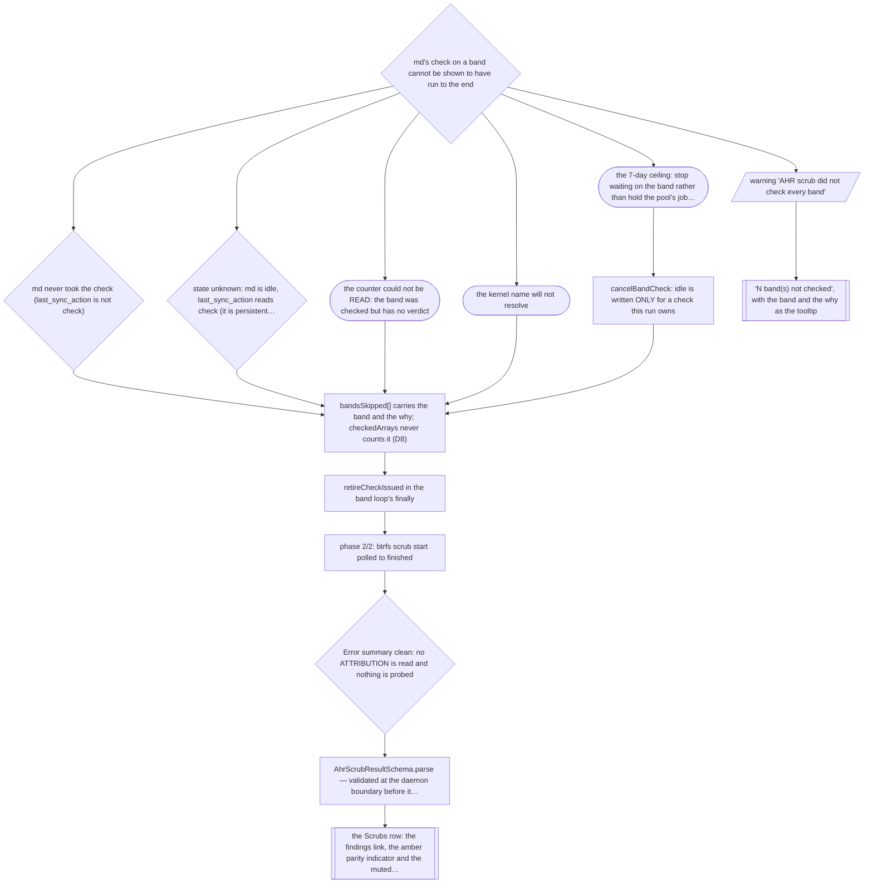
```mermaid
flowchart TD
  X17{"md's check on a band cannot be shown to have run to the end"}
  S11{"md never took the check (last_sync_action is not check)"}
  S13{"state unknown: md is idle, last_sync_action reads check (it is persistent…"}
  S16(["the 7-day ceiling: stop waiting on the band rather than hold the pool's job…"])
  S20n(["the counter could not be READ: the band was checked but has no verdict"])
  S63[/"warning 'AHR scrub did not check every band'"/]
  S03(["the kernel name will not resolve"])
  S30["bandsSkipped[] carries the band and the why; checkedArrays never counts it (D8)"]
  S18["cancelBandCheck: idle is written ONLY for a check this run owns"]
  U03[["'N band(s) not checked', with the band and the why as the tooltip"]]
  S31["retireCheckIssued in the band loop's finally"]
  S40["phase 2/2: btrfs scrub start polled to finished"]
  S42{"Error summary clean: no ATTRIBUTION is read and nothing is probed"}
  S60["AhrScrubResultSchema.parse — validated at the daemon boundary before it…"]
  S64[["the Scrubs row: the findings link, the amber parity indicator and the muted…"]]
  X17 --> S11
  X17 --> S13
  X17 --> S16
  X17 --> S20n
  X17 --> S63
  X17 --> S03
  S11 --> S30
  S13 --> S30
  S16 --> S18
  S20n --> S30
  S63 --> U03
  S03 --> S30
  S30 --> S31
  S18 --> S30
  S31 --> S40
  S40 --> S42
  S42 --> S60
  S60 --> S64
```

| leaf | kind | what the system does | `code:` | `test:` | `gt:` |
|---|---|---|---|---|---|
| `X17` | decision | md's check on a band cannot be shown to have run to the end: never started, state unknown, taken over, or its counter unreadable | `packages/daemon/src/services/ahr-scrub.ts:lastSyncAction` | `packages/daemon/src/services/__tests__/ahr-scrub.test.ts:a check that aborted (idle + a persistent last_sync_action=check, counter unmoved) is UNKNOWN, not a verdict` | — |
| `S11` | decision | md never took the check (`last_sync_action` is not `check`): the band is a skip and its `mismatch_cnt` is read as NO verdict — it belongs to an earlier check | `packages/daemon/src/services/ahr-scrub.ts:lastSyncAction` | `packages/daemon/src/services/__tests__/ahr-scrub.test.ts:records a band whose check md NEVER started, and reads no stale counter for it` | — |
| `S13` | decision | state unknown: md is idle, `last_sync_action` reads `check` (it is persistent on any node that ever ran mdcheck) and the counter never moved — not a verdict, either way | `packages/daemon/src/services/ahr-scrub.ts:lastSyncAction` | `packages/daemon/src/services/__tests__/ahr-scrub.test.ts:a check that aborted (idle + a persistent last_sync_action=check, counter unmoved) is UNKNOWN, not a verdict` | — |
| `S16` | refusal | the 7-day ceiling: stop waiting on the band rather than hold the pool's job exclusion open for ever | `packages/daemon/src/services/ahr-scrub.ts:ceilingText` | `packages/daemon/src/services/__tests__/ahr-scrub.test.ts:the absolute ceiling is the last resort — a band that never goes idle stops being waited on` | — |
| `S20n` | refusal | the counter could not be READ: the band was checked but has no verdict — a skip, never coverage (N12) | `packages/daemon/src/services/ahr-scrub.ts:mismatchCount` | `packages/daemon/src/services/__tests__/ahr-scrub.test.ts:a band whose mismatch_cnt cannot be READ is a skip, not coverage (N12)` | — |
| `S63` | notification | warning "AHR scrub did not check every band": a clean-but-incomplete scrub is never silent | `packages/daemon/src/services/ahr-scrub.ts:skippedBody` | `packages/daemon/src/services/__tests__/ahr-scrub.test.ts:a band whose mismatch_cnt cannot be READ is a skip, not coverage (N12)` | — |
| `S03` | refusal | the kernel name will not resolve: the check was already issued, so it is cancelled WITHOUT writing idle (an unprovable idle aborts a rebuild) and the band is a skip | `packages/daemon/src/services/ahr-scrub.ts:cancelBandCheck` | `packages/daemon/src/services/__tests__/ahr-scrub.test.ts:a band whose kernel name will not resolve is LEFT ALONE` | `GT-19` |
| `S30` | action | `bandsSkipped[]` carries the band and the why; `checkedArrays` never counts it (D8) | `packages/daemon/src/services/ahr-scrub.ts:scrubAhrPool` | `packages/daemon/src/services/__tests__/ahr-scrub.test.ts:a band md never started is recorded, not coverage — checkedArrays stays honest` | — |
| `S18` | action | cancelBandCheck: `idle` is written ONLY for a check this run owns — a foreign op, or a frozen array, is left exactly as it is and named | `packages/daemon/src/services/ahr-scrub.ts:cancelBandCheck` | `packages/daemon/src/services/__tests__/ahr-scrub.test.ts:a frozen band that refuses idle is said so — the scrub carries on` | `GT-19` |
| `U03` | ui | "N band(s) not checked", with the band and the why as the tooltip | `packages/pve-integration/src/69-scrubs.js:skippedFor` | `packages/pve-integration/test/dialog-contracts.harness.mjs:scrubs: a scrub that skipped a band says how many, labelled` | — |
| `S31` | action | retireCheckIssued in the band loop's `finally` — the token never outlives the iteration that took it (N3) | `packages/daemon/src/services/selfheal-syncop.ts:retireCheckIssued` | `packages/daemon/src/services/__tests__/ahr-scrub.test.ts:retires the token on the SKIP paths too — md never started the check (N3)` | — |
| `S40` | action | phase 2/2: `btrfs scrub start` polled to finished — one pass, two callers (the scrub and the parity rewrite) | `packages/daemon/src/services/ahr-scrub.ts:btrfsScrubPass` | `packages/daemon/src/services/__tests__/ahr-scrub.test.ts:runs btrfs scrub to completion, THEN per-array checks sequentially` | `GT-3` |
| `S42` | decision | Error summary clean: no ATTRIBUTION is read and nothing is probed — the journal is read once more for the corrected-metadata count alone (selfheal.12), the one rot signal a clean scrub can hold | `packages/daemon/src/services/ahr-scrub.ts:parseBtrfsScrubStatus` | `packages/daemon/src/services/__tests__/ahr-scrub.test.ts:a clean scrub probes nothing, and reads the journal only for the corrected-metadata window` | `GT-3` |
| `S60` | action | AhrScrubResultSchema.parse — validated at the daemon boundary before it leaves as a job result | `packages/daemon/src/services/ahr-scrub.ts:scrubAhrPool` | `packages/daemon/src/services/__tests__/ahr-scrub.test.ts:the new record fields round-trip the shared schema — and stay optional` | — |
| `S64` | ui | the Scrubs row: the findings link, the amber parity indicator and the muted skipped-band count share ONE cell, each with its own tooltip | `packages/pve-integration/src/69-scrubs.js:renderLastScrub` | `packages/pve-integration/test/dialog-contracts.harness.mjs:scrubs: the row says how many files, labelled` | — |

### R18 — file changed, truncated, deleted or inode reused between scrub and repair

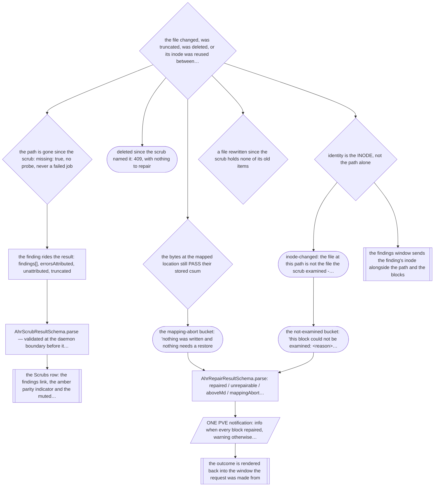
```mermaid
flowchart TD
  X18{"the file changed, was truncated, was deleted, or its inode was reused between…"}
  S51{"the path is gone since the scrub: missing: true, no probe, never a failed job"}
  RT06c(["deleted since the scrub named it: 409, with nothing to repair"])
  E04d{"the bytes at the mapped location still PASS their stored csum"}
  X18a{"a file rewritten since the scrub holds none of its old items"}
  X18r{"identity is the INODE, not the path alone"}
  S50["the finding rides the result: findings[], errorsAttributed, unattributed, truncated"]
  J41(["the mapping-abort bucket: 'nothing was written and nothing needs a restore"])
  E00b(["inode-changed: the file at this path is not the file the scrub examined -…"])
  U09[["the findings window sends the finding's inode alongside the path and the blocks"]]
  S60["AhrScrubResultSchema.parse — validated at the daemon boundary before it…"]
  J50["AhrRepairResultSchema.parse: repaired / unrepairable / aboveMd / mappingAbort…"]
  J47(["the not-examined bucket: 'this block could not be examined: &lt;reason&gt;…"])
  S64[["the Scrubs row: the findings link, the amber parity indicator and the muted…"]]
  J51[/"ONE PVE notification: info when every block repaired, warning otherwise…"/]
  J52[["the outcome is rendered back into the window the request was made from"]]
  X18 --> S51
  X18 --> RT06c
  X18 --> E04d
  X18 --> X18a
  X18 --> X18r
  S51 --> S50
  E04d --> J41
  X18r --> E00b
  X18r --> U09
  S50 --> S60
  J41 --> J50
  E00b --> J47
  S60 --> S64
  J50 --> J51
  J47 --> J50
  J51 --> J52
```

| leaf | kind | what the system does | `code:` | `test:` | `gt:` |
|---|---|---|---|---|---|
| `X18` | decision | the file changed, was truncated, was deleted, or its inode was reused between the scrub and the repair | `packages/daemon/src/services/ahr-scrub.ts:pathExists` | `packages/daemon/src/services/__tests__/ahr-scrub.test.ts:a file deleted since the scrub is reported as missing, not as a failure` | — |
| `S51` | decision | the path is gone since the scrub: `missing: true`, no probe, never a failed job | `packages/daemon/src/services/ahr-scrub.ts:pathExists` | `packages/daemon/src/services/__tests__/ahr-scrub.test.ts:a file deleted since the scrub is reported as missing, not as a failure` | — |
| `RT06c` | refusal | deleted since the scrub named it: 409, with nothing to repair | `packages/daemon/src/services/ahr-scrub.ts:pathExists` | `packages/daemon/src/routes/__tests__/ahr-repair.test.ts:409 for a path that no longer exists — deleted since the scrub named it` | — |
| `E04d` | decision | the bytes at the mapped location still PASS their stored csum: `mapping-abort`, "not corrupt here", nothing written — this is what makes a wrong mapping harmless | `packages/daemon/src/services/selfheal-repair.ts:reverify` | `packages/daemon/src/services/__tests__/selfheal-repair.test.ts:ABORTS when the bytes at the computed location still pass their csum` | `GT-11` |
| `X18a` | decision | a file rewritten since the scrub holds none of its old items: the owner scan answers "no extent of this file covers the reported stripe" rather than refusing | `packages/daemon/src/services/selfheal-map.ts:extentsForStripe` | `packages/daemon/src/services/__tests__/selfheal-map.test.ts:a scan whose leaves hold none of the inode's items returns [] — it does not refuse` | — |
| `X18r` | decision | identity is the INODE, not the path alone: `AhrRepairFile.inode` rides the finding, and the engine stats the path at the gates - before anything is pinned | `packages/shared/src/schemas/selfheal.ts:AhrRepairFile` | `packages/daemon/src/services/__tests__/selfheal-repair.test.ts:repairs when the inode matches the file that is there` | — |
| `S50` | action | the finding rides the result: findings[], errorsAttributed, unattributed, truncated | `packages/daemon/src/services/ahr-scrub.ts:attributeScrub` | `packages/daemon/src/services/__tests__/ahr-scrub.test.ts:round-trips a full finding through JSON unchanged` | — |
| `J41` | refusal | the `mapping-abort` bucket: "nothing was written and nothing needs a restore — the bytes there still pass their stored checksum" **[not-corrupt-here-advice]** | `packages/daemon/src/services/ahr-repair.ts:MAPPING_ABORT_SENTENCE` | `packages/daemon/src/services/__tests__/ahr-repair.test.ts:a mapping-abort is never told to restore from backup — it means the block is FINE (selfheal.7 F2, R9)` | — |
| `E00b` | refusal | `inode-changed`: the file at this path is not the file the scrub examined - `not-examined`, nothing pinned, nothing written, and never a restore | `packages/daemon/src/services/selfheal-repair.ts:repairBlock` | `packages/daemon/src/services/__tests__/selfheal-repair.test.ts:refuses NOT-EXAMINED when it does not, and pins nothing` | — |
| `U09` | ui | the findings window sends the finding's inode alongside the path and the blocks | `packages/pve-integration/src/69-scrubs.js:repairSelection` | `packages/pve-integration/test/dialog-contracts.harness.mjs:and the finding's INODE, so the daemon can check identity (F11)` | — |
| `S60` | action | AhrScrubResultSchema.parse — validated at the daemon boundary before it leaves as a job result | `packages/daemon/src/services/ahr-scrub.ts:scrubAhrPool` | `packages/daemon/src/services/__tests__/ahr-scrub.test.ts:the new record fields round-trip the shared schema — and stay optional` | — |
| `J50` | action | AhrRepairResultSchema.parse: repaired / unrepairable / aboveMd / mappingAbort / notExamined, always summing to the blocks attempted | `packages/daemon/src/services/ahr-repair.ts:repairAhrFiles` | `packages/daemon/src/services/__tests__/ahr-repair.test.ts:the notification names all five counts, and they add up (review R9, seventh pass F3)` | — |
| `J47` | refusal | the `not-examined` bucket: "this block could not be examined: <reason>; nothing was written; re-scrub after <what would change>". Its own count, its own paragraph, and never the mapping-abort sentence, which asserts the bytes passed their checksum | `packages/daemon/src/services/ahr-repair.ts:notExaminedSentence` | `packages/daemon/src/services/__tests__/ahr-repair.test.ts:a not-examined block never carries restore advice, and keeps the run a warning` | — |
| `S64` | ui | the Scrubs row: the findings link, the amber parity indicator and the muted skipped-band count share ONE cell, each with its own tooltip | `packages/pve-integration/src/69-scrubs.js:renderLastScrub` | `packages/pve-integration/test/dialog-contracts.harness.mjs:scrubs: the row says how many files, labelled` | — |
| `J51` | notification | ONE PVE notification: `info` when every block repaired, `warning` otherwise, with the per-file advice and the file list capped at 20 | `packages/daemon/src/services/ahr-repair.ts:repairBody` | `packages/daemon/src/services/__tests__/ahr-repair.test.ts:everything repaired notifies at info and says so` | — |
| `J52` | ui | the outcome is rendered back into the window the request was made from — per-file verdicts on their own rows, and the four counts | `packages/pve-integration/src/69-scrubs.js:showRepairResult` | `packages/pve-integration/test/dialog-contracts.harness.mjs:repair: the result appears in the window the request was made from` | — |

### R19 — a crc32c collision on a candidate (accepted residual)

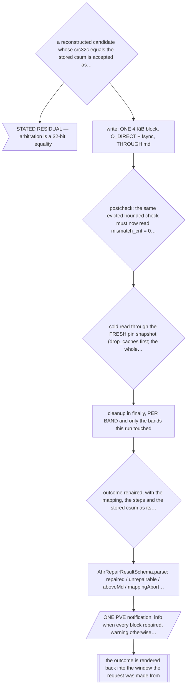
```mermaid
flowchart TD
  X19{"a reconstructed candidate whose crc32c equals the stored csum is accepted as…"}
  E08b>"STATED RESIDUAL — arbitration is a 32-bit equality"]
  E11["write: ONE 4 KiB block, O_DIRECT + fsync, THROUGH md"]
  E12{"postcheck: the same evicted bounded check must now read mismatch_cnt = 0…"}
  E13{"cold read through the FRESH pin snapshot (drop_caches first; the whole…"}
  E14["cleanup in finally, PER BAND and only the bands this run touched"]
  E15{"outcome repaired, with the mapping, the steps and the stored csum as its…"}
  J50["AhrRepairResultSchema.parse: repaired / unrepairable / aboveMd / mappingAbort…"]
  J51[/"ONE PVE notification: info when every block repaired, warning otherwise…"/]
  J52[["the outcome is rendered back into the window the request was made from"]]
  X19 --> E08b
  X19 --> E11
  E11 --> E12
  E12 --> E13
  E13 --> E14
  E14 --> E15
  E15 --> J50
  J50 --> J51
  J51 --> J52
```

| leaf | kind | what the system does | `code:` | `test:` | `gt:` |
|---|---|---|---|---|---|
| `X19` | decision | a reconstructed candidate whose crc32c equals the stored csum is accepted as the original | `packages/daemon/src/services/selfheal-csum.ts:crc32c` | `packages/daemon/src/services/__tests__/selfheal-csum.test.ts:a single flipped bit changes the csum — the whole basis of arbitration` | `GT-11` |
| `E08b` | residual | STATED RESIDUAL — arbitration is a 32-bit equality: a crc32c COLLISION on a reconstructed candidate is accepted as the original and written through md, and nothing downstream can tell the difference | — | — | `GT-11` |
| `E11` | action | write: ONE 4 KiB block, O_DIRECT + fsync, THROUGH md — and only after the reconstruction matched the checksum btrfs stored for it **[md-block-write]** | `packages/daemon/src/services/selfheal-repair.ts:repairBlock` | `suite:7-member` | `GT-8` |
| `E12` | decision | postcheck: the same evicted bounded check must now read `mismatch_cnt = 0` AND the same direct member-row computation must agree - the stripe was written through md moments ago, which is exactly the state its check answers from the cache in (GT-23) | `packages/daemon/src/services/selfheal-repair.ts:boundedWindowCheck` | `suite:7-bcheck` | `GT-8` |
| `E13` | decision | cold read through the FRESH pin snapshot (drop_caches first; the whole logical extent when compressed) — a warm page of the live file answers from memory and hides everything | `packages/daemon/src/services/selfheal-repair.ts:coldRead` | `suite:3-cold` | `GT-9` |
| `E14` | action | cleanup in `finally`, PER BAND and only the bands this run touched: rmw_level, then the sync window under the ownership rule, then stripe_cache_size, then destroy the pin | `packages/daemon/src/services/selfheal-repair.ts:restoreSyncKnobs` | `packages/daemon/src/services/__tests__/selfheal-repair.test.ts:restores rmw_level on the band it turned it down on — and leaves the other band alone` | `GT-13` |
| `E15` | decision | outcome `repaired`, with the mapping, the steps and the stored csum as its audit trail | `packages/daemon/src/services/selfheal-repair.ts:repairBlock` | `packages/daemon/src/services/__tests__/selfheal-repair.test.ts:produces an outcome the shared schema accepts` | `GT-8` |
| `J50` | action | AhrRepairResultSchema.parse: repaired / unrepairable / aboveMd / mappingAbort / notExamined, always summing to the blocks attempted | `packages/daemon/src/services/ahr-repair.ts:repairAhrFiles` | `packages/daemon/src/services/__tests__/ahr-repair.test.ts:the notification names all five counts, and they add up (review R9, seventh pass F3)` | — |
| `J51` | notification | ONE PVE notification: `info` when every block repaired, `warning` otherwise, with the per-file advice and the file list capped at 20 | `packages/daemon/src/services/ahr-repair.ts:repairBody` | `packages/daemon/src/services/__tests__/ahr-repair.test.ts:everything repaired notifies at info and says so` | — |
| `J52` | ui | the outcome is rendered back into the window the request was made from — per-file verdicts on their own rows, and the four counts | `packages/pve-integration/src/69-scrubs.js:showRepairResult` | `packages/pve-integration/test/dialog-contracts.harness.mjs:repair: the result appears in the window the request was made from` | — |

### R20 — the periodic timer paths (missed occurrence, vanished job, restart, shared spindles)

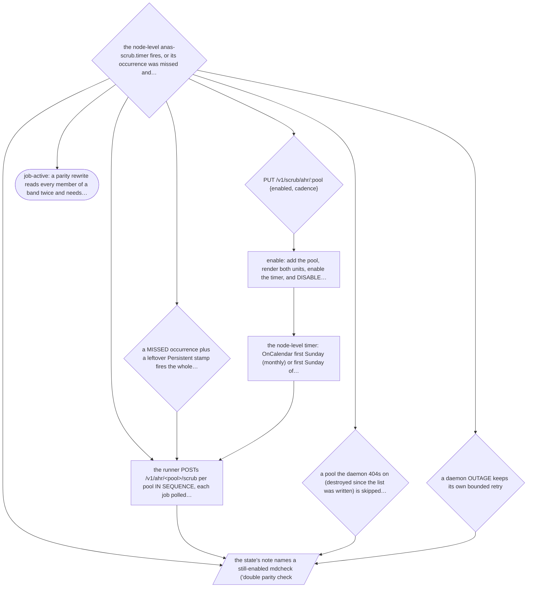
```mermaid
flowchart TD
  X20{"the node-level anas-scrub.timer fires, or its occurrence was missed and…"}
  T00{"PUT /v1/scrub/ahr/:pool {enabled, cadence}"}
  T04{"a MISSED occurrence plus a leftover Persistent stamp fires the whole…"}
  T05["the runner POSTs /v1/ahr/&lt;pool&gt;/scrub per pool IN SEQUENCE, each job polled…"]
  T06{"a pool the daemon 404s on (destroyed since the list was written) is skipped…"}
  T08{"a daemon OUTAGE keeps its own bounded retry"}
  T13[/"the state's note names a still-enabled mdcheck ('double parity check"/]
  P02a(["job-active: a parity rewrite reads every member of a band twice and needs…"])
  T02["enable: add the pool, render both units, enable the timer, and DISABLE…"]
  T03["the node-level timer: OnCalendar first Sunday (monthly) or first Sunday of…"]
  X20 --> T00
  X20 --> T04
  X20 --> T05
  X20 --> T06
  X20 --> T08
  X20 --> T13
  X20 --> P02a
  T00 --> T02
  T04 --> T05
  T05 --> T13
  T06 --> T13
  T08 --> T13
  T02 --> T03
  T03 --> T05
```

| leaf | kind | what the system does | `code:` | `test:` | `gt:` |
|---|---|---|---|---|---|
| `X20` | decision | the node-level `anas-scrub.timer` fires, or its occurrence was missed and `Persistent=true` fires it at boot | `packages/daemon/src/services/scrub-schedule-units.ts:renderScrubTimerUnit` | `packages/daemon/src/services/__tests__/scrub-schedule-units.test.ts:the timer unit carries the OnCalendar, Persistent=true and the install target` | — |
| `T00` | decision | PUT /v1/scrub/ahr/:pool {enabled, cadence} — a surgical edit of the ONE node-level timer's embedded schedule | `packages/daemon/src/routes/scrub.ts:scrubRoutes` | `packages/daemon/src/routes/__tests__/scrub.test.ts:PUT /scrub/ahr/ahr0 {enabled:true} writes the units and takes mdcheck over (202 job)` | — |
| `T04` | decision | a MISSED occurrence plus a leftover Persistent stamp fires the whole two-phase scrub the moment the timer is re-enabled — so removal clears the stamp, and the enable confirm warns anyway | `packages/daemon/src/services/scrub-schedule-units.ts:scrubStampPath` | `packages/daemon/src/services/__tests__/scrub-schedule-units.test.ts:removeScrubUnits clears the timer's Persistent stamp (review R10)` | — |
| `T05` | action | the runner POSTs /v1/ahr/<pool>/scrub per pool IN SEQUENCE, each job polled to a terminal state before the next — pools on one node share spindles | `packages/daemon/src/scrub-task.ts:runScrubSchedule` | `packages/daemon/src/__tests__/scrub-task.test.ts:scrubs pools IN SEQUENCE — the second POST only after the first job is terminal` | — |
| `T06` | decision | a pool the daemon 404s on (destroyed since the list was written) is skipped with a journald line; the sequence continues | `packages/daemon/src/scrub-task.ts:scrubPool` | `packages/daemon/src/__tests__/scrub-task.test.ts:a pool that no longer exists (404) is skipped with a journald line, sequence continues` | — |
| `T08` | decision | a daemon OUTAGE keeps its own bounded retry: a refused connection is not evidence the job is gone, and a live job is polled with no cap at all | `packages/daemon/src/scrub-task.ts:pollScrubJob` | `packages/daemon/src/__tests__/scrub-task.test.ts:a job still running past the old 24h backstop keeps being polled — no cap on a live job` | — |
| `T13` | notification | the state's `note` names a still-enabled mdcheck ("double parity check — mdcheck is on") and every md array that is no AHR band | `packages/daemon/src/services/scrub-schedules.ts:foreignMdArrays` | `packages/daemon/src/services/__tests__/scrub-schedules.test.ts:the note is honest: mdcheck on ⇒ "double parity check"; foreign md arrays are named` | — |
| `P02a` | refusal | `job-active`: a parity rewrite reads every member of a band twice and needs the array to itself | `packages/daemon/src/services/ahr-parity-rewrite.ts:rewriteBandParity` | `packages/daemon/src/services/__tests__/ahr-parity-rewrite.test.ts:refuses while another job is in flight on the pool` | — |
| `T02` | action | enable: add the pool, render both units, enable the timer, and DISABLE mdadm's mdcheck timers — ANAS owns md checks on this node, never double-scheduled | `packages/daemon/src/services/scrub-schedules.ts:setAhrScrubEnabled` | `packages/daemon/src/services/__tests__/scrub-schedules.test.ts:enabling the FIRST pool creates the units (monthly default) and DISABLES mdcheck` | `GT-21` |
| `T03` | action | the node-level timer: `OnCalendar` first Sunday (monthly) or first Sunday of the quarter, `Persistent=true`, the schedule JSON in the marker comment | `packages/daemon/src/services/scrub-schedule-units.ts:renderScrubTimerUnit` | `packages/daemon/src/services/__tests__/scrub-schedule-units.test.ts:the timer unit carries the OnCalendar, Persistent=true and the install target` | — |

### R21 — legacy and foreign states (mdcheck, marker-less units, masked timers, uninstall)

```mermaid
flowchart TD
  X21{"the node is in a state ANAS did not create"}
  T01{"a unit on ANAS's fixed names WITHOUT the X-ANAS-Schedule= marker is someone else's"}
  T01a(["409 foreign-unit, nothing changed"])
  T02a["disabling a pool that was never enabled is a NO-OP"]
  T02b["the LAST pool off: both units removed, the Persistent stamp cleared, and…"]
  T09["uninstall.sh: disable and remove both units, clear the stamp, and re-enable mdcheck"]
  T10{"state read: enabled is the pool being IN the timer's list AND the timer enabled"}
  T11>"LEGACY: mdcheck on with no ANAS units is REPORTED as the mechanism it is…"]
  T12>"MISSING LEAF — systemctl preset / preset-all RE-ENABLES both mdcheck…"]
  P01c(["a result with no per-band counts at all (an older daemon): refuse rather than guess"])
  T13[/"the state's note names a still-enabled mdcheck ('double parity check"/]
  T09a(["the mdcheck units are masked or not installed"])
  X21 --> T01
  X21 --> T01a
  X21 --> T02a
  X21 --> T02b
  X21 --> T09
  X21 --> T10
  X21 --> T11
  X21 --> T12
  X21 --> P01c
  T01 --> T01a
  T02b --> T13
  T09 --> T09a
  T10 --> T13
```

| leaf | kind | what the system does | `code:` | `test:` | `gt:` |
|---|---|---|---|---|---|
| `X21` | decision | the node is in a state ANAS did not create: mdcheck on with no ANAS units, a marker-less unit on ANAS's names, masked timers, or an uninstall | `packages/daemon/src/services/scrub-schedules.ts:ahrScrubNote` | `packages/daemon/src/services/__tests__/scrub-schedules.test.ts:the LEGACY state (no ANAS units, mdcheck on) reads as mdcheck-timer with the takeover note (review F1/F4)` | `GT-21` |
| `T01` | decision | a unit on ANAS's fixed names WITHOUT the `X-ANAS-Schedule=` marker is someone else's: never rewritten, never deleted | `packages/daemon/src/services/scrub-schedule-units.ts:scrubUnitsAreForeign` | `packages/daemon/src/services/__tests__/scrub-schedule-units.test.ts:a SERVICE-only foreign unit is refused even with no timer present (review F13)` | — |
| `T01a` | refusal | 409 `foreign-unit`, nothing changed — and a marker-less TIMER beside a marked service is the legacy pair, adopted rather than refused for ever | `packages/daemon/src/services/scrub-schedule-units.ts:ForeignUnitError` | `packages/daemon/src/routes/__tests__/scrub.test.ts:PUT /scrub/ahr/:pool on a FOREIGN anas-scrub unit → 409 reason foreign-unit, no job (review R10)` | — |
| `T02a` | action | disabling a pool that was never enabled is a NO-OP: mdcheck is handed back only when ANAS actually took it (N4) | `packages/daemon/src/services/scrub-schedules.ts:setAhrScrubEnabled` | `packages/daemon/src/services/__tests__/scrub-schedules.test.ts:disabling a pool that was never enabled changes NOTHING — and never turns mdcheck on (N4)` | — |
| `T02b` | action | the LAST pool off: both units removed, the Persistent stamp cleared, and mdcheck restored — the node returns to stock | `packages/daemon/src/services/scrub-schedule-units.ts:removeScrubUnits` | `packages/daemon/src/services/__tests__/scrub-schedules.test.ts:disabling the LAST pool removes the units and RESTORES mdcheck (ruling 2026-09-14)` | `GT-21` |
| `T09` | action | uninstall.sh: disable and remove both units, clear the stamp, and re-enable mdcheck — restoring the DISTRO DEFAULT, not guessing at prior state | `packaging/uninstall.sh:remove_schedule_units` | `packaging/test/uninstall-schedules.test.sh:both mdcheck timers re-enabled, --now` | `GT-21` |
| `T10` | decision | state read: `enabled` is the pool being IN the timer's list AND the timer enabled — a pool left in a list whose units were removed by other means is not reported as on | `packages/daemon/src/services/scrub-schedules.ts:readAhrScrubState` | `packages/daemon/src/services/__tests__/scrub-schedules.test.ts:enabled = in the timer's pool list AND the timer enabled; cadence + nextRun + phases ride along` | — |
| `T11` | residual | LEGACY: mdcheck on with no ANAS units is REPORTED as the mechanism it is (`mdcheck-timer`) and never adopted — mdcheck is on by default on a stock node, so its being on is no evidence anyone opted in | `packages/daemon/src/services/scrub-schedules.ts:ahrScrubNote` | `packages/daemon/src/services/__tests__/scrub-schedules.test.ts:the LEGACY state (no ANAS units, mdcheck on) reads as mdcheck-timer with the takeover note (review F1/F4)` | `GT-21` |
| `T12` | residual | MISSING LEAF — `systemctl preset` / `preset-all` RE-ENABLES both mdcheck timers (GT-21 PROVEN: they carry no preset exemption and default to enable). ANAS ships no preset file and takes no action; the node then runs two parity checks, and every ANAS scrub, repair and rewrite 409s on the node-wide check for the duration | — | — | `GT-21` |
| `P01c` | refusal | a result with no per-band counts at all (an older daemon): refuse rather than guess | `packages/daemon/src/services/ahr-parity-rewrite.ts:scrubParityMismatches` | `packages/daemon/src/services/__tests__/ahr-parity-rewrite.test.ts:a scrub result with no per-band counts at all refuses rather than guessing` | — |
| `T13` | notification | the state's `note` names a still-enabled mdcheck ("double parity check — mdcheck is on") and every md array that is no AHR band | `packages/daemon/src/services/scrub-schedules.ts:foreignMdArrays` | `packages/daemon/src/services/__tests__/scrub-schedules.test.ts:the note is honest: mdcheck on ⇒ "double parity check"; foreign md arrays are named` | — |
| `T09a` | refusal | the mdcheck units are masked or not installed: the uninstaller says what it could not do, what that leaves, and how to put it right by hand (N7) | `packaging/uninstall.sh:warn` | `packaging/test/uninstall-schedules.test.sh:it says what it could not do, and what that leaves` | `GT-21` |

### R22 — mapping failure (unreadable band geometry, unresolvable extent, owner-scan cap)

```mermaid
flowchart TD
  X22{"the chain from file block to member offset cannot be followed"}
  E01c(["a pvmove is in flight, or the pool's dm target is not linear"])
  E01d(["a band whose geometry cannot be read, or a segment that is not on an md array at all"])
  E03a{"a SelfhealMapError anywhere in the chain carries the REASON the chain stopped…"}
  E09a(["guard failed: the mapping and the array disagree, so NOTHING about this file…"])
  S44{"journalctl without PCRE2: re-read the whole window without -g; an unreadable…"}
  S55{"mapping unavailable, no extent covers the stripe, or nothing failed on re-read"}
  X22a["attribution survives it: one unreadable band does not void the whole pool's…"]
  E03b(["an INLINE extent or a HOLE: there is no on-disk location at all. A hole is…"])
  E03c(["a truncated owner scan, a band whose geometry went unreadable between the…"])
  J47(["the not-examined bucket: 'this block could not be examined: &lt;reason&gt;…"])
  S60["AhrScrubResultSchema.parse — validated at the daemon boundary before it…"]
  S50["the finding rides the result: findings[], errorsAttributed, unattributed, truncated"]
  J50["AhrRepairResultSchema.parse: repaired / unrepairable / aboveMd / mappingAbort…"]
  S64[["the Scrubs row: the findings link, the amber parity indicator and the muted…"]]
  J51[/"ONE PVE notification: info when every block repaired, warning otherwise…"/]
  J52[["the outcome is rendered back into the window the request was made from"]]
  X22 --> E01c
  X22 --> E01d
  X22 --> E03a
  X22 --> E09a
  X22 --> S44
  X22 --> S55
  X22 --> X22a
  E03a --> E03b
  E03a --> E03c
  E09a --> J47
  S44 --> S60
  S55 --> S50
  E03b --> J47
  E03c --> J47
  J47 --> J50
  S60 --> S64
  S50 --> S60
  J50 --> J51
  J51 --> J52
```

| leaf | kind | what the system does | `code:` | `test:` | `gt:` |
|---|---|---|---|---|---|
| `X22` | decision | the chain from file block to member offset cannot be followed: a band with no readable geometry, an unresolvable extent, an inline extent, a hole, or an owner scan that hit its bound | `packages/daemon/src/services/selfheal-map.ts:resolveContext` | `packages/daemon/src/services/__tests__/selfheal-map.test.ts:refuses a truncated owner scan rather than returning the prefix it reached` | `GT-2` |
| `E01c` | refusal | a pvmove is in flight, or the pool's dm target is not linear: every byte offset this chain computes would be stale | `packages/daemon/src/services/selfheal-map.ts:parseDmTable` | `packages/daemon/src/services/__tests__/selfheal-repair.test.ts:REFUSES while a pvmove is moving the extents under the pool` | — |
| `E01d` | refusal | a band whose geometry cannot be read, or a segment that is not on an md array at all: the whole pool is refused rather than guessed at | `packages/daemon/src/services/selfheal-map.ts:resolveContext` | `packages/daemon/src/services/__tests__/selfheal-repair.test.ts:REFUSES a pool whose segment is not on an md array at all` | — |
| `E03a` | decision | a SelfhealMapError anywhere in the chain carries the REASON the chain stopped (`inline-extent`, `hole`, `owner-scan-truncated`, `band-unreadable`, `unresolvable`): the block was NOT examined, and the mapping-abort sentence asserts the opposite | `packages/daemon/src/services/selfheal-map.ts:SelfhealMapError` | `packages/daemon/src/services/__tests__/selfheal-map.test.ts:every map failure carries its reason (F3)` | — |
| `E09a` | refusal | guard failed: the mapping and the array disagree, so NOTHING about this file has been established - `not-examined` with reason code `unresolvable`, never the bucket that advises a restore | `packages/daemon/src/services/selfheal-repair.ts:readBackGuard` | `packages/daemon/src/services/__tests__/selfheal-repair.test.ts:REFUSES: the md offset is not where these member bytes live` | — |
| `S44` | decision | journalctl without PCRE2: re-read the whole window without -g; an unreadable journal degrades to NO attribution, never to a failed scrub | `packages/daemon/src/services/ahr-scrub.ts:scrubJournalArgs` | `packages/daemon/src/services/__tests__/ahr-scrub.test.ts:re-reads without -g when journalctl has no pattern matching, rather than losing the attribution` | `GT-3` |
| `S55` | decision | mapping unavailable, no extent covers the stripe, or nothing failed on re-read: `probedUnverified` / `unidentified` with the reason — never an empty badBlocks that reads as nothing found | `packages/daemon/src/services/ahr-scrub.ts:buildFindings` | `packages/daemon/src/services/__tests__/ahr-scrub.test.ts:unresolvable AND nothing failing → unidentified, with the mapping error as the reason` | — |
| `X22a` | action | attribution survives it: one unreadable band does not void the whole pool's findings, and the probe still reads the file at the kernel's own offset | `packages/daemon/src/services/ahr-scrub.ts:buildFindings` | `packages/daemon/src/services/__tests__/ahr-scrub.test.ts:one band with no readable geometry does not void the whole pool's findings` | `GT-3` |
| `E03b` | refusal | an INLINE extent or a HOLE: there is no on-disk location at all. A hole is reachable on any ANAS-created LUN, every image of which is created sparse with ftruncate, and says nothing whatever about the LUN's data | `packages/daemon/src/services/selfheal-map.ts:resolveBlock` | `packages/daemon/src/services/__tests__/selfheal-repair.test.ts:a HOLE: not-examined / hole` | — |
| `E03c` | refusal | a truncated owner scan, a band whose geometry went unreadable between the gates and the resolve, or any other chain that cannot be followed | `packages/daemon/src/services/selfheal-map.ts:locateLogicalIn` | `packages/daemon/src/services/__tests__/selfheal-repair.test.ts:a band whose geometry goes unreadable after the gates: not-examined / band-unreadable` | — |
| `J47` | refusal | the `not-examined` bucket: "this block could not be examined: <reason>; nothing was written; re-scrub after <what would change>". Its own count, its own paragraph, and never the mapping-abort sentence, which asserts the bytes passed their checksum | `packages/daemon/src/services/ahr-repair.ts:notExaminedSentence` | `packages/daemon/src/services/__tests__/ahr-repair.test.ts:a not-examined block never carries restore advice, and keeps the run a warning` | — |
| `S60` | action | AhrScrubResultSchema.parse — validated at the daemon boundary before it leaves as a job result | `packages/daemon/src/services/ahr-scrub.ts:scrubAhrPool` | `packages/daemon/src/services/__tests__/ahr-scrub.test.ts:the new record fields round-trip the shared schema — and stay optional` | — |
| `S50` | action | the finding rides the result: findings[], errorsAttributed, unattributed, truncated | `packages/daemon/src/services/ahr-scrub.ts:attributeScrub` | `packages/daemon/src/services/__tests__/ahr-scrub.test.ts:round-trips a full finding through JSON unchanged` | — |
| `J50` | action | AhrRepairResultSchema.parse: repaired / unrepairable / aboveMd / mappingAbort / notExamined, always summing to the blocks attempted | `packages/daemon/src/services/ahr-repair.ts:repairAhrFiles` | `packages/daemon/src/services/__tests__/ahr-repair.test.ts:the notification names all five counts, and they add up (review R9, seventh pass F3)` | — |
| `S64` | ui | the Scrubs row: the findings link, the amber parity indicator and the muted skipped-band count share ONE cell, each with its own tooltip | `packages/pve-integration/src/69-scrubs.js:renderLastScrub` | `packages/pve-integration/test/dialog-contracts.harness.mjs:scrubs: the row says how many files, labelled` | — |
| `J51` | notification | ONE PVE notification: `info` when every block repaired, `warning` otherwise, with the per-file advice and the file list capped at 20 | `packages/daemon/src/services/ahr-repair.ts:repairBody` | `packages/daemon/src/services/__tests__/ahr-repair.test.ts:everything repaired notifies at info and says so` | — |
| `J52` | ui | the outcome is rendered back into the window the request was made from — per-file verdicts on their own rows, and the four counts | `packages/pve-integration/src/69-scrubs.js:showRepairResult` | `packages/pve-integration/test/dialog-contracts.harness.mjs:repair: the result appears in the window the request was made from` | — |

### R23 — the pool's top-level mount held by a backup during a repair

```mermaid
flowchart TD
  X23{"a backup or snapshot job holds the pool's on-demand top-level mount for hours"}
  RT05(["the pool's top-level mount is already held"])
  E01e(["the pool's top-level mount is already held"])
  E11["write: ONE 4 KiB block, O_DIRECT + fsync, THROUGH md"]
  E13a{"the top-level mount is held: the read is SKIPPED after a bounded 60 s wait…"}
  E12{"postcheck: the same evicted bounded check must now read mismatch_cnt = 0…"}
  E14["cleanup in finally, PER BAND and only the bands this run touched"]
  E13{"cold read through the FRESH pin snapshot (drop_caches first; the whole…"}
  E15{"outcome repaired, with the mapping, the steps and the stored csum as its…"}
  J50["AhrRepairResultSchema.parse: repaired / unrepairable / aboveMd / mappingAbort…"]
  J51[/"ONE PVE notification: info when every block repaired, warning otherwise…"/]
  J52[["the outcome is rendered back into the window the request was made from"]]
  X23 --> RT05
  X23 --> E01e
  X23 --> E11
  X23 --> E13a
  E11 --> E12
  E13a --> E14
  E12 --> E13
  E14 --> E15
  E13 --> E14
  E15 --> J50
  J50 --> J51
  J51 --> J52
```

| leaf | kind | what the system does | `code:` | `test:` | `gt:` |
|---|---|---|---|---|---|
| `X23` | decision | a backup or snapshot job holds the pool's on-demand top-level mount for hours | `packages/daemon/src/services/selfheal-repair.ts:gateRefusal` | `packages/daemon/src/services/__tests__/selfheal-repair.test.ts:REFUSES when the pool's top-level mount is already held (a backup is in flight)` | — |
| `RT05` | refusal | the pool's top-level mount is already held: said at the door rather than blocked behind a backup for hours | `packages/daemon/src/routes/ahr-mutate.ts:ahrMutationRoutes` | `packages/daemon/src/routes/__tests__/ahr-repair.test.ts:409 while a backup holds the pool's top-level mount — said at the door, not by the engine` | — |
| `E01e` | refusal | the pool's top-level mount is already held — the engine refuses rather than queueing behind a backup with md's knobs turned aside | `packages/daemon/src/services/selfheal-repair.ts:gateRefusal` | `packages/daemon/src/services/__tests__/selfheal-repair.test.ts:REFUSES when the pool's top-level mount is already held (a backup is in flight)` | — |
| `E11` | action | write: ONE 4 KiB block, O_DIRECT + fsync, THROUGH md — and only after the reconstruction matched the checksum btrfs stored for it **[md-block-write]** | `packages/daemon/src/services/selfheal-repair.ts:repairBlock` | `suite:7-member` | `GT-8` |
| `E13a` | decision | the top-level mount is held: the read is SKIPPED after a bounded 60 s wait and says so — the block is still `repaired`, because the write and the post-check already happened | `packages/daemon/src/services/selfheal-repair.ts:coldRead` | `packages/daemon/src/services/__tests__/selfheal-repair.test.ts:does not block behind a backup for the final cold read — it says the read was skipped` | — |
| `E12` | decision | postcheck: the same evicted bounded check must now read `mismatch_cnt = 0` AND the same direct member-row computation must agree - the stripe was written through md moments ago, which is exactly the state its check answers from the cache in (GT-23) | `packages/daemon/src/services/selfheal-repair.ts:boundedWindowCheck` | `suite:7-bcheck` | `GT-8` |
| `E14` | action | cleanup in `finally`, PER BAND and only the bands this run touched: rmw_level, then the sync window under the ownership rule, then stripe_cache_size, then destroy the pin | `packages/daemon/src/services/selfheal-repair.ts:restoreSyncKnobs` | `packages/daemon/src/services/__tests__/selfheal-repair.test.ts:restores rmw_level on the band it turned it down on — and leaves the other band alone` | `GT-13` |
| `E13` | decision | cold read through the FRESH pin snapshot (drop_caches first; the whole logical extent when compressed) — a warm page of the live file answers from memory and hides everything | `packages/daemon/src/services/selfheal-repair.ts:coldRead` | `suite:3-cold` | `GT-9` |
| `E15` | decision | outcome `repaired`, with the mapping, the steps and the stored csum as its audit trail | `packages/daemon/src/services/selfheal-repair.ts:repairBlock` | `packages/daemon/src/services/__tests__/selfheal-repair.test.ts:produces an outcome the shared schema accepts` | `GT-8` |
| `J50` | action | AhrRepairResultSchema.parse: repaired / unrepairable / aboveMd / mappingAbort / notExamined, always summing to the blocks attempted | `packages/daemon/src/services/ahr-repair.ts:repairAhrFiles` | `packages/daemon/src/services/__tests__/ahr-repair.test.ts:the notification names all five counts, and they add up (review R9, seventh pass F3)` | — |
| `J51` | notification | ONE PVE notification: `info` when every block repaired, `warning` otherwise, with the per-file advice and the file list capped at 20 | `packages/daemon/src/services/ahr-repair.ts:repairBody` | `packages/daemon/src/services/__tests__/ahr-repair.test.ts:everything repaired notifies at info and says so` | — |
| `J52` | ui | the outcome is rendered back into the window the request was made from — per-file verdicts on their own rows, and the four counts | `packages/pve-integration/src/69-scrubs.js:showRepairResult` | `packages/pve-integration/test/dialog-contracts.harness.mjs:repair: the result appears in the window the request was made from` | — |

### R24 — the operator names a path outside the pool — a symlink, a bind mount

```mermaid
flowchart TD
  X24{"the request names a path that is not a live file on the pool's own device"}
  RT06a(["a bind mount inside the tree is not the pool's to write"])
  RT06b(["a path outside the mountpoint — a finding inside @snapshots — is refused by…"])
  RT06d["a §12 pool's findmnt SOURCE carries the fs root in brackets"]
  E00a(["outside the mountpoint: SelfhealRunError, with nothing touched at all"])
  X24 --> RT06a
  X24 --> RT06b
  X24 --> RT06d
  X24 --> E00a
```

| leaf | kind | what the system does | `code:` | `test:` | `gt:` |
|---|---|---|---|---|---|
| `X24` | decision | the request names a path that is not a live file on the pool's own device: outside the tree, a symlink out of it, or a bind mount laid over part of it | `packages/daemon/src/routes/ahr-mutate.ts:repairRealPath` | `packages/daemon/src/routes/__tests__/ahr-repair.test.ts:400 for a symlink that resolves OUTSIDE the pool's tree, though the string is inside (D12)` | — |
| `RT06a` | refusal | a bind mount inside the tree is not the pool's to write: 400 naming the device it actually sits on | `packages/daemon/src/routes/ahr-mutate.ts:repairMountSource` | `packages/daemon/src/routes/__tests__/ahr-repair.test.ts:400 for a path whose filesystem is NOT the pool's own LV` | — |
| `RT06b` | refusal | a path outside the mountpoint — a finding inside `@snapshots` — is refused by name, never quietly skipped | `packages/daemon/src/routes/ahr-mutate.ts:ahrMutationRoutes` | `packages/daemon/src/routes/__tests__/ahr-repair.test.ts:400 for a path outside the pool's mountpoint — repair is the live @data tree only` | — |
| `RT06d` | action | a §12 pool's findmnt SOURCE carries the fs root in brackets: `--nofsroot`, with the bracket stripped as a second line of defence (N2) | `packages/daemon/src/routes/ahr-mutate.ts:repairFindmntArgs` | `packages/daemon/src/routes/__tests__/ahr-repair.test.ts:202 when findmnt reports the btrfs fs root in brackets` | — |
| `E00a` | refusal | outside the mountpoint: SelfhealRunError, with nothing touched at all | `packages/daemon/src/services/selfheal-repair.ts:repairBlock` | `packages/daemon/src/services/__tests__/selfheal-repair.test.ts:refuses a file outside the mountpoint before doing anything at all` | — |

## Findings

Ranked lose-data > false-assurance > operational. Each names the concrete
scenario and what would close it. The two that prompted this exercise — the
parity-only-rot gap (D1) and the RAID1 md-repair mis-application (N1) — are both
shipped; these are the next ones of the same shape.

### Lose-data

**F1 — R9 · a RAID1 band mismatch that phase 2 cannot attribute has NO reachable
verb.** *(leaf `X9r`, `test: —`; the missing half of N1.)*
Phase 1 issues `mdadm --action=check` on a mirror band like any other and counts
`mismatch_cnt > 0`. Phase 2 finds nothing, and it cannot: btrfs reads through
md, md serves the read from whichever leg `read_balance` picks, and if that is
the healthy leg every checksum passes. So the scrub fires the PARITY-ONLY
notification, the Scrubs row shows the amber indicator, and its tooltip says a
mirror's legs "are arbitrated per block by Repair from parity". That verb takes
`{ files: [{ path, blocks }] }` and is lit only by `repairableFinding`, which
requires at least one named block — and phase 2 named none. The toolbar button
is greyed ("no scrub findings for this pool since the daemon started"), the
findings window has no rows, and Rewrite parity is correctly refused
(`not-a-parity-band`). The band keeps a rotten leg until the good leg fails, at
which point md serves the rot. This is the shape D1 closed for parity bands: a
stated fact, a promised remedy, and no way to reach it.
**Closes it:** a per-band mirror verb that walks the band's stripes, reads BOTH
legs directly and arbitrates each disagreement against the csum tree — every
piece already exists (`memberOffsetOn`, `readStoredCsum`, `crc32c`, the mirror
branch of `reconstruct`, `readMemberWithRetry`). Minimum honest fix: stop the
tooltip naming a verb the operator cannot reach.
**CLOSED (seventh pass), half of it.** The half that was a lie went first: the
Scrubs row tooltip, the Rewrite-parity button reason and the parity window
stopped naming a verb the operator cannot reach (leaf `X9r`, harness-checked).

**CLOSED IN FULL (2026-09-15, story `selfheal.11`).** R9 has its verb —
`POST /v1/ahr/:name/mirror-reconcile`, beside Rewrite parity in the same window,
need-gated on the band's level so exactly one of the two is ever lit. Arm A
repeats the ordinary scrub, which GT-22 proved heals the band through md when
md's read-balance serves the rotten leg; arm B reads both legs in full and
arbitrates every differing row against the checksum btrfs stored for it — the
csum tree for DATA, the node's own header checksum for METADATA and SYSTEM —
writing only the leg that matches, THROUGH md. Rows nothing can vouch for are
counted and left exactly as they are. The `md-action-repair` action is
unreachable from R9 by construction: every command the service issues goes
through a guard that throws on `--action=repair` before the process is spawned,
and the suite's case-9 rows assert the same thing against the kernel's own log.
The root went from 39 nodes / 7 terminal leaves to 62 / 20, all of them carrying
code AND a test.

**F2 — R1 · a repair that WROTE a proven-correct block is reported
`unrepairable` and told to restore from backup.** *(leaf `E12a`, mis-applied
`restore-from-backup-advice`, `test: —`.)*
RAID6 with rot in the target block AND in the Q member: the P-XOR candidate wins
arbitration, the read-back guard passes, the pre-write re-check passes, and
`writeDirect` puts the reconstructed block through md. It is now provably
correct — it matched the checksum btrfs stored for it. The post-check's bounded
check then still counts a mismatch, because Q is still wrong, and
`selfheal-repair.ts:repairBlock` fails the block with *"the block was written
back but the bounded md check over stripe N still reports mismatch_cnt=… — the
parity group is not consistent. Restore `<file>` from backup."* The operator is
told to overwrite a file that was just repaired, which is how a restore from an
older backup loses data that was recoverable. And the residual — parity rot on
that band — is recorded nowhere: it is not in the scrub's `parityMismatches`, so
Rewrite parity refuses with `no-parity-mismatch` until a fresh multi-hour
two-phase scrub has run.
**Closes it:** a non-zero post-check AFTER a successful write is a different
verdict from one before it. Report the block `repaired` with a
parity-inconsistent qualifier, carry the band into a parity-mismatch record, and
point at Rewrite parity — never at a restore.
**CLOSED (seventh pass).** A non-zero post-check AFTER a write is now a
different question: the block is re-read COLD — through the pin, where btrfs
verifies its stored checksum on the read — and arbitrated again (`coldVerify`,
leaf `E12a`). If it passes, the outcome is `repaired` carrying a
`parityResidual { array, band, bandIndex, mismatchCnt }` and the sentence "the
block is repaired; the band still has a parity/Q mismatch — run Rewrite parity"
(`E12c`). The repair job rolls those up into `AhrRepairResult.parityResiduals`
in the SAME row shape a scrub's `parityMismatches` uses (`J54`), the Scrubs
parity indicator reads the newer of the pool's last scrub and its last repair
(`U02r`), and `parityRewriteEvidence` accepts a repair-job source (`P01r`) — so
the residual is actionable without a fresh multi-hour two-phase scrub. Only a
block that fails its cold re-read as well is `unrepairable`, and only that leaf
(`E12d`) carries restore advice.

### False assurance

**F3 — R16 / R22 · a block whose MAPPING failed is reported "not corrupt here —
nothing needs a restore".** *(leaf `E03a`, mis-applied `not-corrupt-here-advice`,
`test: —`.)*
`repairBlock`'s catch turns ANY `SelfhealMapError` into the `mapping-abort`
bucket. That bucket's sentence — `ahr-repair.ts:MAPPING_ABORT_SENTENCE` in the
notification, and the same words in the findings window — asserts a positive
fact: *"the bytes on the member still pass their stored checksum, so there was
nothing to reconstruct … Nothing was written, and they need no restore."* True of
the one case `reverify` establishes it for. False of every map failure: an inline
extent, a HOLE (`resolveBlock` refuses `diskByte === 0` by name, and
`iscsi-mutate.ts:createSparseImage` creates every LUN image with `ftruncate`, so
this is reachable on any ANAS-created LUN), an owner scan truncated at
`MAX_OWNER_LEAVES`, a band whose geometry went unreadable mid-run. Those blocks
were never examined at all, and they may be genuinely corrupt.
**Closes it:** separate the two. A `reasonCode` on `mapping-abort` — or a fifth
count — telling "not corrupt at the mapped location" from "the location could not
be determined", each with its own sentence.
**CLOSED (seventh pass).** `SelfhealMapError` now carries a `reasonCode`
(`inline-extent` | `hole` | `owner-scan-truncated` | `band-unreadable` |
`unresolvable`), set at each throw site, and the engine turns it into a new
outcome kind: `not-examined`. `mapping-abort` keeps its meaning for the ONE case
that establishes it — the re-verify READ the block and it passed. The repair job
counts `notExamined` in its own bucket, the arithmetic is
`repaired + unrepairable + aboveMd + mappingAbort + notExamined === blocks`
everywhere, and the per-file advice is "this block could not be examined:
&lt;reason&gt;; nothing was written; re-scrub after &lt;what would change&gt;"
— never "they need no restore".

**F4 — R4 · on a RAID1 band, rot that arrived THROUGH md is reported "restore
from backup" instead of "above md".** *(leaf `E04f`, mis-applied
`restore-from-backup-advice`, `test: —`.)*
On a parity band, through-md rot reaches the precheck, `mismatch_cnt` reads 0
(GT-6) and the outcome is `above-md` carrying the sentence that matters: *"parity
already agreed with the bad data — this implicates something other than the disks
(memory, controller, software)."* On a mirror the same fault puts the same bad
bytes on both legs, so `reverify` aborts before the precheck ever runs: *"every
mirror leg fails the stored csum … there is no good copy left. Restore from
backup."* The remedy happens to be the same; the DIAGNOSIS is not. `aboveMd`
stays 0, the notification never says it, and a node with failing memory keeps
corrupting. Parallel construction: the same fault must read the same way on both
band types.
**Closes it:** when every leg fails, run the precheck anyway and take the
`above-md` verdict when the mirror's own bounded check counts 0.
**CLOSED (seventh pass).** On a mirror, every leg failing the stored csum no
longer aborts before the pre-check. The bounded check runs first, because a
mirror check compares the legs with each other: `mismatch_cnt == 0` means the
legs AGREE and are both wrong, which is `above-md` in the same words a parity
band gets (leaf `E04f1`); `> 0` means they disagree and neither matches, which
is `unrepairable` (`E04f2`). Parallel construction holds — one fault, one
reading, on both band types.

**F5 — R10 / R14 · an outcome that says "nothing written" after the block was
written.** *(leaf `E12b`, `test: —`.)*
`boundedWindowCheck` raises `ForeignSyncOpError` whenever md has taken an
operation of its own — including from the POST-check, which runs after
`writeDirect`. `repairBlock`'s single global catch answers every one of them with
*"array state changed mid-repair: …, nothing written"*. A member failing inside
the post-check window (minutes on a 20 TB band) therefore produces an outcome
whose central factual claim is false, in the bucket that then advises a restore.
**Closes it:** a flag set at the write step; the post-write catch says the block
was written and the array changed under the verification.
**CLOSED (seventh pass).** A `written` flag is set the moment `writeDirect`
returns, and the catch words the outcome from it: *"the block was written and
matches its checksum; the post-check could not run (md started &lt;op&gt;) —
re-scrub to confirm parity"*, reported `repaired` with a `postcheckSkipped`
note (leaves `E12b`/`J53`). "Nothing written" is now only ever said about a run
that wrote nothing.

**F6 — R5 · a DUP metadata correction leaves ANAS no signal at all.** *(leaf
`X5r`, `code: —`, `test: —`, GT-20.)*
GT-20 proved the repair of a rotten metadata copy happens in the RW MOUNT's read
path, and that a later `btrfs scrub` reports `corrected_errors: 0`. The only
durable evidence is the one-time dmesg pair `checksum verify failed on logical
<bytenr> mirror 1 …` / `read error corrected: ino 0 off <bytenr>`, and the
attribution parses neither — `parseScrubWarning` matches only `scrub: checksum
error …`, `parseUnattributedScrubError` only `unable to fixup`, read and super
errors. A disk quietly eating metadata reads as a clean pool.
**Closes it:** one more pattern over the SAME journal window the attribution
already reads, reported as a corrected-metadata count rather than as a finding.

**F7 — R21 · `systemctl preset` re-enables the mdcheck timers ANAS turned off,
and ANAS neither prevents nor notices it.** *(leaf `T12`, `code: —`, `test: —`,
GT-21.)*
GT-21 is explicit: an apt reinstall leaves admin-disabled timers alone, but
`systemctl preset` — or a `preset-all` after a systemd upgrade — enables both,
because they carry no preset exemption and the node's two preset files have no
catch-all. The node then runs mdcheck's ten days of 6-hour windows on the same
spindles as the ANAS scrub, and because `runningAhrCheck` is node-wide, every
periodic scrub, every Repair and every Rewrite parity answers 409 for the
duration. The `note` says "double parity check — mdcheck is on" to whoever opens
the Scrubs screen; the timer's runner records failures and moves on. GT-21's own
verdict says it: *"if the timers must stay off, they need an explicit
preset/disable, not just `is-enabled`."*
**Closes it:** ship a preset fragment (`disable mdcheck_start.timer`, `disable
mdcheck_continue.timer`) alongside the units while ANAS owns md checks, removed
with them — the same surgical, reversible shape as the units themselves.

**F8 — R11 · the md bad-block list exists only in the shell hook.** *(leaf `H5`,
`code: —`, `test: —`.)*
`packaging/anas-md-event.sh:count_bad_block_ranges` reads
`/sys/block/<md>/md/dev-*/bad_blocks` once, at `RebuildFinished`, and says *"N
unreadable sector range(s) … data in those ranges could not be reconstructed"*.
Nothing in the daemon reads it — not the pool state, not the scrub result, not
`arrayRefusal`, not `preWriteRefusal`, not `parityRewriteArrayRefusal`. A band
with recorded BBL entries is a band md cannot fully reconstruct from, and Rewrite
parity would hand it a whole-band `mdadm --action=repair` regardless.
**Closes it:** read the same file where the topology is built, surface it as a
band-level fact on the Hybrid RAID view, and refuse Rewrite parity on a band
whose BBL is non-empty.
**CLOSED (seventh pass).** The md geometry reads each member's
`bad_blocks` (`md/rd<n>/bad_blocks` — the kernel's own symlink to
`dev-<name>`), one range per line, matched in that member's own data
coordinates; an UNREADABLE list is `null` and is deliberately not the same as an
empty one (leaf `H5`). Rewrite parity refuses a band with any non-empty list
(`bad-blocks-present`, `H6`), and the repair engine treats a member with a range
over the target ROW as absent — RAID5 then has nothing left, RAID6 still has the
other syndrome (`H7`).

**F9 — R22 · a read-back guard failure advises a restore.** *(leaf `E09a` →
`J40`, mis-applied `restore-from-backup-advice`.)*
The guard fires precisely when "the mapping and the array disagree" — when
nothing about this file has been established at all. The block lands in
`unrepairable` and the per-file advice is "restore this file from backup". Same
shape as F3, one step further down the sequence, and it wants the same fix.
**CLOSED (seventh pass).** The guard's failure is `not-examined` with reason
code `unresolvable` and the sentence "the mapping and the array disagree;
nothing was written, and nothing is known about this file's bytes" (leaf
`E09a`). R22 no longer reaches restore advice at all.

### Operational

**F10 — R16 · neither Repair nor Rewrite parity is `held-by-lun`-aware.** *(leaf
`RT10`, `test: —`.)*
`routes/ahr-mutate.ts:ahrHeldByLunConflict` is in the same file and hard-409s a
pool DESTROY while a LUN is served from it. The repair route neither refuses nor
discloses it, and the parity-rewrite confirm gate — which asks the operator to
agree to hours of whole-band reading — never mentions that a guest's disk is live
on the pool. `ahr-repair.ts` already calls `heldByLunOnce`, but only after the
fact, to word the advice.
**Closes it:** a disclosure line in both confirm gates. Not a hard refusal — a
repair writes a block it has proven correct, which is the opposite of unsafe.
**CLOSED (seventh pass), asymmetrically — because the two verbs write
different things.** Repair now consults `heldByLun` up front, before a confirm
code is minted, and a path backing a LUN with an ACTIVE initiator session is a
409 `lun-session-active` (leaf `RT10`): the block is proven and btrfs's
copy-on-write leaves the old extent alone, but the initiator holds its own cache
and has no idea the bytes moved, so it is logged out first. Rewrite parity WARNS
instead (`RT11`) — a band-level read patrol and a parity write, with no file
byte touched — and the operator weighs the hours of reading under a live disk.

**F11 — R18 · repair identity is the path, not the inode.** *(leaf `X18r`,
`test: —`.)*
A scrub finding carries `inode` and `subvolume`; `AhrRepairRequest` carries
`{ path, blocks }`. A path deleted and re-created between scrub and repair is
caught by `reverify` ("not corrupt here") and by nothing else. That is safe, and
it is the whole reason `reverify` exists — but it is a residual worth stating
rather than an invariant anyone checks.
**Closes it:** carry the finding's inode and subvolume into the request and refuse
a mismatch by name.
**CLOSED (seventh pass).** `AhrRepairFile` gained an optional `inode`, the
findings window sends it (`U09`), and the engine `stat`s the path at the gates —
before anything is pinned — and refuses a mismatch by name: `inode-changed`, in
the `not-examined` bucket, with "the file at this path is not the file the scrub
examined" (leaves `X18r`/`E00b`).

**F12 — 6 leaves with `test: —`**, down from 15. `X5r`, `X13`, `X13b`, `E04e`,
`E08b`, `T12`. Nine of the fifteen closed with F1–F5 and F8–F11 above; `E13b`
picked up the test the F2 work gave it (the cold read still erroring after a
write is exactly what separates a parity residual from an unprovable block).
What is left is F6 (`X5r`) and F7 (`T12`), which this pass did not touch, plus
selfheal.5's documented not-covered paths — `E04e` (more than one bad on-disk
sector inside one compressed blob), `X13`/`X13b` (power loss inside the write
window) — and `E08b`, the crc32c collision, which is untestable by construction.

**F13 — 54 orphan exported actions** (exported functions of the named services
that no leaf references). Still 54 after the seventh pass, which added five
exports (`parseBadBlocks`, `memberHasBadBlock`, `bandBadBlocks`,
`badBlocksRefusal`, `repairParityResiduals`) and referenced four of them from
leaves — `bandBadBlocks` joined group (b), and four helpers the new leaves name
left it. Three groups, only the third worth acting on:

- *(a) out of scope by design, 11.* The ZFS half of `scrub-schedules.ts`
  (`parseZfsScrubEnabled`, `zfsScrubGetArgs`, `zfsScrubSetArgs`,
  `readZfsScrubState`, `setZfsScrubEnabled`) plus `ahrScrubRunning`,
  `parseIsEnabled`, `parseMdcheckEnabled`, `isEnabledArgs`, `mismatchCntArgs`,
  `mdcheckToggleArgs`. ZFS scrubbing is not this arc.
- *(b) reached transitively, 40.* Parsers and placement helpers a named function
  calls: `parseChunkItems`, `chunkForLogical`, `logicalToLvByte`,
  `parseExtentItems`, `extentForFileOffset`, `parseExtentTreeItems`,
  `placeMdByte`, `stripeDataOrder`, `readMdGeometry`, `parseMdDetailExport`,
  `geometryFromAttributes`, `btrfsDeviceFor`, `coveringChunk`, `locateLogicalIn`,
  `subvolumeIdOf`, `chunkStripeOffsets`, `segmentForLvByte`, `selfhealBand`,
  `csumHex`, `parseCsumItems`, `findCsumEntry`, `csumFromLeafBytes`, `gfMul`,
  `gfPow2`, `gfInv`, `SelfhealRunError`, `syncActionArgs`, `lastSyncActionArgs`,
  `kernelJournalMessages`, `countErrorSummary`, `journalSince`,
  `approximateDuration`, `scrubCadenceToOnCalendar`, `renderScrubServiceUnit`,
  `parseScrubServiceUnit`, `readScrubSchedule`, `readScrubTimerNext`,
  `writeScrubUnits`, `parseRunnerArgs`, `isIdleSyncAction`. Each has its own unit
  test; none is a decision an operator ever sees.
- *(c) worth a second look, 3.* `selfheal-syncop.ts:hasIssuedCheck` has no caller
  outside its own module's `ownsSyncOp` and its tests — the ownership question is
  asked one way only, which is the design, but the export widens a surface whose
  whole point is that exactly one place decides. `forgetIssuedChecks` is a test
  hook on a production module. `scrub-task.ts:main` is the CLI entry.

### Invariants that came back clean

- `md-action-repair` is reachable from R1 and no other root. The mirror band (R9)
  terminates at `not-a-parity-band` and the member-failure root (R10) at
  `array-busy` — N1 and GT-18 hold.
- `not-corrupt-here-advice` is reachable from R18 and no other root, and
  `restore-from-backup-advice` only from faults where nothing below the checksum
  tree can prove the block right. Both were violated before the seventh pass;
  mis-applied actions now count 0.
- Every one of the 24 roots reaches at least one terminal leaf: there is no fault
  in this list the system meets with nothing at all.
- No orphan nodes: every leaf in the tree is reachable from a fault.
- Every `code:` and every `test:` reference resolves against the tree at
  `02d9fe3`, and again at the seventh pass.
